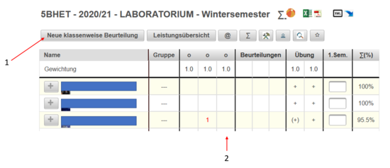
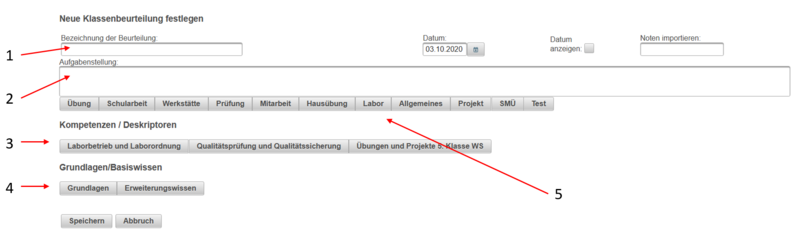

# Laborübung anlegen
Um eine Laborübung anzulegen drückt man im Notenkatalog des Gegenstandes Labor auf **Neu klassenweise Beurteilung** - siehe 1. Es wird eine weitere Spalte im Notenkatalog angelegt - siehe 2.
 
Es öffnet sich eine Eingabemaske. Nutzen Sie diese um die Laborübung zu dokumentieren.
 

