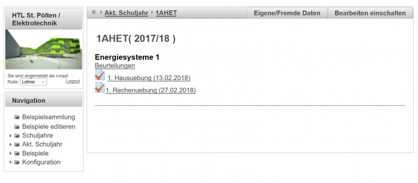
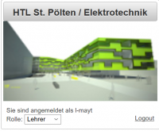
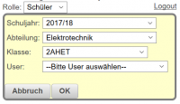
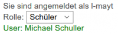

# LeTTo-Hauptansicht
 ]]

## Login-Informationen
Unterhalb des Server-Logos finden Sie den Bereich mit den Login-Informationen:
 

###  Änderung der Rolle 
Folgende Benutzer-Rollen sind möglich:
* [globaler Administrator](/notimplemented/index.md)
* [Administrator](/notimplemented/index.md)
* [Lehrer](/notimplemented/index.md)
* [Schüler](/notimplemented/index.md)
Angezeigt wird der Benutzernamen des angemeldeten Users. Abhängig von der Rolle des Benutzers kann der Login-Status verändert werden. Administratoren können die Rolle eines Lehrers oder eines Schülers annehmen, Lehrer können die Rolle eines Schülers annehmen.
 

Beim Wechsel der Rolle kann mit der Auswahl von Abteilung, Klasse und Benutzer jeder beliebige Schüler ausgewählt werden. Nach Bestätigung mit OK verhält sich das System so, wie wenn sich der ausgewählte Benutzer eingeloggt hätte.
 

Der ausgwählte Benutzer wird in grüner Farbe angezeigt.

###  Ausloggen / Abmelden 
Wenn das System für 20 Minuten nicht bedient wird, dann werden Sie automatisch ausgeloggt. 
Trotzdem melden Sie sich bitte vom System ab, wenn Sie den Arbeitsplatz verlassen.

## Navigation
Die Navigation kann über die Baumstruktur im Bereich _Navigation_ erfolgen oder auch über die Links oberhalb des Hauptfensters.
Beim Klick auf einen Link oder auf die Baumstruktur wird im [Arbeitsbereich](#arbeitsbereich-) eine Übersicht mit allen weiteren Möglichkeiten angeboten.

**Tipp:** In der [Navigation](#navigation-) kann ein Element durch Klick auf das kleine Dreickssymbol  aufgeklappt werden.

Der Navigationsbereich tritt nach dem Login am [LeTTo-Server](../Hauptseite/index.md) in Erscheinung und dient zur Navigation über die Funktionalitäten des Servers.

Folgende Bereiche sind dabei in der Navigation für Lehrer und für Schüler auswählbar.

###  Navigation für Lehrer 
####  Beispielsammlung / Beispiele editieren
* [Fragevorschau bestehender Beispiele](../Beispielsammlung/index.md)
* [Beispiele erstellen und verändern](../BeispielsammlungEditieren/index.md)
* [Baumstrukturartige Darstellung der Beispielsammlung](../Ordnerverwaltung/index.md)
* [Testerstellung](../ErstellenvonTests/index.md)

####  Schuljahre 
* [Liste aller Schuljahre](../Schuljahr/index.md), die für diesen Lehrer angelegt sind. Hier kann der Lehrer auch ein vergangenes Schuljahr selektieren. In jedem Schuljahr wird die Lehrfächerverteilung in LeTTo eingespielt. Damit sind dann in jedem Schuljahr die entsprechenden Gegenstände dem Lehrer zugeordnet.

####  Akt. Schuljahr 
* [Liste aller Klassen](../Schuljahr/index.md), die vom eingeloggten Lehrer im aktuellen Schuljahr unterrichtet werden: Aus der Liste der Klassen kann eine Klasse für die Bearbeitung im Hauptfenster gewählt werden.

####  Konfiguration 
* _Profil anzeigen_: [Ansicht des eigenen Profils](../Profilanzeigen/index.md)
* _Klassenzuordnung_: Hier ist die [Lehrfächerverteilung](../Klassenzuordnung/index.md) abgebildet und jeder Lehrer kann sich zu einer Klasse hinzufügen, wenn er laut Datenimport nicht eingetragen ist. Diese Option kann verwendet werden, um zB. bei Supplierstunden oder Vertretungen Online-Tests zum Üben zu geben. Wenn Klasse, Fach und Gegenstand eingetragen sind, dann kann ganz normal ein [Test](../ErstellenvonTests/index.md) angelegt werden.
* _Themen-Abos_: Hier kann jeder Lehrer die [angezeigten Hauptthemen und Lehrer der Beispielsammlung](../Abos/index.md) einschränken.
* _Benutzer_: [Benutzer suchen](../Benutzer/index.md) und [Schülerpasswörter setzen](../Schülerpasswortzurücksetzen/index.md)
* _Beurteilung_: [Konfiguration des Beurteilungssystems](../Beurteilungskonfiguration/index.md)
* _Statistik_: Information für die Programmierer
* _Lehrplan_: [Ansicht und Konfiguration der Lehrpläne](../Lehrpläne/index.md)
* _User-Konfiguration_: [Festlegung von Benutzerdefinierten Parametern](../User-Konfiguration/index.md)

###  Navigation für Schüler 
#### Schuljahre
* Liste aller Schuljahre in welchen der Schüler am LeTTo angelegt war: Hier kann der Schüler auch ein vergangenes Schuljahr selektieren

#### Akt. Schuljahr
* zur Auswahl des aktuellen Schuljahres

#### Mein Profil
* [Ansicht des eigenen Schülerprofils](../Profilanzeigen/index.md)

## Arbeitsbereich
Im Arbeitsbereich werden alle Tests und Beurteilungen sowie die Verwaltung und Konfiguration durchgeführt.
Je nach Auswahl in der Navigation erfolgt die Darstellung im Arbeitsbereich.

