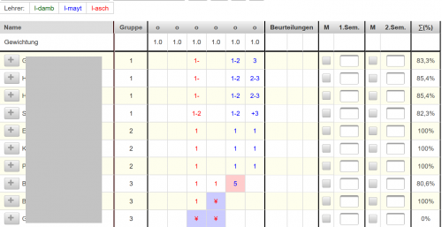
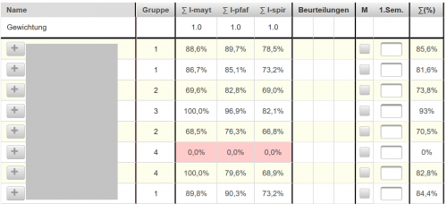

# Lehrerübergreifender Katalog
Siehe auch [Einzel-Katalog eines Lehrers](../Katalog/index.md)

Für alle Lehrer, die einen Gegenstand gemeinsam unterrichten, kann der Katalog auch in einem **Summenmodus** angezeigt werden. Laut [Beurteilungskonfiguration](../Beurteilungskonfiguration/index.md#summe-über-lehrer) kann dieser Summenkatalog alle Detailnoten von allen Lehrern enthalten oder nur die Summen-Bewertungen von allen Lehrern anzeigen:

 
### Darstellung mit allen Detailnoten
Im Übersichtskatalog werden alle Detailnoten angezeigt und aus allen Detailnoten wird ein gemeinsamer Prozentwert berechnet.

Die Noten der unterrichtenden Lehrer werden in unterschiedlichen Farben angezeigt. Die Zuordnung der Farben zu den Lehrerkürzeln wird links oben angezeigt. 

Negative Teilnoten von einzelnen Lehrern (Prozentwerte kleiner als 50%) werden mit rotem Hintergrund dargestellt.

Bei Noten, bei denen noch eine [wesentliche Teilnote fehlt zusammengesetzte-beurteilungen](../Katalog/index.md#zusammengesetzte-beurteilungen), werden mit blauem Hintergrund angezeigt.

Noten, die vom eingeloggten Benutzer stammen, können auch im **Lehrerübergreifenden Katalog** geändert werden: Beim Klick auf die Note wird der [Dialog zur Notendefinition](../Katalog/index.md#eingeben-von-noten-zu-einer-klassenweise-beurteilung) angezeigt. Fremde Noten können nicht verändert werden (eine Fehlermeldung wird angezeigt).

 

### Darstellung mit den Summen-Prozentergebnissen
Für jeden Lehrer in diesem Gegenstand wird eine eigene Spalte im gemeinsamen Katalog angelegt und die Leistungen, die bei einem Lehrer erbracht wurden, werden unter einem einzelnen Prozentwert subsummiert.

Der berechnete Durchschnittswert wird als Mittelwert dieser subsummierten Durchschnittswerte dargestellt.

Negative Teilnoten von einzelnen Lehrern (Prozentwerte kleiner als 50%) werden mit rotem Hintergrund dargestellt.

## Schulweite Konfiguration von zusammenhängenden Gegenständen (Admin)

Es können durch den Schul-Administrator auch Gegenstände definiert werden, die für diese Summenbildung in einer Klasse herangezogen werden.
Die Konfiguration erfolgt im Setup-Service über die [Environment-Variable](../LeTToEnvironment) **LETTO_1_KATALOG_SHARED**.
Folgende Definitionen sind möglich:
* Beginn des Kurznamens von Gegenständen: zB: IST_ definiert einen Zusammenhang zwischen allen Gegenständen, die mit IST_ in der Kurzbezeichnung beginnen. Es wird somit eine gemeinsame Notenbildung über alle Fächer, die mit IST_ beginnen, ermöglicht.
* Definition von zusammenhängenden Gegenständen mit: Kurzname1:Kurzname2: Alle Kürzel der zusammenhängenden Gegenstände werden durch Doppelpunkt getrennt angegeben.
* Mehrere solche Definitionen können durch Leerzeichen getrennt angegeben werden.

Beispiel: ***LETTO_1_KATALOG_SHARED = IST_ IE1:AT1 FI:AIIT***

Alle Gegenstände einer Klasse, die mit IST_ beginnen, werden gemeinsam in den Summenkatalog von IST_ einbezogen und IE1 und AT1 sowie 
FI und AIIT werden in der Summendarstellung gemeinsam verwendet.

