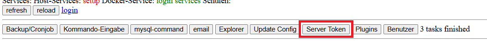
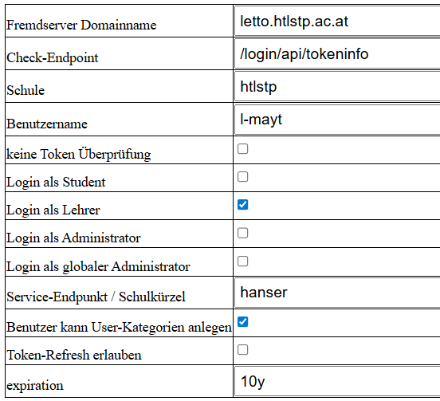
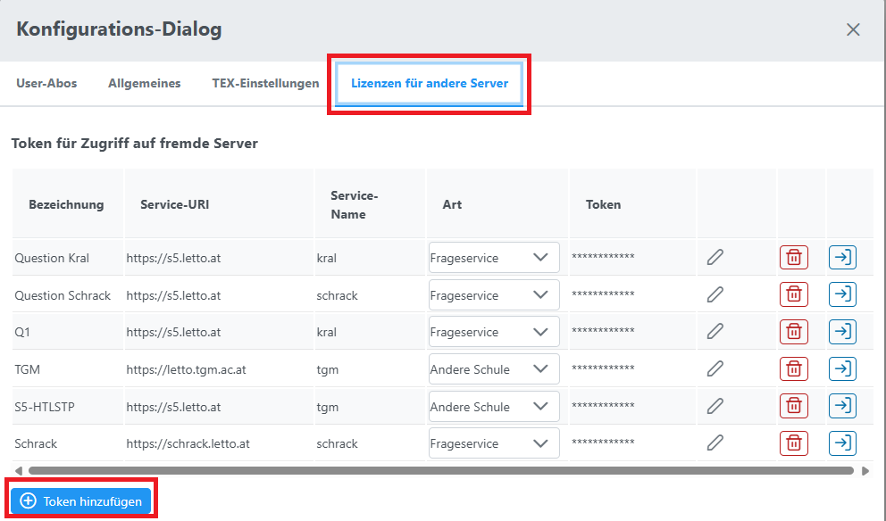
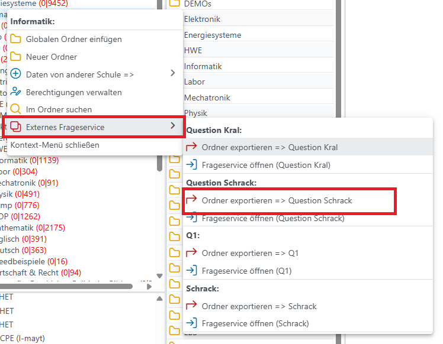
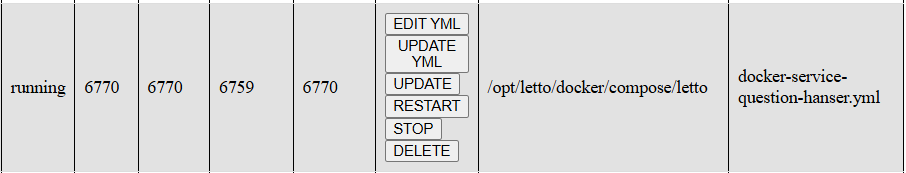

# LeTTo-Private 

## Konfiguration des Servers für LeTTo-Private

### Token für Serverkommunikation erstellen
Im Setup-Serive Server-Token erstellen:

Fogende Felder sind wesentlich:
* Fremdserver Domainname: Hier ist die Domain des Servers einzutragen, der auf den LeTTo-Private Service zugreifen darf.
* Schule: Schulkürzel der Schule, die den Zugriff erhalten soll.
* Benutzer: Benutzername des Benutzers der Schule, der den Zugriff erhalten soll.
* Login als Lehrer aktivieren!
* Benutzer kan User-Kategorien anlegen: Aktivieren, damit der Benutzer Kategorien anlegen kann.
* expiration: 10y: entspricht 10 Jahre!
* 
Der generierte Token muss von dem Benutzer, der das Service bespielen darf, auf seiner Instanz importiert werden.

## Main-Service für den Zugriff konfigurieren
Öffnen von Main am Server, von wo der Zugriff erfolgen soll und Einstellungen wählen:

Im Setup-Dialog den Token hinzufügen:

Folgende Felder sind wesentlich:
* Bezeichnung: Freie Bezeichnung des Zugriffs, der dann in der Serverliste erscheint.
* Service-URI: URL des LeTTo-Private Servers, z.B. https://lit.letto.at/
* Bezeichnung des Serive, das angesprocjen werden kann: zB: Hanser
* Art: <b>Frageservice</b> auswählen!
* Token: Hier den generierten Token einfügen.

Mit dem Häckchen-Button abschliessen und speichern.

Damit ist die autentifizierte Verbindung zum LeTTo-Private Server hergestellt und Daten können auf LeTTo-Private-Server hochgeladen werden.
Nach dem Ende der gesamten Konfiguration können über

ganze Ordner als "Bücher" auf LeTTo-Private hochgeladen werden.

# Service-Konfiguration für LeTTo-Private

## Anlegen einer yml Konfigurationsdatei für das Service durch Kopie von bestehender question-yml
Die vorhandene docker-service-question.yml kopieren:
<pre>
/opt/letto/docker/compose/letto$ cp docker-service-question.yml docker-service-question-hanser.yml
</pre>
yaml editieren:

Notwendige Änderungen bei Änderung auf zB. <b>hanser</b>:

### ports-Abschnitt komplett löschen!

Der Name bestimmt das Projekt und sollte bei jeder yml-Datei unterschiedlich sein - er kann mit -p bei docker-compose überschrieben werden
* name: letto-question-hanser
* services auf question-hanser:
* hostname: letto-question-hanser
* container_name: letto-question-hanser

Environment Variablen:
*       - letto_question_baseadress=${QUESTION_NAME_HANSER:-hanser}
*       - letto_question_cache=${QUESTION_CACHE_HANSER:-true}

+ evt. env-Variable setzten. QUESTION_NAME_HANSER muss ungleich <b>question</b> sein!

ändern!

### .env-Einträge ergänzen
In der .env-Datei im Verzeichnis /opt/letto/docker/compose/letto folgende Einträge ergänzen:

APP_PRIVATE_URI=https://lit.letto.at/NAME

wobei NAME durch den jeweiligen Servicenamen zu ersetzen ist, zB. hanser

## 2. Variante (empfohlen): Verwendung von <b>docker-compose-question-extern.yml</b>

<i>docker-compose-question-extern.yml </i> für Servie kopieren und in <b>QUESTION_1</b> die Nummer durch 
neue Nummer oder sprechenden Namen ersetzen. Folgende Einträge in der .env-Datei anpassen:

* QUESTION_1_NAME=hanser
* QUESTION_1_OPEN=true/false
* QUESTION_1_CACHE=true
* QUESTION_1_SAVEASYNC=true
* QUESTION_1_QUESTION_HTMLPRERENDER_EXTERN=true/false

# Proxy-Konfiguration

In question.conf (alle NAME - Einträge durch den jeweiligen Servicenamen ersetzen):

<pre>
location /NAME/ {
    rewrite ^/NAME(.*)$  /question$1 break;
    resolver 127.0.0.11;
    proxy_set_header   Host $host;
    proxy_set_header   X-Real-IP $remote_addr;
    proxy_set_header   X-Forwarded-For $proxy_add_x_forwarded_for;
    proxy_set_header   X-Forwarded-Proto $scheme;
    proxy_pass         http://letto-question-NAME.nw-letto:8102;
    proxy_read_timeout 90;
}docker 
</pre>

### Bp. für Hanser -Service
<pre>
location /hanser/ {
    rewrite ^/hanser(.*)$  /question$1 break;
    resolver 127.0.0.11;
    proxy_set_header   Host $host;
    proxy_set_header   X-Real-IP $remote_addr;
    proxy_set_header   X-Forwarded-For $proxy_add_x_forwarded_for;
    proxy_set_header   X-Forwarded-Proto $scheme;
    proxy_pass         http://letto-question-hanser.nw-letto:8102;
    proxy_read_timeout 90;
}
</pre>

