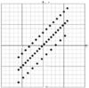
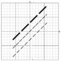
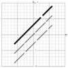
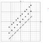
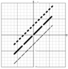
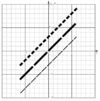
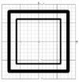
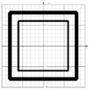
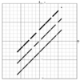

# Linienart
Die Linienart im [Plot](../Plot/index.md)-Plogin wird über den **style** Wert der als String definiert ist angegeben. 

##  Zeichen für die Definition der Linienart 

| Zeichen         | Beschreibung                                                                                                                | Beispiel                                                                                                       | Graph                                                                       |
|-----------------|-----------------------------------------------------------------------------------------------------------------------------|----------------------------------------------------------------------------------------------------------------|-----------------------------------------------------------------------------|
| . (Punkt)       | kurzer Strich bzw. Punkt                                                                                                    | line(-6,-3,6,9,style=".",size=8);line(-6,-6,6,6,style="2.",size=8);line(-6,-9,6,3,style="6.",size=8)           |   |
| - (Minus)       | mittlerer Strich                                                                                                            | line(-6,-3,6,9,style="-",size=8);line(-6,-6,6,6,style="-",size=3);line(-6,-9,6,3,style="9-",size=3)            |   |
| - (Unterstrich) | langer Strich                                                                                                               | line(-6,-3,6,9,style="_",size=8);line(-6,-6,6,6,style="_",size=3);line(-6,-9,6,3,style="9_",size=3)            |   |
| (Leerzeichen)   | Zwischenraum                                                                                                                | line(-6,-3,6,9,style=". .",size=8);line(-6,-6,6,6,style=". ",size=8);line(-6,-9,6,3,style="- ",size=3)         |   |
| r               | abgerundete Enden                                                                                                           | line(-6,-3,6,9,style=".r",size=8);line(-6,-6,6,6,style="-r",size=8);line(-6,-9,6,3,style="-r",size=3)          |   |
| s               | rechteckige Enden                                                                                                           | line(-6,-3,6,9,style=".s",size=8);line(-6,-6,6,6,style="-s",size=8);line(-6,-9,6,3,style="-s",size=3)          |   |
| R               | abgerundete äußere Ecken                                                                                                    | rect(-8,-8,8,8,style="R",size=18);rect(-6,-6,6,6,style="R",size=8)                                             |   |
| B               | angefaste äußere Ecken                                                                                                      | rect(-8,-8,8,8,style="B",size=18);rect(-6,-6,6,6,style="B",size=8)                                             |   |
| 0..9 (Ziffer)   | setzt den automatischen Leerraum zwischen zwei Linien (0:extrem kurz 9:lang). Der Wert kann auch mehrmals angegeben werden. | line(-6,-3,6,9,style="1-4-9-",size=5);line(-6,-6,6,6,style="1--9--",size=4);line(-6,-9,6,3,style="1-.",size=4) |   |

##  Beispiele 

