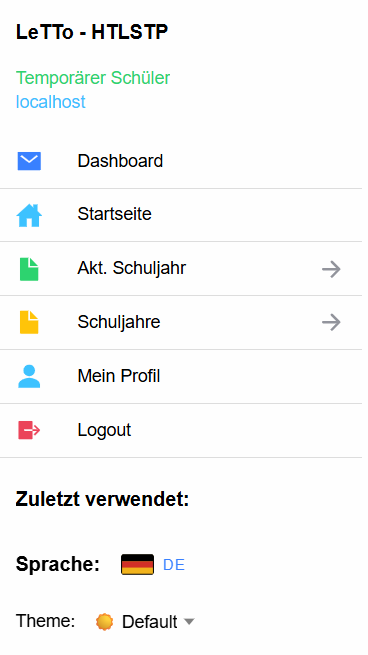
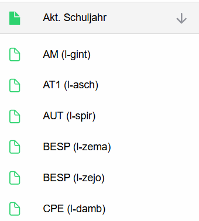
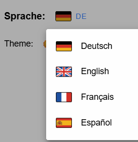

# Menü - Schüler

## Allgemeines Menü
Über das Menü kann in der Anwendung navigiert werden. 
Kurzbeschreibung der Menü-Einträge:
* **Dashboad:** Liefert für den Schüler ein [Dashboard](../Dashboard/index.md) mit allen Aktivitäten, die bearbeitet werden sollen.
* **Startseite:** Link zur Startseite für den Benutzer ([Akt. Schuljahr](../Schuljahr_neu/index.md)) damit wird der Benutzer auf die Übersicht für das aktuelle Schuljahr umgeleitet. 
* **Akt. Schuljahr:** Aufklappbare Liste mit allen Gegenständen, die akt. Schuljahr verfügbar sind.  
* **Schuljahre:** Aufklappbare Liste mit allen verfügbaren Schuljahren, damit kann auch auf Aktivitäten von früheren Schuljahren zugegriffen werden.
* **Mein Profil:** Seite zur [Konfiguration des User-Profils](../ProfilanzeigenNeu/index.md), damit können Sie vor allem ihr Passwort ändern.
* **Logout:** Abmelden von der Anwendung

## Zuletzt verwendete Aktivitäten
Unter zuletzt verwendet finden Sie eine Liste von zuletzt bearbeiteten Aktivitäten.
Über diese Links können Sie rasch zuletzt bearbeitete Aktivitäten wieder fortsetzen.

## Konfiguration für die Seite
* **Sprache:** Auswahl der gewünschten Sprache der App:  
* **Themen-Auswahl**: Auswahl des gewünschten Designs für die Anwendung (hell/dunkel/...) 