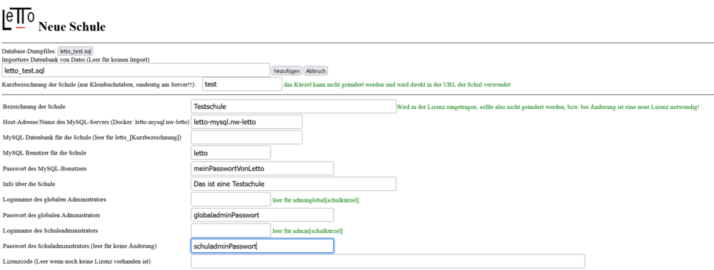

# Migration LeTTo zu Docker
##  Migration einer bestehenden LeTTo-Installation auf eine Docker-Installation 
####  siehe auch 
* [Administration](../Administration/index.md)
* [Anforderungen](../Anforderungen/index.md)
* [Installation](../Installation/index.md)
* [Dockerinstallation Erstkonfiguration](../DockerinstallationErstkonfiguration/index.md)

###  Migration einer Linux-basierten LeTTo-Installation direkt auf den bestehenden Server 
Besteht bereits eine lokale Installation auf einem Linux Server (idealerweise Ubuntu 18.04,20.04,22.04 oder Debian 11) dann kann direkt auf diesem Server eine dockerbasierte Installation vorgenommen und dabei die bestehenden Daten übernommen werden.

####  Als root-Benutzer am Server auf dem LeTTo im Verzeichnise /opt/letto installiert ist 
* Firewall so konfigurieren, dass der Port 9096 des Servers von dem PC erreichbar ist, von dem aus das Setup eingerichtet werden soll.
* Update aller Pakete
  <pre>apt-get update -y
apt-get upgrade -y
apt-get dist-upgrade -y
apt-get autoremove -y</pre>
* !! **Docker aus den Ubuntu oder Debian-Quellen darf nicht installiert sein**, bzw. muss vor dem Installationsscript deinstalliert werden. Das Install-Script installiert Docker aus den original Docker-Quellen !! 
* Stop des LeTTo-Servers
  <pre>/opt/letto/stop.sh</pre>
* MySQL-Dump der Datenbank erstellen
  <pre>mysqldump --user=letto --password=dasPasswortDesLeTToBenutzers -h 127.0.0.1 letto &gt;letto.sql</pre>
* Stop des apache2-Webservers
  <pre>service apache2 stop</pre>
* Download des Installationsscripts von [https://build.letto.at/download/install/scripts/debian-ubuntu/install-letto-ubuntu-docker.sh](https://build.letto.at/download/install/scripts/debian-ubuntu/install-letto-ubuntu-docker.sh)
  <pre>wget https://build.letto.at/download/install/scripts/debian-ubuntu/install-letto-ubuntu-docker.sh</pre>
* Start des Installationsscripts - Zu Beginn wird nach dem Passwort des administrativen Benutzers admin gefragt. Ist kein Benutzer letto am System angelegt, so wird dieser mit dem gleichen Passwort angelegt.
  <pre>bash ./install-letto-ubuntu-docker.sh</pre>

####  Schul-Kürzel definieren 
* Nun sollte man sich ein **Kürzel für die Schule** überlegen. Diese Kürzel wird im Filsystem und in der URL für die Identifikation der Schule verwendet. Das Schulkürzel darf nur aus Kleinbuchstaben und Zahlen bestehen und sollte mindestens 3 Zeichen lang sein. Im weiteren Verlauf wird das Kürzel **school** verwendet. Ein einmal definiertes Kürzel kann nicht mehr geändert werden, ausser durch ein Verschieben der Schule auf eine neue Installation bei der die Lizenzinformation verloren geht.
####  Datenbank-Dump ins database-dump Verzeichnis kopieren 
  cp letto.sql /opt/letto/docker/storage/database-dump/letto_**school**.sql
####  Verschieben der LeTTo-Daten aus der lokalen Installation in das Docker-Storage Verzeichnis 
* images Verzeichnis löschen/verschieben in Sicherungverzeichnis (kann nach erfolgreicher Installation glöscht werden)
  mv /opt/letto/docker/storage/images /opt/letto/docker/storage/imagesold
* Verschieben der Bilder in den Docker-Storage 
  mv /opt/letto/images /opt/letto/docker/storage/images
  mv /opt/letto/docker/storage/images/photos /opt/letto/docker/storage/photos/**school**
  mv /opt/letto/docker/storage/images/plugins /opt/letto/docker/storage/plugins/**school**
  mv /opt/letto/projekt /opt/letto/docker/storage/projekte/**school**
* Verlinken der Bilder wenn man die alte LeTTo-Installation parallel weiterbetreiben möchte (Nur sinnvoll, wenn dort die gleiche Revision von LeTTo läuft)
  ln -s /opt/letto/docker/storage/images /opt/letto
  ln -s /opt/letto/docker/storage/photos/**school** /opt/letto/images/photos
  ln -s /opt/letto/docker/storage/plugins/**school** /opt/letto/images/plugins
  ln -s /opt/letto/docker/storage/projekte/**school** /opt/letto/projekt
* Anpassen der Environment-Variablen für den bestehenden alten TomEE-Server wenn man die alte LeTTo-Installation parallel weiterbetreiben möchte. In der Datei /opt/tomee/bin/setenv.sh hinzufügen von:
  export letto_pathImagesPhotos=/opt/letto/docker/storage/photos/**school**
  export letto_webPathImagesPhotos=/images/photos/**school**
  export letto_pathImagesPlugins=/opt/letto/docker/storage/plugins/**school**
  export letto_webPathImagesPlugins=/images/plugins/**school**
  export letto_pathProjekte=/opt/letto/docker/storage/projekte/**school**
  export letto_pathProjektAbgaben=/opt/letto/docker/storage/projekte/**school**
  export letto_webPathProjekte=/projekte/**school**
####  weitere Konfiguration im Setup Service 
Nach der Installation ist das Setup-Service über einen Browser auf dem **https-Port 9096** erreichbar. Für die Ersteinrichtung müssen beim [ersten Start](../DockerinstallationErstkonfiguration/index.md) einige Informationen angegeben werden.

####  Anlegen der Schule 

* Im Setup-Service durch "Schule hinzufügen" erreicht man den Konfigurationsdialog für den Schulimport/Neuanlage
#####  Dialog 

* Jede Schule von der ein Datenbankdump im Verzeichnis /opt/letto/docker/storage/database-dump existiert erscheint hier als Button bei den Database-Dumpfiles. Durch einen Klick auf den Butteon wird das Dumpfile in das Feld "Importiere Datenbank" eingetragen und das Schulkürzel welches im Dateinamen nach letto_ folgt wird bei der Kurzbezeichnung eingetragen. 
* Kurzbezeichnung: Achten sie darauf, dass die Kurzbezeichnung nachträglich nicht mehr geändert werden kann!
* Die Bezeichnung der Schule wird in der Lizenzdatei eingetragen. Wird die Bezeichnung später geändert, muss auch eine neue Lizenz ausgestellt werden.
* Der Datebankname für die Schuldatenbank kann hier gesetzt werden. Im Normalfall wird das Feld leer gelassen damit die Standard-Datenbank letto_**school** verwendet wird
* Das MySQL-Benutzer für die Datenbank der Schule ist im Normalfall letto.
* Das MySQL-Benutzer-Passwort für die Datenbank der Schule mit dem zuvor angegebenen Benutzer. Vorsicht bei Multischulumgebungen, wird hier der gleiche Benutzername und der gleiche MySQL-Server verwendet, dann muss das Passwort bei allen verwendeten Schule gleich sein!!
* Info über die Schule: Information über die Schule für den Lizenzserver
* Loginname des globalen Administrators: Wird hier kein Benutzer angegeben, so wird ein Benutzer "adminglobal**school**" angelegt wenn ein Passwort dafür definiert wird.
* Passwort des globalen Administrators
* Loginname des Schuladministrators: Wird hier kein Benutzer angegeben, so wird ein Benutzer "admin**school**" angelegt wenn ein Passwort dafür definiert wird.
* Passwort des Schuladministrators
* Lizenzcode und alle restlichen Einträge werden direkt aus dem SQL-Dump übernommen, können deshalb freigelassen werden. Wird trotzdem etwas eingetragen, so gilt natürlich dieser Eintrag nach dem Import der Daten.
* Der Button "hinzufügen" legt die Schule an und spielt die Daten ein. Danach ist die Schule sofort verwendbar.

####  alte Installation neben der neuen Installation weiterbetreiben 
* alten Server wieder starten
  /opt/letto/start.sh  

* Im Setup-Service - Proxy Konfiguration
* aus den "Template-Configurations" die Datei "letto.conf" mit "COPY TO PROXY" ins Verzeichnis /opt/letto/docker/proxy kopieren
* Im oberen Bereich "Proxy-Configurations" kann die Datei "letto.conf" nun eingesehen und ggf. angepasst werden. 
* Der Button "Proxy neu starten" startet den Proxy neu und nun kann der alte Server wieder verwendet werden.
####  Kontrolle der Funktion 
Nun sollte der Server gründlich getestet werden. Ggf. können in den .env Dateien noch Optimierungen für den Speicherbedarf etc. vorgenommen werden.
####  Entfernen des Apache vom Host-System 
Wenn der Reverse-Proxy letto-proxy ordentlich funktioniert und der Letto-Server funktioniert sollte noch vom Host-System der Apache2-Webserver entfernt werden, oder zumindestens daran gehindert werden dass er beim Systemstart startet, da er sonst die Ports 80 und 443 für den Reverse-Proxy blockieren würde.
  apt-get purge apache2 -y

###  Migration einer bestehenden LeTTo-Installation auf einen neuen Linux-Server als Docker-Installation 
Liegt eine LeTTo-Installation auf einem beliebigen System vor, so kann sie wie hier beschrieben in eine Docker-Installation auf einem Linux-Server übertragen werden.

####  Am alten Server die Daten sichern und für den Transfer zum neuen Server vorbereiten 
* Stop des LeTTo-Servers
  /opt/letto/stop.sh
* MySQL-Dump der Datenbank erstellen
  mysqldump --user=letto --password=dasPasswortDesLeTToBenutzers -h 127.0.0.1 letto &gt;letto.sql
* Sichern der Plugin-Bilder
  tar -C /opt/letto/images/plugins -czf plugins.tgz . 
* Sichern der Schüler-Photos
  tar -C /opt/letto/images/photos -czf photos.tgz . 
* Sicherung der Schülerprojekte
  tar -C /opt/letto/projekt -czf projekte.tgz .
* Sichern der Bilder 
  tar -C /opt/letto/images -czf images.tgz --exclude plugins --exclude photos .
* Die erstellten Dateien werden dann am Zielsystem für den Datenimport benötigt.

####  Als root-Benutzer am Ziel Server 
* Installation des Servers als Ubuntu 22.04 oder Debian 11 System 
  * ssh-server sollte installiert sein 
  * Port 80,443,9096 müssen frei sein (kein Webserver wie etwa apache2 oder nginx installiert!)
* !! **Docker aus den Ubuntu oder Debian-Quellen darf nicht installiert sein**, bzw. muss vor dem Installationsscript deinstalliert werden. Das Install-Script installiert Docker aus den original Docker-Quellen !! 
* Firewall so konfigurieren, dass der Port 9096 des Servers von dem PC erreichbar ist, von dem aus das Setup eingerichtet werden soll.
* Update aller Packete
  apt-get update -y
  apt-get upgrade -y
  apt-get dist-upgrade -y
  apt-get autoremove -y
* Download des Installationsscripts von [https://build.letto.at/download/install/scripts/debian-ubuntu/install-letto-ubuntu-docker.sh](https://build.letto.at/download/install/scripts/debian-ubuntu/install-letto-ubuntu-docker.sh)
  wget https://build.letto.at/download/install/scripts/debian-ubuntu/install-letto-ubuntu-docker.sh
* Start des Installationsscripts - Zu Beginn wird nach dem Passwort des administrativen Benutzers admin gefragt. Ist kein Benutzer letto am System angelegt, so wird dieser mit dem gleichen Passwort angelegt.
  bash ./install-letto-ubuntu-docker.sh

####  Schul-Kürzel definieren 
* Nun sollte man sich ein **Kürzel für die Schule** überlegen. Diese Kürzel wird im Filsystem und in der URL für die Identifikation der Schule verwendet. Das Schulkürzel darf nur aus Kleinbuchstaben und Zahlen bestehen und sollte mindestens 3 Zeichen lang sein. Im weiteren Verlauf wird das Kürzel **school** verwendet. Ein einmal definiertes Kürzel kann nicht mehr geändert werden, ausser durch ein Verschieben der Schule auf eine neue Installation bei der die Lizenzinformation verloren geht.
####  Datenbank-Dump ins database-dump Verzeichnis kopieren 
  cp pfadDerGesichertenSchuldaten/letto.sql /opt/letto/docker/storage/database-dump/letto_**school**.sql
####  weitere Konfiguration im Setup Service 
Nach der Installation ist das Setup-Service über einen Browser auf dem **https-Port 9096** erreichbar. Für die Ersteinrichtung müssen beim [ersten Start](../DockerinstallationErstkonfiguration/index.md) einige Informationen angegeben werden.
####  Anlegen der Schule 

* Im Setup-Service durch "Schule hinzufügen" erreicht man den Konfigurationsdialog für den Schulimport/Neuanlage
#####  Dialog 

* Jede Schule von der ein Datenbankdump im Verzeichnis /opt/letto/docker/storage/database-dump existiert erscheint hier als Button bei den Database-Dumpfiles. Durch einen Klick auf den Butteon wird das Dumpfile in das Feld "Importiere Datenbank" eingetragen und das Schulkürzel welches im Dateinamen nach letto_ folgt wird bei der Kurzbezeichnung eingetragen. 
* Kurzbezeichnung: Achten sie darauf, dass die Kurzbezeichnung nachträglich nicht mehr geändert werden kann!
* Die Bezeichnung der Schule wird in der Lizenzdatei eingetragen. Wird die Bezeichnung später geändert, muss auch eine neue Lizenz ausgestellt werden.
* Der Datebankname für die Schuldatenbank kann hier gesetzt werden. Im Normalfall wird das Feld leer gelassen damit die Standard-Datenbank letto_**school** verwendet wird
* Das MySQL-Benutzer für die Datenbank der Schule ist im Normalfall letto.
* Das MySQL-Benutzer-Passwort für die Datenbank der Schule mit dem zuvor angegebenen Benutzer. Vorsicht bei Multischulumgebungen, wird hier der gleiche Benutzername und der gleiche MySQL-Server verwendet, dann muss das Passwort bei allen verwendeten Schule gleich sein!!
* Info über die Schule: Information über die Schule für den Lizenzserver
* Loginname des globalen Administrators: Wird hier kein Benutzer angegeben, so wird ein Benutzer "adminglobal**school**" angelegt wenn ein Passwort dafür definiert wird.
* Passwort des globalen Administrators
* Loginname des Schuladministrators: Wird hier kein Benutzer angegeben, so wird ein Benutzer "admin**school**" angelegt wenn ein Passwort dafür definiert wird.
* Passwort des Schuladministrators
* Lizenzcode und alle restlichen Einträge werden direkt aus dem SQL-Dump übernommen, können deshalb freigelassen werden. Wird trotzdem etwas eingetragen, so gilt natürlich dieser Eintrag nach dem Import der Daten.
* Der Button "hinzufügen" legt die Schule an und spielt die Daten ein.
####  kopieren der Bilder und Projekte in die Storage-Verzeichnisse 
  tar -xzf pfadDerGesichertenSchuldaten/images.tgz -C /opt/letto/docker/storage/images  
  tar -xzf pfadDerGesichertenSchuldaten/photos.tgz -C /opt/letto/docker/storage/photos/**school**
  tar -xzf pfadDerGesichertenSchuldaten/projekte.tgz -C /opt/letto/docker/storage/projekte/**school**
  tar -xzf pfadDerGesichertenSchuldaten/plugins.tgz -C /opt/letto/docker/storage/plugins/**school**

###  Migration einer bestehenden LeTTo-Installation auf einen neuen Windows-Server als Docker-Installation 
Doku noch nicht realisiert. Bitte entsprechend der Linux-Installation an das System anpassen.

###  Migration einer bestehenden LeTTo-Installation auf einen neuen MAC-Server als Docker-Installation 
Doku noch nicht realisiert. Bitte entsprechend der Linux-Installation an das System anpassen.

[Administration](../Administration/index.md)

