# MultiMeter
###  Allgemeines 
Das Plugin ist noch in der Erstellungsphase. Aktuell sind die analogen Multimeter sowie ein Wattmeter LM1010 realisiert, weitere werden folgen.

###  Funktionsweise 
* Mit diesem Plugin kann ein Multimeter mit Anzeige realsiert werden
* Das Multimeter kann einen berechneten Wert anzeigen
* als Plugin in einer Teilfrage einer Mehrfachberechnungsfrage kann das Multimeter vom Schüler interaktiv bedient werden. 

###  Multimeter für die Anzeige von berechneten Werten 

* Durch die Verwendung des Plugins mit einem PIG-Tag kann ein Wert am Multimeter angezeigt werden.
* Folgende Parameter können beim PIG-Tag sinnvoll verwendet werden:

| Parameter | Beschreibung                                                                                                                                                                                                                                                                                         |
|-----------|------------------------------------------------------------------------------------------------------------------------------------------------------------------------------------------------------------------------------------------------------------------------------------------------------|
| image     | (Standardeinstellung wenn nichts angegeben ist.) Das Messgerät zeigt einen durch var.. (Je nach Gerätetyp var,varac,varu,vari) angegebenen Wert mit einer automatischen Wahl des Messbereiches an. Hier funktioniert auch der **PDF-Ausdruck** der Anzeige.                                          |
| view      | An das Messgerät wird ein durch var.. (Je nach Gerätetyp var,varac,varu,vari) angegebener Wert angelegt. Der Schüler muss den richtigen Messbereich einstellen um ihn vom Messgerät ablesen zu können. Der Schüler nimmt durch die Veränderung des Messbereichsendwerts Einfluss auf die Zeigerlage. |

###  Multimeter als Plugin-Teilfrage einer Mehrfachberechnungsfrage 
* Durch die Verwendung des Plugins in einer Teilfrage kann der Schüler am Messgerät Messbereich und Zeigerausschalg interaktiv einstellen
* Folgende Parameter können sinnvoll (=immer nur ein Parameter) verwendet werden. Bei Mehrfachnennung wird der letzt genannte gültig:

| Parameter | Beschreibung                                                                                                                                                                                                                    |
|-----------|---------------------------------------------------------------------------------------------------------------------------------------------------------------------------------------------------------------------------------|
| view      | An das Messgerät wird ein durch var (Je nach Gerätetyp var,varac,varu,vari) angegebener Wert angelegt. Der Schüler muss den richtigen Messbereich einstellen um ihn vom Messgerät ablesen zu können.                            |
| input     | (Standardeinstellung) Das Messgerät wählt automatisch den korrekten Messbereich für den durch var.. (Je nach Gerätetyp var,varac,varu,vari) angegebenen Wert. Der Schüler muss den korrekten Zeigerausschlag selbst einstellen. |
| in        | ist eine Kurzschreibweise von input mit gleicher Funktion                                                                                                                                                                       |
| all       | Der Schüler kann Messbereich und Zeigerausschlag selbst einstellen.                                                                                                                                                             |

#####  Vorgangsweise bei der Verwendung des Multimeter-Plugins in einer Teilfrage 
* Mehrfachberechnungsfrage Erstellen
* Erstellung des Plugins 
* Hinzufügen einer Teilfrage
* Mode der Teilfrage auf Plugin setzen  
* Im Fragentext Bsp.: [Q0](Q0) einfügen siehe folgendes Bsp.:

 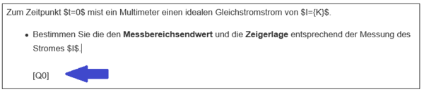

* Zusätzliche Parameter im blauen Bereich von Erg/Info eingeben. Nach dem Pluginnamen folgen nach einem Doppelpunkt die Parameter.
* Das Ergebnis muss mit der korrekten Einheit als Ergebnis vorhanden sein

Bsp:
 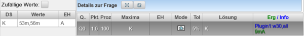

###  Angabe des angezeigten Wertes 
* Der angezeigte Wert muss je nach Type des Messgerätes korrekt angegeben werden
* Über die Einheit des angegebenen Wertes wird über den Messbereich entschieden

| Parameter | Beschreibung                                                                                                                                                                     | Beispiel                 |
|-----------|----------------------------------------------------------------------------------------------------------------------------------------------------------------------------------|--------------------------|
| var=      | Gleichwert (arithmetischer Mittelwert oder linearer zeitlicher Mittelwert) eines Signales oder Wert einer reellen Größe (Widerstand, Frequenz, etc.)                             | var=10V                  |
| varac=    | Effektivwert des Wechselanteiles einer Spannung oder eines Stromes (auch als komplexe Zahl möglich)                                                                              | varac=5V                 |
| varU=     | Effektivwert der Spannung als komplexe Zahl für Wattmeter-Anzeigen                                                                                                               | varU=120V                |
| varI=     | Effektivwert des Stromes als komplexe Zahl für Wattmeter-Anzeigen                                                                                                                | varI=2A+%i*1A            |
| ac        | interpretiert einen mit var= angegebenen Strom oder Spannungswert als Wechselspannungswert                                                                                       | var=10V,ac               |
| acdc      | Zeigt den wahren Effektivwert TrueRMS an, wenn das Messgerät das kann und verwendet dabei var= für den Gleichspannungsanteil und varac= für den Effektivwert des Wechselanteiles |                          |
| P         | Wattmeter in der Betriebsart - Wirkleistung                                                                                                                                      | varU=50V,varI=2A+%i*1A,P |
| Q         | Wattmeter in der Betriebsart - Blindleistung                                                                                                                                     | varU=U1,varI=I1,Q        |
| S         | Wattmeter in der Betriebsart - Scheinleistung (wenn es vom Wattmeter unterstützt wird                                                                                            | varU=U1,varI=I1,S        |

###  sonstige Parameter 

| Parameter | Beschreibung                                                                                                                                              |
|-----------|-----------------------------------------------------------------------------------------------------------------------------------------------------------|
| debug     | Für die Beispielerstellung werden Debug-Informationen angezeigt. Dient nur zur Hilfe bei der Entwicklung und sollte beim Schüler immer abgeschaltet sein! |
| cursor    | Zeigt einen Fadenkreuz-Cursor für die Plugin-Entwicklung                                                                                                  |
| w40       | Setzt den Standard-Zoom auf 40% der Bereichsbreite                                                                                                        |
| back      | zeigt die Rückseite des Gerätes wenn sie bei dem angegebenen Geräte zur Verfügung steht                                                                   |
| off       | Es wird kein Zeiger angezeigt (Alter Parameter nur mehr aus Kompatibilitätsgründen), sollte nicht mehr verwendet werden.                                  |
|           |                                                                                                                                                           |

###  realisierte Multimeter 
Die Art des Multimeters muss in der **Plugin-Definition** angegeben werden (nicht erst im PIG-Tag oder in der Teilfrage)

| Multimeter | Beschreibung | Bild                                                                        | Rückseite                                                                   |
|------------|--------------|-----------------------------------------------------------------------------|-----------------------------------------------------------------------------|
| UNIGOR     |              |  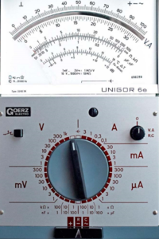 |  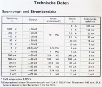 |
| CA5001     |              |  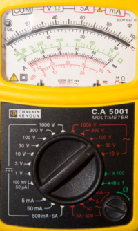 |                                                                             |
| CA5011     |              |  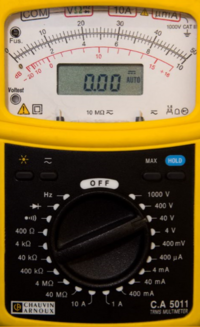 |                                                                             |
| GANZUNIV1  |              |  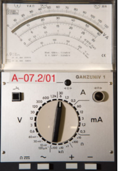 |  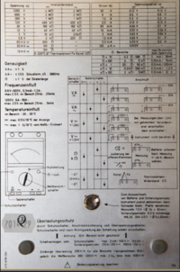 |
| NORMAMETER |              |   |  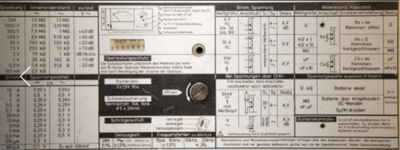 |
| LM1010     |              |  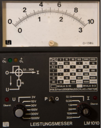 |                                                                             |

###  Beispiele PIG 

| Plugin-Definition                | Beschreibung              | Bild                                                                        |
|----------------------------------|---------------------------|-----------------------------------------------------------------------------|
| CA5001,var=0.03A;image           | Strommessung DC           |   |
| CA5011,varac=25mA;image          | Strommessung AC           |   |
| CA5011,var=10V,varac=5V;acdc     | Spannungsmessung True-RMS |  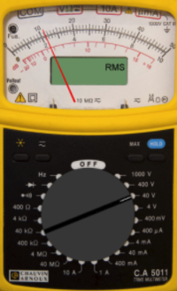 |
| LM1010,varU=140V,varI=3A+%i*2A,P | Wirkleistungsmessung      |  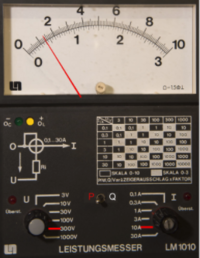 |
| GANZUNIV1,var=35kOhm             | Widerstandsmessung        |  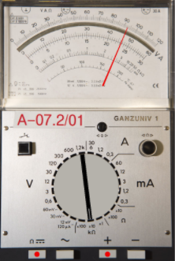             |

[Plugins](../Plugins/index.md)

