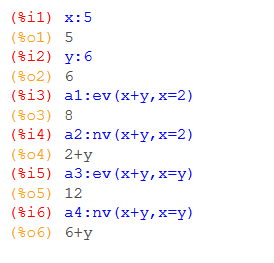

# Nv
Auswertung eines Ausdruckes, als Parameter können Gleichungen angegeben werden, welche dann in den Ausdruck eingesetzt werden. Im Gegensatz zu ev werden bestehende Variable nur in den Gleichungen, aber nicht im Ausdruck selbst eingesetzt!

## Beispiel
 

## siehe auch
* [Berechnungen](../Berechnungen/index.md)

