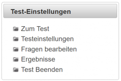

# Online-Tests
Unter Tests oder Online-Tests versteht man in LeTTo jedwede mögliche elektronische Aufgabenstellung, die auch teilweise automatisch von System korrigierbar ist. **Tests** im Sprachgebrauch von LeTTo umfassen also nicht nur Tests im herkömmlichen Sinn, sondern alle möglichen Beurteilungsformen wie Hausübungen, Mitarbeitskontrollen, Schularbeiten, Rechenübungen etc.
Online-Test werden normalerweise für eine ganze Klasse zur Verfügung gestellt. Je nach Art und Konfiguration zeigen diese Onlne-Tests unterschiedliches Verhalten.

Links zum [Klassenzimmer](../Klassenzimmer/index.md), zur [LeTTo-Hauptansicht](../LeTTo-Hauptansicht/index.md)
### Testnavigation für Lehrer
 
Ist ein Test im [Klassenzimmer](../Klassenzimmer/index.md) ausgewählt worden, dann stehenen dem Lehrer folgende Links zur Navigation zur Verfügung:
* Zum Test: [Test durchführen](#test-durchführen-)
* Testeinstellungen: [Testeinstellungen](#testeinstellungen-)
* Fragen bearbeiten: in der [Beispielsammlung](../Beispielsammlung/index.md) können die Fragen dieses Tests geändert werden
* Ergebnisse: [Anzeige aller Schülerergebnisse zu diesem Test](../Test-Ergebnisse/index.md)
* Test Beenden: [Zentrales_Beenden](#zentrales-beenden-) 

Diese Box mit der Testnavigation ist solange sichtbar, bis der Test wieder verlassen wird.

### Testeinstellungen
 
Unter dem Begriff TEST wird im Folgenden jede Online-Aktivität verstanden - also nicht nur Test an sich sondern auch SMÜ, HÜ etc.
#### Testart
Mit der Art des Tests wird das Verhalten zur Laufzeit des Tests festgelegt.
Folgende Modi sind möglich:
* Hausübung
* Test
* Rechenübung
* Stundenwiederholung
* Schularbeit

Bei Hausübungen und bei Rechenübungen ist die Kontrolle von Beispielen während der Testausführung möglich, um die Schüler zum korrekten Ergebnis hinzuführen. 

**Tipp:** Bei Rechenübungen sieht der Lehrer nach kurzer Zeit, welche Schüler noch intensiveren Betreuungsbedarf haben, während die guten Schüler selbständig arbeiten können.

Bei allen andern Testmodi gibt es während der Testausführung keine Rückmeldungen vom System. Die unterschiedlichen Modis sind deshalb verfügbar, um über die [Beurteilungskonfiguration](../Beurteilungskonfiguration/index.md) die unterschiedlichen Kategorien an Arbeiten unterschiedlich gewichten und beurteilen zu können. Siehe auch [Katalog](../Katalog/index.md).

####  Testbezeichnung, Datum 
Legt den Namen der Online-Aufgabenstellung und das Ausführungsdatum fest. Im [Klassenzimmer](../Klassenzimmer/index.md) wird immer die Kombination aus Testbezeichnung und Datum angezeigt. Der Systemvorschlag für den Namen kann geändert oder überschrieben werden.

#### Sichtbarkeit
Die Sichtbarkeit legt fest, ob der Test für SchülerInnen im [Klassenzimmer](../Klassenzimmer/index.md) verfügbar und sichtbar ist. Bei Änderung der Testart wird bei Test, Schularbeit, Stundenwiederholung die Sichtbarkeit automatisch auf unsichtbar gesetzt.
 
#### Abbruch bei Focusverlust
Ist diese Option aktiviert, schließt sich ein gestarteter Test, sobald aus dem Browserfenster geklickt wird. Das bedeutet, es wird das Suchen in parallel geöffneten Dokumenten unterbunden. Abermaliges Öffnenen des Tests für SchülerInnen ist durch das Lehrpersonal möglich. Dazu muss bei laufenden Test der entsprechende Schülertest wieder geöffnet werden.

#### Focusverlust bei Size-Änderung
Diese Option bietet die gleiche Funktionalität wie die oben beschriebene (Abbruch bei Fokusverlust) und schaltet das Browserfenster bei Teststart zusätzlich in den Vollbildmodus. Funktioniert derzeit nicht bei mobilen Endgeräten nur bei Desktop-PC. Wird die Fenstergröße verändert folgt unmittelbar die Testschließung.

#### OnRampe
Mit dieser Option müssen die Fragen, in der vom Lerhpersonal defnierten Reihenfolge beantwortet werden. Die zweite Frage wird erst freigeschalten (beantwortbar), wenn die erste Frage von den SchülerInnen korrekt beantwortet worden ist. 

**Tipp**: Es ist möglich den Lehrpfad vozugeben. 

**Tipp**: Spielemodus: Jede Frage entspricht einem Spiele-Level. Die Fragen müssen didaktisch von der leichtesten bis zur schwierigsten Frage vom Lehrpersonal bei Testerstellung gereiht werden. Wir empfehlen einen **Didaktischen Faden** bereits bei der Fragennamendefinition zu berücksichtigen. LeTTo erlaubt bei der Fragenerstellung die Fragen alphabetisch (nummerisch) zu ordnen. Die Ordnung entspricht dann gleich der didaktischen Ordnung (=Schwierigkeitsgrad).

#### Punkteabzug bei fehlerhafter Eingabe
Für jeden fehlerhaften Versuch werden Punkte abgezogen. Der Abzug wird in der Frage selbst unter der Einstellung Penalty festgelegt.
 

**Tipp**: Mit dieser Option wird die Schülerstrategie "Probieren bis richtig" unterbunden.

#### Anzahl an Gruppen
Über die Anzahl an Gruppen legen Sie fest, wieviele Gruppen ein Test haben soll. In der [Beispielsammlung](../Beispielsammlung/index.md) können sie dann für die unterschiedlichen Gruppen die Beispiele festlegen. 

**Achtung:** Wenn Sie die Gruppenanzahl verkleinern, dann gehen die Beispiele in gelöschten Gruppen verloren!

#### Gruppierung
 
Über Gruppierung können mehrer Tests zu einer Gruppe von Tests zusammengefasst werden, wobei immer nur der beste Testversuch im [Katalog](../Katalog/index.md) aufscheint und bewertet wird. Anwendung der Gruppierung bei Nachtests, Nachschularbeiten oder Prüfungen, die nach einer Abwesenheit für den versäumten Test durchgeführt werden.

Im angezeigten Dialog sehen Sie alle weiteren Online-Tests, die dieser Aktivität zugeordnet sind. 
Mit der nebenstehenden Auswahlliste können Sie diesen Test einem anderen Test zuordnen oder diese Zuordnung mit _Keine Gruppe_ wieder entfernen.

#### Bereiche
Es können Bereiche eines Tests definiert werden. Bspw. ist die Englisch-sRDP in mehrere Bereiche gegliedert. 
 
Diese Bereiche erlauben einen Test als einzelnen Test zu verwalten und durchzuführen. Die Testauswertung erfolgt seitens von LeTTo seperat für die einzelnen definierten Bereiche.

 

#### Zeitbegrenzung
Mit Start und Stop können Sie festlegen, wann der Test verfügbar sein soll. Werden beide Optionen (Start und Stop) aktiviert, dann ist der Test für die Schüler nur in diesem Zeitintervall sichtbar/verfügbar und kann somit nur in diesem Zeitintervall gestartet werden. 

**Achtung:** Nur wenn die Checkboxen gesetzt sind, ist die zeitbegrenzung aktiv!

Mit **Begrenzung in Minuten** legen Sie fest, wie lange ein Testversuch maximal dauern darf. Der Schüler sieht bei Aktivierung der Zeitbegrenzung die noch zur Verfügung stehenden Arbeitszeit. Der Test schließt automatisch nach Ablauf der Zeit. 

**Achtung:** Die Zeitbegrenzung führt bei vielen Schülern zu einem vermeidbaren, erhöhten Stresslevel.

#### Sonstige Einstellungen
Das Beurteilungsschema kann aus einer Liste von verfügbaren Voreinstellungen ausgewählt werden. Im Sinne der Einheitlichkeit können diese Beurteilungsschemen nur vom Administrator festgelegt werden.

#### Einheiteneinstellungen

Abzug: Legt fest, wieviele Prozent bei einer fehlerhaften Einheit abgezogen werden. 

Globale Einheitenkonfiguration: Es werden nicht die Testeinstellungen, sondern der global definierte Umgang mit Einheiten verwendet.

### Test durchführen
#### &lt;span id="Test starten"&gt;Test starten
 
Durch Anklicken eines Online-Tests im [Klassenzimmer](../Klassenzimmer/index.md) wird der Tests zum Start vorbereitet.
Ist der Test verfügbar (siehe auch [Testeinstellungen](#testeinstellungen-)) und noch nicht gestartet, dann kann ein Testversuch mit **Test starten** begonnen werden.

Beim Starten des Tests werden die Zahlenwerte aller [Variablen](../Datensätze/index.md) von Berechnungsbeispielen festgelegt. **Achtung:** Diese Zahlenwerte können NICHT mehr geändert werden, da sonst die Schülerergebnisse nicht mehr zur Angabe passen würden. Fehler in Beispielen, die schon in gestarteten Test bemerkt werden, können geändert werden (vor allem math. Fehler), ausser Fehler die bei der Datensatz-Definition gemacht wurden!

 
Tests können jederzeit unterbrochen werden. Ist ein Testversuch noch nicht beendet, dann kann er später fortgesetzt werden.

In nebenstehender Abbildung ist ein Versuch eines Lehrers dargestellt. Lehrerversuche können mit dem x-Löschen-Button wieder entfernt werden. Für Schüler ist ein Löschen von Testversuchen nicht möglich.

#### &lt;span id="Test nicht verfügbar"&gt;Test nicht verfügbar
In der [Tests#testeinstellungen-](/notimplemented/index.md) kann festgelegt werden, zu welchen Zeitpunkten ein Test ausgeführt werden darf. Ist das Öffnen eines bereits begonnenen Testversuchts nicht mehr erlaubt, dann erscheint am Bildschirm folgende Meldung:
 

Angezeigt wird auch der Zeitraum, in dem die Testbearbeitung erlaubt war.

#### &lt;span id="Testfragen"&gt;Testfragen
 
Wurde der Testversuch gestartet, dann ist im [Navigationsbereich](../LeTTo-Hauptansicht/index.md#navigation) auf der linken Seite eine Box mit **Fragenauswahl** zu sehen. 

**Naviagation innerhalb des Tests**
In der Fragenauswahl sind alle Beispiele dieses Tests durch Beispielnummern angeführt. Jedes Beispiel kann durch Klick auf die entsprechende Beispielnummer ausgewählt und angezeigt werden. Wird ein anderes Beispiel gewählt, dann werden alle Eingaben automatisch zwischengespeichert.

 
Je nach [Testeinstellung](#testeinstellung-) sind Testfragen während der Testausführung kontrollierbar oder nicht. Im Modus 'Test' kann der Schüler die Eingaben natürlich nicht kontrollieren, am Ende des Beispiels ist nur der Button **Nächste Frage** eingeblendet.
Im Modus **Hausübung** oder **Rechenübung** wird ein weiterer Button **Prüfen** angezeigt, mit dem die Eingabe auf Richtigkeit geprüft werden kann.

Zum Abgeben oder Beenden des Onine-Tests finden Sie in der **Fragenauswahl** einen Link **Test beenden / beurteilen**.

In der **Fragenauswahl** werden Fragen, die bereits beantwortet, aber noch nicht kontrolliert wurden, mit grauer Farbe hinterlegt. Kontrollierte Fragen werden in roter, gelber oder grüner Farbe gekennzeichnet. Dabei bedeutet:
* hellrot: falsch
* hellgelb: teilweise richtig
* hellgrün: richtig
* Die Farben kräftiger bedeuten, dass der Lehrer das Ergebnis manuell und nachträglich geändert hat.

#### &lt;span id="Test beenden"&gt;Test beenden
Vor der Abgabe eines Tests bekommt der Schüler noch eine Rückmeldung, ob alle Fragen beantwortet wurden. Sollten irrtümlich Fragen vergessen worden sein, dann kann man mit den entsprechenden Buttons neben den Fragen wieder zur Fragebeantwortung wechseln.

 

Mit **Test abgeben** wird der Test endgültig abgegeben, es sind dann keine Änderungen mehr möglich.

Mit **Test fortsetzten** kann man zurück zur Testbearbeitung wechseln.

### Test-Ergebnisse
Siehe [Test-Ergebnisse](../Test-Ergebnisse/index.md)

### Zentrales Beenden
Tests können zentral vom Lehrer geschlossen werden:
 
#### Test schliessen
Mit dem Button **Test schliessen** wird in den Testeinstellungen der betreffende Test als geschlossen markiert. Neue Testversuche können dann von Schülern nicht mehr geöffnet oder fortgesetzt (bspw. nach Focusverlust) werden. Die vom Schüler zur Laufzeit aktuell bearbeiteten Beispiele können aber noch gespeichert werden.

Direkt nach dem Schliessen des Tests sind die korrekten Ergebnisse für jene Schüler sichtbar, welche bereits abgegeben haben und somit sind die korrekten Lösungen auch sichtbar.

#### Zentrales Beenden des Tests
Dies ist die schärfere Version des Test-Beendens. Alle Testversuche werden SOFORT geschlossen und auch beurteilt. Nach dem zentralen Beenden des Test werden clientseitige Eingaben der Schüler nicht mehr am Server gespeichert! Daher bitte nur nach vorheriger Ankündigung verwenden, da die aktuellen Eingaben nicht mehr übernommen werden! Es kommt durch den Klick auf den Button Nächste Frage, durch die direkte Beispielwahl des Schülers sowie der manuellen Testabgabe des Schülers zur Speicherung der Schülerlösungen am Server. 
**Das bedeutet, durch das zentrale Beenden des Tests finden alle Eingaben der Schüler, welche noch nicht am Server gespeichert sind, keine Berücksichtigung bei der Bewertung des Test. Nicht gespeicherte Eingaben gehen verloren.** 

Mit der Checkbox **Auch nicht gestartete Testversuche (negativ) beurteilen** werden für alle Schüler negative Noten eingetragen, die gar keinen Testversuch gestartet haben. Diese Option darf nicht bei Tests oder Stundenwiederholungen verwendet werden, sondern dient vor allem zur negativen Beurteilung von nicht gemachten Hausübungen oder Rechenübungen.

