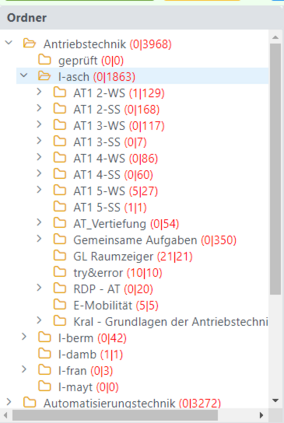
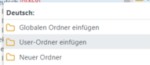
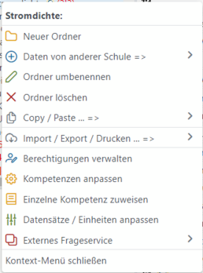
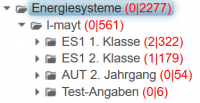

# Ordnerverwaltung
## Verwaltung von Kategorien und Ordnern

Kategorien und Hauptthemen sind Synonyme für einen Ordner, wie er in einem Dateisystem verwendet wird. In Letto wird für einen Ordner häufig auch der Begriff **Kategorie verwendet**, da in vielen Learn-Management-Systemen dieser Begriff üblich ist.

### Ordner-Baum
 
Die Themenliste dient als Basis für die Organisation der Fragesammlung. Sie ist als Baum aufgebaut und kann ähnlich dem Ordnerbaum im Explorer durchsucht werden.

Die oberste Ordnerebene enthält die Hauptthemen, die nur vom Administrator angelegt werden können, um "Datenwildwuchs" zu verhindern. Innerhalb eines Hauptthemas  kann jeder Lehrer einen Unterordner mit seinem Loginnamen anlegen. 
 Innerhalb dieses Ordners kann jeder Lehrer seine eigene Ordnerstruktur mit Kategorien anlegen und hat in seinem Bereich alle Rechte.
Der Administrator kann auch '''[Globale Kategorien](../GlobaleKategorien/index.md)''' einfügen. Diese können als gemeinsame Ordner für mehrere Benutzer dienen, wenn der Administrator diesen Benutzern die entsprechenden Rechte zugewiesen hat.

**Tipp zur Navigation:** Verwenden Sie bitte zum raschen Navigieren durch die Ordnerstruktur die **kleinen Dreiecke**  auf der linken Seite jedes Ordners! Damit werden Order auf- und zugeklappt, ohne dass auf die Datenbank zugegriffen werden muss, was die Reaktionszeiten verkürzt.
Wenn Sie die Fragen eines Ordners anzeigen wollen, dann müssen sie auf den Ordner klicken, dann wird die [Fragenliste](../Fragenliste/index.md) neu geladen und die erste Frage in dieser Liste wird angezeigt.

#### Rechte
Innerhalb eines eigenen Ordners hat jeder Lehrer volle Kontrolle über seine Daten und damit alle Rechte. Andere Lehrer können alle Beispiele sehen und bearbeiten, aber nicht ändern und löschen.

Jeder Lehrer kann aber Kollegen das Recht geben, innerhalb eines Ordners Beispiele zu **ändern**, zu **löschen** oder neue Beispiele **eizufügen**. (Kontext-Menü =&gt; 

#### Kontext-Menü
 
Das Kontext-Menü kann immer mit der rechten Maustaste geöffnet werden. Folgende Optionen stehen zur Verfügung:
* Ausschneiden (CTRL-X): Kategorie wird vorgemerkt zum späteren Verschieben
* Einfügen (CTRL-V): Einfügen von Daten aus der Zwischenablage. Eingefügt oder verschoben werden Fragen oder Kategorien
* Kategorie umbenennen: Ein Eingabefeld öffnet sich zur Definition des neuen Kategorienamens
* Neue Kategorie: Ein Eingabefeld öffnet sich zur Definition des neuen Kategorienamens
* Kategorie löschen: Löschen der aktuell ausgewählten Kategorie. Enthält der Ordner noch Daten, dann wird eine Warnung angezeigt.

* Kategorie drucken: Erzeugt eine [PDF-Fragesammlung](../PDF/index.md) aller Fragen in der aktuellen Kategorie
* [Reife- Diplomprüfungsfragen](../Reife-undDiplomprüfungsfragen/index.md): Erstellt ein PDF-Dokument zur Verwendung bei mündlichen Prüfungen für die Reife- und Diplomprüfung
* [Kategorie exportieren](../Datenexportieren/index.md): Alle Fragen und Unterordner in einem XML-Format (Datentyp: LTO) exportieren
* [Daten importieren](../Fragenimportieren/index.md): Aus einem LTO-File Fragen in den akt. Ordner importieren

* [Berechtigungen verwalten](../Berechtigungenverwalten/index.md): Hiermit können Sie in einem beliebigen Ordner anderen Benutzern Rechte zum Einfügen / Ändern / Löschen geben
* [Kompetenzen anpassen](../Kompetenzenanpassen/index.md): Festlegung, welche Themen aus dem Lehrplan in diesem Ordner verwendet werden können.
* [Einzelne Kompetenz zuweisen](../EinzelneKompetenzzuweisen/index.md): Diesem Ordner eine Kometenz zuweisen: Diese wird beim Anlegen einer neuen Frage automatisch zugewiesen.
* [Datensätze / Einheiten anpassen](../Datensätze_Einheitenanpassen/index.md): Definition von Werten bzw. Einheiten, die bestimten Variablen defaultmäßig zugewiesen werden

## Anzeige der Fragenanzahl
 

Wird in der [Benutzerkonfiguration](../User-Konfiguration/index.md) der Parameter **showQuestionCount** auf **1** gesetzt, dann werden in der Baumansicht die Anzahl an Fragen pro Ordner angezeigt. 

Die erste Zahl beschreibt die Anzahl an Fragen im aktuellen Ordner, die zweite Zahl gibt die Anzahl an Fragen in allen Unterordnern wieder.

## Online-Tests

Im unteren Bereich der Kategorien befindet sich der Bereich der Online-Tests.
Die Lehrfächerverteilungen sind im System verfügbar und somit sieht hier jeder Lehrer seine Klassen und Gegenstände eines Schuljahres.

