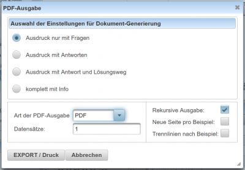

# PDF
Der Dialog zur Erstellung von **PDF-Dokumenten** kann entweder aus dem [Kategorie-Baum](../Ordnerverwaltung/index.md) über das [Kontext-Menü](../Ordnerverwaltung/index.md#kontext-menü) aufgerufen werden oder für eine einzelne Frage aus dem [Toolbar](../Toolbar/index.md) mit dem  Button.

## Ausgabe in PDF-Dokumenten
 

Fragen können einzeln als PDF-Dokument erzeugt werden oder es können alle Fragen einer Kategorie inklusive aller Unterordner in ein PDF-Dokument als Fragensammlung ausgegeben werden. 

Folgende Einstellungsmöglichkeiten sind verfügbar:

| Ausdruck nur mit Fragen             | Am Druck sind nur die Angaben der Fragen vorhanden                                               |
|-------------------------------------|--------------------------------------------------------------------------------------------------|
| Ausdruck mit Antworten              | Ausgedruckt werden die Angaben und die Ergebnisse der Fragen                                     |
| Ausdruck mit Antwort und Lösungsweg | Ausgedruckt werden die Angaben, die Ergebnisse und der Lösungsweg in Form des Maxima-Lösungswegs |
| komplett mit Info                   | Alle Infos zur Frage inklusive Angabe, Ergebnisse, … ausgeben                                    |

### Art der PDF-Ausgabe
Die Ausgabe kann als PDF-Dokument oder als TEX-Code exportiert werden.

### Datensätze
Mit dem Eingabefeld zur Datensatzdefinition kann festgelegt werden, welche Seiten ausgedruckt werden sollen.
Möglich sind einzelne Datensatzangeben, Kombinationen aus Zahlen mit Beistrichen und Bindestrichen.
* 1 : Die Werte des 1. Datensatzes werden in der Angabe verwendet
* 1,3,5-8: Die Werte des 1,3,5,6,7,und 8. Datensatzes werden verwendet

### Angaben für den Ausdruck von Kategorien

| Rekursive Ausgabe         | Wenn diese Checkbox angewählt wurde, dann werden alle Unterordner und alle darin enthaltenen Fragen in den Ausdruck eingebunden |
|---------------------------|---------------------------------------------------------------------------------------------------------------------------------|
| Neue Seite pro Blatt      | Jede Seite wird auf ein getrenntes Blatt ausgedruckt                                                                            |
| Trennstrich nach Beispiel | Nach jedem Beispiel wird ein Trennstrich über die ganze Seitenbreite gezogen                                                    |

Kategorie:Dialoge

