# Plot-Plugin Cursor Darstellung
Der Cursor im Plot Plugin kann mit dem Parameter **cursor=**WERT gesetzt werden - siehe [Video](https://youtu.be/AA95ipIXtac).

| WERT    | Beschreibung                                                                                                           | Beispiel                                                                    |
|---------|------------------------------------------------------------------------------------------------------------------------|-----------------------------------------------------------------------------|
| OFF     | kein CURSOR, keine Fußlegende                                                                                          |  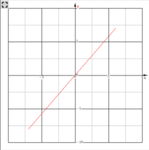 |
| ON      | Fadenkreuz, ohne Legende ohne Fußlegende                                                                               |  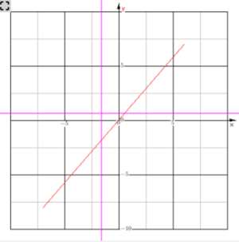 |
| PIXEL   | Fadenkreuz, Cursor Pixel-Koordinaten , ohne Fußlegende                                                                 |  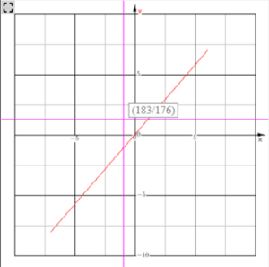 |
| NUMBERS | Fadenkreuz, Nur eine Fußlegende                                                                                        |  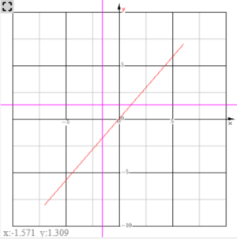 |
| CNUM    | Standardwert - Fadenkreuz, Cursor-Werte xy, Fußlegende xy                                                              |  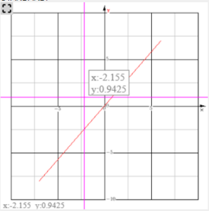 |
| CARG    | Fadenkreuz, Cursor-Werte und Fußlegende xy und abs/arg vom Ursprung                                                    |  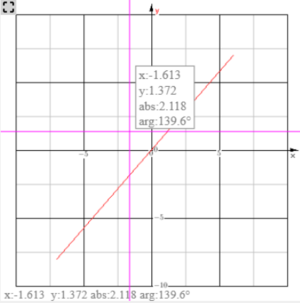 |
| CREL    | Fadenkreuz, Cursor-Werte und Fußlegende xy und abs/arg vom letzten Punkt oder vom Startwert bei toline,topoint,toarrow |  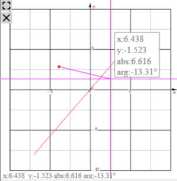 |
| POINT   | Cursor-Punkt, ohne Cursor-Werte, ohne Fußlegende                                                                       |  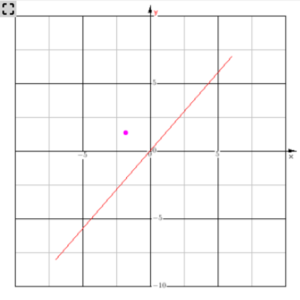 |
| PNUM    | Cursor-Punkt, Fußlegende xy                                                                                            |  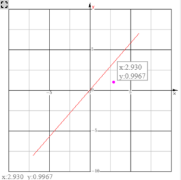 |
| PARG    | Cursor-Punkt, Cursor-Werte und Fußlegende xy und abs/arg vom letzten Punkt oder vom Ursprung                           |  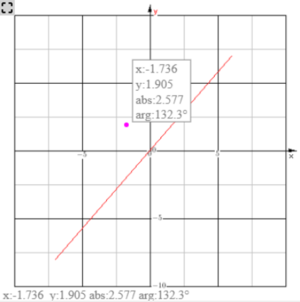 |
| ALL     | Cursor-Fadenkreuz, Fußlegende xy-Werte, Cursor Pixelangaben                                                            |  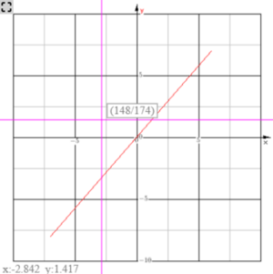 |
| HLINE   | Cursor nur horizontale Linie, keine Fußlegende keine Cursorangaben                                                     |  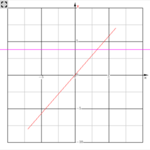 |
| HNUM    | Cursor nur horizontale Linie, Fußlegende und Cursor als Werte                                                          |  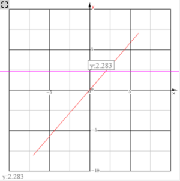 |
| VLINE   | Cursor nur vertikale Linie, keine Fußlegende keine Cursorangaben                                                       |  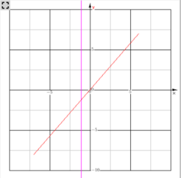 |
| VNUM    | Cursor nur vertikale Linie, Fußlegende und Cursor als Werte                                                            |  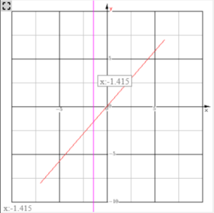 |

##  siehe auch 
* [Plugins](../Plugins/index.md)
* [Plot](../Plot/index.md)

[Plugins](../Plugins/index.md)

