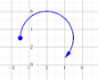
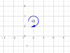
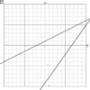

# Plot
Das Plot-Plugin dient zum Zeichnen von beliebigen Funktionsgraphen:
##  Parameter-String 
* Der Parameter-String enthält alle Funktionen die geplottet werden sollen und Parameter, welche für alle Diagramme definiert werden sollen.
* Funktionen und Parameter sind durch **Strichpunkt** getrennt.
* Konfigurationsparameter können im Parameter-String oder im PIG-Tag angegeben werden

###  normaler Funktionsplot (function) 
Der Parameter **function** muss nicht angegeben werden, da er die Standardeinstellung für Plot ist.

mögliche Funktionsdefinitionen:

| Funktion                                                                                                                                                                             | Beschreibung                                                                           | Beispiel                                                                                               | Graph                                                                       |
|--------------------------------------------------------------------------------------------------------------------------------------------------------------------------------------|----------------------------------------------------------------------------------------|--------------------------------------------------------------------------------------------------------|-----------------------------------------------------------------------------|
| f(x):= _{Funktion in x}_                                                                                                                                                             | Funktion in einer Variablen                                                            | f(x):=x^2                                                                                              |   |
| f(t):=&#91;''{Funktion x(t)}'',''{Funktion y(t)}''&#93;                                                                                                                              | parametrische Funktion                                                                 | f(t):=&#91;2*sin(t),2*cos(t)&#93;;t:0,2pi                                                             |   |
| f(x,y):=&#91;&#91;''{x1}'',''{y1}''&#93;,&#91;''{x2}'',''{y2}''&#93;,...&#93;                                                                                                        | Linienzug aus Stützpunkten                                                             | f(x,y):=&#91;&#91;0,0&#93;,&#91;1,1&#93;,&#91;2,0&#93;&#93;                                                            |   |
| f(x,y):=&#91;''{x}'',''{y}''&#93;                                                                                                                                                    | Punkt                                                                                  | f(x,y):=&#91;3,4&#93;                                                                                      |   |
| f(x,y):= _{boolsche Funktion in x und y}_                                                                                                                                            | implizit deklarierte Funktion muss auf der rechten Seite ein boolsches Ergebnis haben! | f(x,y):=x*y&lt;3                                                                                       |   |
| f(x,y):=_{Zeichenelement}_(_{Koordinaten durch Komma getrennt}_,_{parameter}_=_{wert}_) **oder**  _{Zeichenelement}_(_{Koordinaten durch Komma getrennt}_,_{parameter}_=_{wert}_) | Zeichnet vordefiniert graphische Funktionen wie Linen,Punkte,Kreise,etc.               | f(x,y):=line(1,3,5,-3,color=red,points,text=abc) **oder**  line(1,3,5,-3,color=red,points,text=abc) |   |

Anmerkung: Die Definition der Funktion mit := ist nur im Plot-Plugin erlaubt. Möchte man eine Funktion im 
Maxima-Feld definiern und dann im Plot-Plugin verwenden, so muss die Funktion im Maxima-Feld als normaler 
Ausdruck mit Doppelpunkt (wie etwa G:x^2+1) definiert werden. 

Bsp: 
* Maxima-Feld:  
* Plot-Plugin:  

####  Füllungen zwischen Graphen 

Füllbereiche können zwischen zwei Funktionen eingefügt werden. 

Syntax:

| Füllungsdefinition                        | Beschreibung                                                      | Beispiel                                                       | Graph                                                                       |
|-------------------------------------------|-------------------------------------------------------------------|----------------------------------------------------------------|-----------------------------------------------------------------------------|
| fill:_{Funktion1}_ **&gt;** _{Funktion2}_ | Füllung des Bereichs wo die Funkion1 größer als die Funktion2 ist | y(x):=-0.1*x^2+7;y(x):=0.2*x+1;**fill:ch1&gt;ch2,color=green** |   |
| fill:_{Funktion1}_ **&lt;** _{Funktion2}_ | Füllung des Bereichs wo die Funkion1 kleine als die Funktion2 ist | y(x):=-0.1*x^2+7;y(x):=0.2*x+1;**fill:ch1&lt;ch2,color=green** |   |
| fill:_{Funktion1}_ **-** _{Funktion2}_    | Füllung des Bereichs zwischen Funkion1 und Funktion2              | y(x):=-0.1*x^2+7;y(x):=0.2*x+1;**fill:ch1-ch2,color=green**    |   |

* Als Funktionsnamen kann der Name der Funktion, oder die Nummer der Funktion (ch1, ch2,...) verwendet werden
* Nach der Funktionsdefinition kann durch Beistrich getrennt die Füllung konfiguriert werden.

| Parameter       | Beschreibung                                                                                                                                   | Beispiel   |
|-----------------|------------------------------------------------------------------------------------------------------------------------------------------------|------------|
| color=_{Farbe}_ | [Farbe](../Farben/index.md) der Füllung setzen                                                                                                 | color=blue |
| size=           | Linienstärke der Füllungsumrandung                                                                                                             | size=5     |
| fill=           | Füllstärke (mit der Farbe der Linienfarbe) einer Füllung von der Graphenlinie bis zur Nulllinie 0..keine Füllung (Standard) 1..deckend gefüllt | fill=0.3   |
| from=           | Füllung beginnt bei der x-Koordinate                                                                                                           | from=2     |
| to=             | Füllung endet bei der x-Koordinate                                                                                                             | to=5       |

###  gespiegelter Funktionsplot (functiony) 
X und Y-Achse werden vertauscht! 

Beispiel:
<pre>
f(x):=x^2;x:-3,3;y:-3,3;f:size=5;functiony
</pre>
 

###  Bodediagramm (bode, bodeabs, bodearg) 

| Funktion                 | Beschreibung                              | Beispiel                                          | Graph                                                                       |
|--------------------------|-------------------------------------------|---------------------------------------------------|-----------------------------------------------------------------------------|
| G(s):= _{Funktion in s}_ | Laplace-transformierte                    | G(s):=1/(1+s);bode;s:0.01,100;abs:-60,20,size=4   |   |
| G(s):= _{Funktion in s}_ | Laplace-transformierte mit Frequenz f     | G(s):=1/(1+s);bode;f:0.01,100;abs:-60,20,size=4   |      |
| G(w):= _{Funktion in w}_ | Fouriertransformierte mit Kreisfrequenz w | G(w):=1/(1+j*w);bode;w:0.01,100;abs:-60,20,size=4 |   |
| G(w):= _{Funkion in w}_  | Fouriertransformierte mit Frequenz f      | G(w):=1/(1+j*w);bode;f:0.01,100;abs:-60,20,size=4 |   |
| G(s):= _{Funktion in s}_ | Nur Betragsfrequenzgang                   | G(s):=1/(1+0.01*s);bodeabs                        |   |
| G(s):= _{Funktion in s}_ | Nur Betragsfrequenzgang                   | G(s):=1/(1+0.01*s);bodearg                        |   |

###  Konfiguration von Achsen und Funktionen 
Alle Konfigurationen zu Achsen und Funktionen beginnen mit dem Namen der Achse oder Funktion (Bsp: i(t) dann muss i:color=red --&gt; setzt die Farbe auf rot) gefolgt von einem Doppelpunkt und der durch Beistrich getrennten Parameterliste.

<pre>
Name:par1=wert1,par2=wert2,switch1,switch2
</pre>

####  Name 

| Name          | Beschreibung                                                                       | Beispiel           | Name |
|---------------|------------------------------------------------------------------------------------|--------------------|------|
| Variable      | Eine Variable, welche als Parameter einer Funktion auf einer Achse aufgetragen ist | f(x):=x^2+2*x      | x    |
| Funktion      | Eine Funktion, welche auf einer Achse aufgetragen ist                              | f(x):=x^2+2*x      | f    |
| Absolutbetrag | Der Absolutbetrag einer komplexen Funktion                                         | G(s):=1/(1+s);bode | abs  |
| Argument      | Das Argument einer komplexen Funktion                                              | G(s):=1/(1+s);bode | arg  |

####  Parameter 
Wenn die **ersten zwei Parameter** aus Variablen und Datensätzen numerisch berechenbar sind, werden sie als **Grenzen der Achsen** verwendet. 

Weitere Parameter:

| Parameter  | Beschreibung                                                                                                                                                        | Beispiel                                     |
|------------|---------------------------------------------------------------------------------------------------------------------------------------------------------------------|----------------------------------------------|
| color      | [Farbe](../Farben/index.md) des Graphen                                                                                                                             | color=red                                    |
| size       | Linienstärke                                                                                                                                                        | size=5                                       |
| style      | [Linienart](../Linienart/index.md) setzen mit einem Definitionsstring der die Elemente Punkt,Minus,Unterstrich,Leerzeichen für die Definition der Linienart enthält | style=".-"                                   |
| pointstyle | [Punktstyle](../Punktstyle/index.md) mit einem Definitionsstring für Start,Zwischen und Endpunkt durch Minus getrennt.                                              | pointstyle=".-x-&gt;"                        |
| fill       | Füllstärke (mit der Farbe der Linienfarbe) einer Füllung von der Graphenlinie bis zur Nulllinie 0..keine Füllung (Standard) 1..deckend gefüllt                      | fill=0.3                                     |
| name       | Beschriftungstext der Legende                                                                                                                                       | name=abc                                     |
| tex        | Beschriftungstext der Legende als LaTeX Formel                                                                                                                      | tex=&#92;alpha                               |
| eh         | Einheit die bei einem parametrischen Plot angezeigt werden soll                                                                                                     | f(x,y):=&#91;&#91;1,2&#93;,&#91;3,4&#93;&#93;;y:0,3,eh=V |
| grid       | fixiert das Achsraster auf den angegebenen Wert                                                                                                                     | f(x):=x^2-3;x:-4,4,grid=1                    |
| griddiv    | setzt die Anzahl der Teilungen zwischen zwei Grid-Werte einer Achse                                                                                                 | f(x):=x^2-3;x:-4,4,griddiv=2                 |

####  Schalter 
Schalter haben keinen Wert, sondern werden nur aktiv wenn sie angegeben werden.

| Schalter | Beschreibung                                               |
|----------|------------------------------------------------------------|
| fill     | Setzt die Füllstärke auf 0.3 wie wenn fill=0.3 gesetzt ist |
| name=    | löscht die Legendenbeschriftung                            |
| 1000     | setzt die Anzahl der berechneten Werte auf 1000            |
| log      | Ändert die Skala der Achse auf eine logarithmische Skala   |
| dB       | Ändert die Skala der Achse auf eine dB-Skala               |

####  Beispiele 
<pre>
x:-4,5,color=red,size=4
arg:color=blue
</pre>

###  allgemeine Parameter 

| Parameter                            | Beschreibung                                                                                                                                                                                                                                                                                                                                                               | Beispiel                                                                                                         |
|--------------------------------------|----------------------------------------------------------------------------------------------------------------------------------------------------------------------------------------------------------------------------------------------------------------------------------------------------------------------------------------------------------------------------|------------------------------------------------------------------------------------------------------------------|
| all=off                              | Schaltet alle Achsen und Gitter ab.   mögliche Modi sind: x,y,on,off                                                                                                                                                                                                                                                                                                    | g(x):=x+4;g;y:-10,10;all=off                                                                                     |
| grid=&#91;mode&#93;                  | Setzt die Darstellungsart des Hauptgitters!   mögliche Modi sind: x,y,all,off                                                                                                                                                                                                                                                                                           | g(x):=x+4;g;y:-10,10;grid=off                                                                                    |
| helpgrid=&#91;mode&#93;              | Setzt die Darstellungsart des Hilfsgitters!   mögliche Modi sind: x,y,all,off                                                                                                                                                                                                                                                                                           |                                                                                                                  |
| axis=&#91;mode&#93;                  | Setzt die Darstellungsart der Achspfeile   mögliche Modi sind: x,y,all,off                                                                                                                                                                                                                                                                                              |                                                                                                                  |
| legend=&#91;mode&#93;                | Setzt die Darstellungsart der Achsenbeschriftung  mögliche Modi sind: x,y,all,off                                                                                                                                                                                                                                                                                       |                                                                                                                  |
| numbers=&#91;mode&#93;               | Setzt die Darstellungsart der Zahlen bei den Achsen   mögliche Modi sind: x,y,all,off                                                                                                                                                                                                                                                                                   |                                                                                                                  |
| cursor=&#91;mode&#93;                | Setzt die [ Darstellungsart des Cursors](../Plot-PluginCursorDarstellung/index.md) bei der Eingabe.   mögliche Modi sind: cnum(Standard),off,on,pixel,numbers,carg,crel,point,pnum,parg,all,hline,hnum,vline,vnum                                                                                                                                                       |                                                                                                                  |
| input=&#91;mode&#93;                 | Setzt die [Art der Eingabe](../PluginInputMode/index.md) für die **Mausbedienung** des Plugins.   mögliche Modi sind: off, measure, point, line, hline, vline, toline(x,y),topoint(x,y),toarrow(x,y), lines, arrow, points, polyline, polygon, function, mc(), mcxy()                                                                                                   |                                                                                                                  |
| inputcounter=&#91;anzahl&#93;        | Definiert die Anzahl der Punkte, die ein Schüler bei der Eingabe mindestens setzen muss. Ist nur aktiv wenn die Lösung als Funktion oder Gleichung angegeben wurde.                                                                                                                                                                                                        |                                                                                                                  |
| inputcolor=&#91;farbe&#93;           | Setzt die Zeichenfarbe für Schülereingaben                                                                                                                                                                                                                                                                                                                                 | inputcolor=blue                                                                                                  |
| bgcolor=&#91;farbe&#93;              | Setzt die Hintergrundfarbe                                                                                                                                                                                                                                                                                                                                                 | bgcolor=lightgray                                                                                                |
| gridcolor=&#91;farbe&#93;            | Setzt die Farbe des Hauptgitters                                                                                                                                                                                                                                                                                                                                           | gridcolor=black                                                                                                  |
| helpgridcolor=&#91;farbe&#93;        | Setzt die Farbe des Hilfsgitters                                                                                                                                                                                                                                                                                                                                           | helpgridcolor=black                                                                                              |
| legendcolor=&#91;farbe&#93;          | Setzt die Farbe der Achslegende                                                                                                                                                                                                                                                                                                                                            | legendcolor=black                                                                                                |
| numbercolor=&#91;farbe&#93;          | Setzt die Farbe des Zahlenbeschriftungen                                                                                                                                                                                                                                                                                                                                   | numbercolor=black                                                                                                |
| axiscolor=&#91;farbe&#93;            | Setzt die Farbe der Achsen                                                                                                                                                                                                                                                                                                                                                 | axiscolor=black                                                                                                  |
| w&#91;breite&#93;&#91;Auflösung&#93; | Breite und [Auflösung](../Plot-PluginAuflösung/index.md) des Bildes setzen.                                                                                                                                                                                                                                                                                                | w80, w80h, wh, wl, ws, w70h, w90s, w50l, w30H, w70L, w100S, w30-300, w40-800x600                                 |
| size=&#91;Auflösung&#93;             | Setzt die Bildgröße in Pixel. Siehe [Auflösung](../Plot-PluginAuflösung/index.md)                                                                                                                                                                                                                                                                                          | size=800, size=800x600                                                                                           |
| ae   achseinheit                  | Einheit bei den Achslegenden                                                                                                                                                                                                                                                                                                                                               |                                                                                                                  |
| showparams=off                       | Schaltet die Anzeige der Parameterwerte einer Parameterfunktion aus (on/off)                                                                                                                                                                                                                                                                                               | f(t):=&#91;cos(t),sin(t)&#93;;showparams=off                                                                     |
| htext=&#91;text&#93;                 | Zeigt den angegebenen Text als Achs-Legende auf der horizontalen Achse an                                                                                                                                                                                                                                                                                                  | htext=U1                                                                                                         |
| vtext=&#91;text&#93;                 | Zeigt den angegebenen Text als Achs-Legende auf der vertikalen Achse an                                                                                                                                                                                                                                                                                                    | vtext=U1                                                                                                         |
| htex=&#91;text&#93;                  | Zeigt den angegebenen Text als Achs-Legende auf der horizontalen Achse mit LaTeX Formelsatz an                                                                                                                                                                                                                                                                             | htex=&#92;alpha                                                                                                  |
| vtex=&#91;text&#93;                  | Zeigt den angegebenen Text als Achs-Legende auf der vertikalen Achse mit LaTeX Formelsatz an                                                                                                                                                                                                                                                                               | vtex=&#92;alpha                                                                                                  |
| point(f)                             | Zeichnet die durch Punkte gegebene Funktion nur aus den Stützpunkten                                                                                                                                                                                                                                                                                                       | f(x,y):=&#91;&#91;0,a&#93;,&#91;a,b&#93;&#93;;point(f)                                                           |
| line(f)                              | Zeichnet die durch Punkte gegebene Funktion als Liniezug (Standard)                                                                                                                                                                                                                                                                                                        | f(x,y):=&#91;&#91;0,a&#93;,&#91;a,b&#93;&#93;;line(f)                                                            |
| vect(f)                              | Zeichnet die durch Punkte gegebene Funktion als Vectorkette                                                                                                                                                                                                                                                                                                                | f(x,y):=&#91;&#91;0,a&#93;,&#91;a,b&#93;&#93;;vect(f)                                                            |
| ort(f)                               | Zeichnet die durch Punkte gegebene Funktion aus einzelnen Ortsvektoren                                                                                                                                                                                                                                                                                                     | f(x,y):=&#91;&#91;0,a&#93;,&#91;a,b&#93;&#93;;ort(f)                                                             |
| linepoint(f)                         | Zeichnet die durch Punkte gegebene Funktion als Linienzug mit Stützpunkten                                                                                                                                                                                                                                                                                                 | f(x,y):=&#91;&#91;0,a&#93;,&#91;a,b&#93;&#93;;linepoint(f)                                                       |
| view=x1,y1,x2,y2                     | Setzt den sichtbaren Bereich bezüglich des normal quadratischen Zeichenfensters auf das angegebene Rechteck (x1,y1)(x2,y2). Die Angabe von x1,x2,y1,y2 erfolgt mittels Ganzzahlen als Prozentwerte wobei links oben 0,0 und rechts unten 100,100 liegen. Die Standardeinstellung ist somit view=0,0,100,100  Prozentwerte sind größer als 100 und auch negativ möglich! | f(x):=sin(x);x:0,2pi;view=10,0,60,70   |

###  Ortskurve (ortskurve) 
Zeichnet die **Frequenzgangsortskurve** einer Funktion im Laplacebereich mit dem **Laplaceoperator s** oder einer Fouriertransformierten mit der **Kreisfrequenz w**.

Beispiel:
<pre>
G(s):=1/(1+0.01*s);ortskurve;ReG:-1,1;ImG:-1,1;G:size=4,color=blue
</pre>
 

###  zeichnen in ein vordefiniertes Bild 
* Ein Bild welches in der [Bildliste](../DateienzurFrageverwalten/index.md) einer Frage existiert kann als Hintergrundbild für eine Zeichnung verwendet werden. Für das Bild IMG0 verwende:
<pre>
baseimage(0)
</pre>

* Die Bildgröße wird direkt als Basis für das Koordinatensystem verwendet 
* Der Koordinatenursprung liegt links oben
* Die positive x-Achse zeigt nach rechts
* Die positive y-Achse zeigt nach unten

###  vordefinierte graphische Funktionen 

Für das einfache Zeichnen von beliebigen Elementen sind graphische Grundelemente vordefiniert. Diese Elemente können auch ein einigen anderen Plugins wie [Wsr](../Wsr/index.md), [Gsr](../Gsr/index.md), [Dsr](../Dsr/index.md), [Graph](../Graph/index.md), [DigiGraph](../DigiGraph/index.md) und [Elektronik](../Elektronik/index.md) durch Strichpunkt getrennt verwendet werden.

####  Definition 
######  Definition als Funktion 
<pre>
{name}({parameter1},{parameter2}):={zeichenelement}({parameter},{parameter},{parameter},...)
</pre>

Wie zum Beispiel:
<pre>
f(x,y):=line(-3,-4,8,2,textsize=4,textcolor=red,pointcolor=black,"HALLO")
</pre>

ANMERKUNG: falls eine weitere Funktion in der Zeichenebene mit nicht-Standard-Achsvariablen (x,y) verwendet wird sollten die Achsvariablen der anderen Funktion für parameter1 und parameter2 verwendet werden, damit wird dann in das vorhandene Achsensystem gezeichnet

Wie zum Beispiel:

<pre>
u(t):=20V*sin(2*%pi*50Hz*t)
f(t,u):=line(5ms,-5V,15ms,20V,textsize=1,textcolor=red,pointcolor=black,"HALLO")
u:-30V,30V
t:0ms,20ms
</pre>

######  direkte Definition des Zeichenelementes ohne Funktion 
Da hier der Funktionsname und die Parameter nicht definiert sind werden als **Parameter immer x und y** verwendet und der Funktionsname ist gleich wie der Zeichenelementname.
<pre>
{zeichenelement}({parameter},{parameter},{parameter},...)
</pre>

_VORSICHT_: falls in der Zeichenebenen nicht x und y bei den Achsen verwendet werden wird dadurch eine weitere y-Achse mit dem Bereich -10..10 hinzugefügt. In diesem Fall ist die funktionale Schreibweise f(x,y):=funktionsname... zu bevorzugen, wobei dann statt x und y die vorandenen Achsvariablen zu verwenden sind!

Wie zum Beispiel:
<pre>
line(-3,-4,8,2,textsize=4,textcolor=red,pointcolor=black,"HALLO")
</pre>

######  Beschreibung der Parmeter 

* name : Name der Funktion, welche wie eine normale parametrische Funktion verwendet werden kann
* parameter1 : Name der Funktionsvariablen auf der horizontalen Achse
* parameter2 : Name der Funktionsvariablen auf der verzikalen Achse
* zeichenelement: Name des Zeichenelementes wie line,point,vect,etc.
* parameter : Die Parameter  beginnen immer mit den Funktionskoordinaten, welche in Anzahl und Art von dem Zeichenelement abhängig sind. Danach können in beliebiger Reihenfolge Parameter angegeben werden welche die Funktion parametrieren wie etwa textcolor,color,points,fill,etc.

#####  Verwendung im PIG-Tag 
Alle voerdefinierten Elemente können auch durch Strichpunkt getrennt im PIG-Tag angegeben werden.

Ein Anführungszeichen " muss bei der Verwendung im PIG-Tag im Definitionsstring mit einem Backslash verblockt werden.
<pre> &#91;PIG Plugin2 "text(2,2,tex=&#92;&quot;&#92;alpha&#92;")"/&#93; </pre>

####  definierte Zeichenelemente 

| Funktion                                                   | Beschreibung                                                                                                                                                           | Beispiel                                                                                                                                                                 | Graph                                                                                                                                                        |
|------------------------------------------------------------|------------------------------------------------------------------------------------------------------------------------------------------------------------------------|--------------------------------------------------------------------------------------------------------------------------------------------------------------------------|--------------------------------------------------------------------------------------------------------------------------------------------------------------|
| line(x1,y1,x2,y2)                                          | Zeichnet eine Line vom Startpunkt x1/y1 zum Endpunkt x2/y2                                                                                                             | line(-3,-6,8,5)                                                                                                                                                          |                                                                                    |
| arrow(x1,y1,x2,y2)                                         | Zeichnet einen Pfeil vom Startpunkt x1/y1 zum Endpunkt x2/y2                                                                                                           | arrow(-3,-6,8,5)                                                                                                                                                         |                                                                                    |
| dimension(x1,y1,x2,y2)                                     | Zeichnet eine Bemaßung vom Startpunkt x1/y1 zum Endpunkt x2/y2                                                                                                         | dimension(-3,2,8,5,textsize=3)                                                                                                                                           |                                                                                    |
| hdimension(x1,y1,x2,y2,y)                                  | Zeichnet eine horizontale Bemaßung mit Maßlinien.                                                                                                                      | hdimension(2,2,6,-3,4)                                                                                                                                                   |                                                                                    |
| vdimension(x1,y1,x2,y2,x)                                  | Zeichnet eine horizontale Bemaßung mit Maßlinien.                                                                                                                      | vdimension(2,2,6,-3,8)                                                                                                                                                   |                                                                                    |
| rdimension(x1,y1,r)                                        | Zeichnet eine Radius-Bemaßung.                                                                                                                                         | circle(2,4,3);rdimension(2,4,3)                                                                                                                                          |                                                                                    |
| rdimension(x1,y1,r,alpha)                                  | Zeichnet eine Radius-Bemaßung am Positionswinkel alpha                                                                                                                 | circle(2,4,1.88);rdimension(2,4,1.88,-30°)                                                                                                                               |                                                                                    |
| point(x1,y1)                                               | Zeichnet einen Punkt am Punkt x1/y1                                                                                                                                    | point(-3,-6,"A",textsize=2)                                                                                                                                              |                                                                                    |
| drawpoint(x1,y1)                                           | Zeichnet einen Punkt am Punkt x1/y1                                                                                                                                    | drawpoint(-3,-6,"A",textsize=2)                                                                                                                                          |                                                                                    |
| circle(x1,y1,r)                                            | Zeichnet einen Kreis mit dem Radius r und dem Mittelpunkt x1/y1                                                                                                        | circle(2,3,5)                                                                                                                                                            |                                                                                    |
| oval(x1,y1,rx,ry)                                          | Zeichnet eine Ellipse mit der Halbachse rx auf der x-Achse und der Halbachse ry auf der y-Achse                                                                        | oval(2,3,5,3)                                                                                                                                                            |                                                                                    |
| arc(x1,y1,r,start,arg)                                     | Zeichnet einen Kreisbogen mit dem Mittelpunkt x1,y1 dem Radius r von einem Startwinkel start (rad) mit einer Winkelbogen von arg                                       | arc(2,3,3,180°,-220°,pointstyle="O-&gt;")                                                                                                                                |                                                                                    |
| loop(x1,x2,r)                                              | Zeichnet einen Kreisbogen mit 250° und Pfeil mit Mittelpunkt x1,y1 und Radius r. Mit dem Parameter **reverse** zeigt der Pfeil in die Gegenrichtung.                   | loop(2,3,1,tex="&#92;alpha") loop(2,3,1,tex="&#92;alpha",reverse)                                                                                                     |       |
| rect(x1,y1,x2,y2)                                          | Zeichnet ein Rechteck mit den zwei Eckpunkten x1/y1 und x2/y2                                                                                                          | rect(-3,-6,8,2)                                                                                                                                                          |                                                                                    |
| rectc(x1,y1,b,h)                                           | Zeichnet ein Rechteck mit dem Mittelpunkt x1/y1, Breite b und Höhe h                                                                                                   | rectc(2,4,8,5)                                                                                                                                                           |                                                                                    |
| text(x1,y1,text)                                           | Zeichnet einen Text mit Mittelpunk x1/y1                                                                                                                               | text(-3,4,"ABC")                                                                                                                                                         |                                                                                    |
| drawpoints(&#91;&#91;x1,y1&#93;,&#91;y2,y2&#93;,&#91;x3,y3&#93;&#93;)              | Zeichnet die Punkte welche in der Matrix definiert sind.                                                                                                               | drawpoints(&#91;&#91;2,2&#93;,&#91;8,5&#93;,&#91;3,-5&#93;,&#91;8,2&#93;&#93;)                                                                                           |                                                                                    |
| drawline(&#91;&#91;x1,y1&#93;,&#91;y2,y2&#93;,&#91;x3,y3&#93;&#93;)  | Zeichnet die Punkte welche in der Matrix definiert sind paarweise als Linien.                                                                                          | drawline(&#91;&#91;2,2&#93;,&#91;8,5&#93;,&#91;3,-5&#93;,&#91;8,2&#93;&#93;)                                                                                             |                                                                                    |
| drawvect(&#91;&#91;x1,y1&#93;,&#91;y2,y2&#93;,&#91;x3,y3&#93;&#93;)  | Zeichnet die Punkte welche in der Matrix definiert sind paarweise als Pfeile.                                                                                          | drawvect(&#91;&#91;2,2&#93;,&#91;8,5&#93;,&#91;3,-5&#93;,&#91;8,2&#93;&#93;)                                                                                             |                                                                                    |
| drawlines(&#91;&#91;x1,y1&#93;,&#91;y2,y2&#93;,&#91;x3,y3&#93;&#93;) | Zeichnet die Punkte welche in der Matrix definiert sind paarweise als Geraden.                                                                                         | drawlines(&#91;&#91;2,2&#93;,&#91;8,5&#93;,&#91;3,-5&#93;,&#91;8,2&#93;&#93;)                                                                                            |                                                                                    |
| vect(&#91;&#91;x1,y1&#93;,&#91;y2,y2&#93;,&#91;x3,y3&#93;&#93;)      | Zeichnet Ortsvektoren die Punkte welche in der Matrix definiert sind.                                                                                                  | vect(&#91;&#91;2,2&#93;,&#91;8,5&#93;,&#91;3,-5&#93;&#93;)                                                                                                               |                                                                                    |
| polyline(&#91;&#91;x1,y1&#93;,&#91;y2,y2&#93;,&#91;x3,y3&#93;&#93;)  | Verbindet die  Punkte welche in der Matrix definiert sind durch eine Linie.                                                                                            | polyline(&#91;&#91;2,2&#93;,&#91;8,5&#93;,&#91;3,-5&#93;&#93;)                                                                                                           |                                                                                    |
| polygon(&#91;&#91;x1,y1&#93;,&#91;y2,y2&#93;,&#91;x3,y3&#93;&#93;)   | Verbindet die Punkte welche in der Matrix definiert zu einer geschlossenen Linie.                                                                                      | polygon(&#91;&#91;2,2&#93;,&#91;8,5&#93;,&#91;3,-5&#93;&#93;)                                                                                                            |                                                                                    |
| legend(position,beschriftung,beschriftung)                 | Zeichnet eine Legenden-Box an die angegebene Position (1,2,3,4)                                                                                                        | f(x):=5*sin(x);x:0,2pi;legend(1,alpha+beta,"Parabel");g(x):=x^2-3;legend=off                                                                                             |                                                                                    |
| legend(x,y,beschriftung,beschriftung)                      | Zeichnet eine Legenden-Box an die angegebene Position (Werte zwischen 0 und 1)                                                                                         | f(x):=5*sin(x);x:0,2pi;legend(0.2,0.6,alpha+beta,"Parabel",size=3);g(x):=x^2-3                                                                                           |                                                                                    |
| image(x1,y1,x2,y2,nr)                                      | Zeichnet ein Bild aus der Bildliste der Frage in das Rechteck mit den Eckpunkten (x1,y1) und (y2,y2). Die Nummer entspricht der IMG-Nummer in der Bildliste der Frage. | image(-6,-6,8,6,0)                                                                                                                                                       |                                                                                    |
| imgfunc(function)                                          | Zeichnet eine Funktion, welche im Maximfeld definiert wurde.                                                                                                           | maxima: f1:line(1,2,3,4)  imgfunc(f1)                                                                                                                                 |                                                                                    |
| imgif(bedingung,function1,function2)                       | Zeichnet je nachdem ob eine Bedingung erfüllt (function1) oder nicht erfüllt (function2) die entsprechende Funktion.                                                   | imgif(y!=0,line(1,2,3,4),rect(1,2,3,4))                                                                                                                                  |                                                                                    |
| imgfor(variable,first,second,last,function)                | Zeichnet eine Funktion mit einer Schleife mehrmals.                                                                                                                    | imgfor(x,-4,-3,4,line(x,1,x+4,6))                                                                                                                                        |                                                                                    |
| boxplot(uw,uq,m,oq,ow,pos,height)                          | Zeichnet einen Boxplot. pos und height sind optional.                                                                                                                  | boxplot(-6,-3,1,2,4);boxplot(-4,-2,1,2,5,3,2);boxplot([setboxplot mengen-funktionen](../Berechnungen/index.md#mengen-funktionen)(&#91;1,2,3,4,5,6&#93;),-4,text="Hallo") |                                                                                    |

####  Konfigurations-Parameter 

| Parameter                                                                     | Beschreibung                                                                                                                                                                        | Beispiel                                                                                                                 | Graph                                                                       |
|-------------------------------------------------------------------------------|-------------------------------------------------------------------------------------------------------------------------------------------------------------------------------------|--------------------------------------------------------------------------------------------------------------------------|-----------------------------------------------------------------------------|
| size=                                                                         | Strichstärke und Pfeilgröße                                                                                                                                                         | dimension(-3,2,6,7,size=1);dimension(-3,0,6,5,size=2);dimension(-3,-2,6,3,size=3)                                        |   |
| style=                                                                        | [Linienart](../Linienart/index.md) setzen mit einem Definitionsstring der die Elemente Punkt,Minus,Unterstrich,Leerzeichen für die Definition der Linienart enthält                 | line(-4,-5,8,8,style="_.",size=2)                                                                                        |   |
| color=                                                                        | Linienfarbe                                                                                                                                                                         | dimension(-3,2,6,7,color=red);dimension(-3,0,6,5,color=green);dimension(-3,-2,6,3,color=blue)                            |   |
| textcolor=                                                                    | Textfarbe                                                                                                                                                                           | dimension(-3,2,6,7);dimension(-3,0,6,5,textcolor=red);dimension(-3,-2,6,3,textcolor=green)                               |   |
| bgcolor=                                                                      | Hintergrundfarbe von Text                                                                                                                                                           | dimension(-3,2,6,7);dimension(-3,0,6,5,bgcolor=red);dimension(-3,-2,6,3,bgcolor=green)                                   |   |
| pointcolor=                                                                   | Punktfarbe                                                                                                                                                                          | line(-3,2,6,7);line(-3,0,6,5,pointcolor=red);line(-3,-2,6,3,pointcolor=green)                                            |   |
| fillcolor=                                                                    | Füllfarbe                                                                                                                                                                           | circle(2,4,4,fillcolor=red)                                                                                              |   |
| fill=                                                                         | Füllgrad als Wert zwischen 1 und 255                                                                                                                                                | circle(-4,4,4,fill=20);circle(4,4,4,fill=100);circle(4,-4,4,fill=255)                                                    |   |
| fill                                                                          | Schaltet die Füllung mit einem Standardfüllgrad ein                                                                                                                                 | circle(2,4,4,fill)                                                                                                       |   |
| fillunder                                                                     | Füllt eine Polyline von y=0 bis zur Polylinie                                                                                                                                       | polyline(&#91;&#91;-8,2&#93;,&#91;-2,6&#93;,&#91;3,-6&#93;,&#91;7,5&#93;,&#91;9,5&#93;&#93;,color=red,fillunder)                      |   |
| stairs                                                                        | Zeichnet eine Polylinie als Treppenfunktion mit horizontalen Treppenstufen                                                                                                          | polyline(&#91;&#91;-8,2&#93;,&#91;-2,6&#93;,&#91;3,-6&#93;,&#91;7,5&#93;,&#91;9,5&#93;&#93;,stairs)                                 |   |
| points                                                                        | Zeichnet die Bezugspunkt des Elements als Punkte ein                                                                                                                                | rectc(-4,4,4,4,points);rectc(4,4,4,4,pointcolor=red)                                                                     |   |
| text                                                                          | definiert einen Text, der zu dem graphischen Element geschrieben wird. Statt text="abc" kann auch direkte "abc" geschrieben werden. Formeln werden im LaTeX Formelsatz geschrieben. | line(-3,2,6,7,text="abc");line(-3,0,6,5,"efg");line(-3,-2,6,3,text=2*4mm)                                                |   |
| tex=                                                                          | definiert einen Text, der zu dem graphischen Element als LaTeX Formelsatz interpretiert wird.                                                                                       | line(-3,2,6,7,tex=&#92;alpha);line(-3,0,6,5,tex="&#92;alpha_x");line(-3,-2,6,3,text=2*4'mm2')                            |   |
| textangle=                                                                    | definiert den Schriftwinkel des Textes wobei immer um den Textbezugspunkt rotiert wird                                                                                              | line(-3,2,6,7,text="abc");line(-3,0,6,5,"efg",textangle=90°);line(-3,-2,6,3,text=2*4mm,textangle=180°)                   |   |
| textangleabs=                                                                 | definiert den Schriftwinkel des Textes bezüglich des Koordinatensystems wobei immer um den Textbezugspunkt rotiert wird                                                             | line(-3,2,6,7,text="abc",textangleabs);line(-3,0,6,5,"efg",textangleabs=45°);line(-3,-2,6,3,text=2*4mm,textangleabs=90°) |      |
| textposition=                                                                 | definiert die vertikale Position des Text-Bezugspunktes                                                                                                                             | line(-3,2,6,7,text="abc");line(-3,0,6,5,"efg",textposition=0.4);line(-3,-2,6,3,text=2*4mm,textposition=-0.3)             |   |
| textsize=                                                                     | definiert die Schriftgröße als Faktor (Standard=2)                                                                                                                                  | line(-3,2,6,7,text="abc");line(-3,0,6,5,"efg",textsize=1);line(-3,-2,6,3,text=2*4mm,textsize=3)                          |   |
| unit=                                                                         | Setzt die Einheit einer Bemaßung auf die angegebenen Einheit und dividiert durch den Zahlenwert wenn er nicht gleich 1 ist.                                                         | dimension(-3cm,2cm,6cm,7cm,unit=1cm); dimension(-3cm,0cm,6cm,5cm,unit=2cm)                                               |                                                                             |
| |   |                                                                                                                          |                                                                                                                          |                                                                             |
| unitnorm=                                                                     | Dividiert den Zahlenwert durch die angegebene Einheit.                                                                                                                              | dimension(-3cm,2cm,6cm,7cm,unitnorm=1cm); dimension(-3cm,0cm,6cm,5cm,unitnorm=2cm)                                       |   |
| underline                                                                     | unterstreicht den Text                                                                                                                                                              | rect(-3,2,6,7,text="Abc",underline, textcolor=red)                                                                       |   |
| center                                                                        | zentriert den Text horizontal und vertikal                                                                                                                                          | text(-3,2,6,7,text="Text Demo",center,points,pointcolor=red)                                                             |   |
| hcenter                                                                       | zentriert den Text horizontal                                                                                                                                                       | text(-3,2,6,7,text="Text Demo",hcenter,points,pointcolor=red)                                                            |   |
| vcenter                                                                       | zentriert den Text vertikal                                                                                                                                                         | text(-3,2,6,7,text="Text Demo",vcenter,points,pointcolor=red)                                                            |   |
| left                                                                          | schreibt den Text linksbündig                                                                                                                                                       | text(-3,2,6,7,text="Text Demo",left,points,pointcolor=red)                                                               |   |
| right                                                                         | schreibt den Text rechtsbündig                                                                                                                                                      | text(-3,2,6,7,text="Text Demo",right,points,pointcolor=red)                                                              |   |
| top                                                                           | schreibt den Text nach oben bündig                                                                                                                                                  | text(-3,2,6,7,text="Text Demo",top,points,pointcolor=red)                                                                |   |
| bottom                                                                        | schreibt den Text nach unten bündig                                                                                                                                                 | text(-3,2,6,7,text="Text Demo",bottom,points,pointcolor=red)                                                             |   |
| back                                                                          | Zeichnet das Zeichenelement im Hintergrund                                                                                                                                          | image(-6,-6,8,6,0,back)                                                                                                  |   |

##  siehe auch 
* [Plugins](../Plugins/index.md)
* [Linienart](../Linienart/index.md)
* [Punktstyle](../Punktstyle/index.md)
* [interaktive Eingabe](../PluginInputMode/index.md)
* [Plot-Plugin Cursor Darstellung](../Plot-PluginCursorDarstellung/index.md)

[Plugins](../Plugins/index.md)

