# Plugin Input Mode
Mit dem Parameter **input** kann die Art der interaktiven Eingabe beim [Plot](../Plot/index.md) Plugin durch den Schüler definiert werden.

| Parameter          | Beschreibung                                                                                                          | Beispieldefinition                                                                                                                                                                                                                                                                                                                               | charakteristisches Bild                                                     | Lösung                                                                                                                              |
|--------------------|-----------------------------------------------------------------------------------------------------------------------|--------------------------------------------------------------------------------------------------------------------------------------------------------------------------------------------------------------------------------------------------------------------------------------------------------------------------------------------------|-----------------------------------------------------------------------------|-------------------------------------------------------------------------------------------------------------------------------------|
| input=off          | die interaktive Eingabe ist abgeschaltet, es funktioniert nur das Zoom                                                |                                                                                                                                                                                                                                                                                                                                                  |                                                                             |                                                                                                                                     |
| input=measure      | Messwerkzeug für die Vermessung in einem karthesischen Koordinatensystem                                              |                                                                                                                                                                                                                                                                                                                                                  |  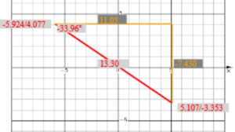 | Punktematrix  &#91;&#91;-5.924,5.077&#93;,&#91;5.107,-3.353&#93;&#93;                                                            |
| input=point        | Eingabe eines einzigen Punktes                                                                                        |                                                                                                                                                                                                                                                                                                                                                  |  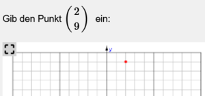 | Vektor   &#91;2,9&#93;                                                                                                           |
| input=points       | Eingabe von mehreren Punkten. Die Reihenfolge der Punkte ist dabei unwesentlich. Es müssen immer alle Punkte stimmen! |                                                                                                                                                                                                                                                                                                                                                  |  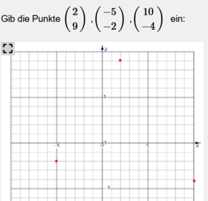 | Punktematrix &#91;&#91;2,9&#93;,&#91;-5,-2&#93;,&#91;10,-4&#93;&#93;                                                             |
| input=line         | Eingabe einer Geraden gegeben durch zwei Punkte.                                                                      |                                                                                                                                                                                                                                                                                                                                                  |  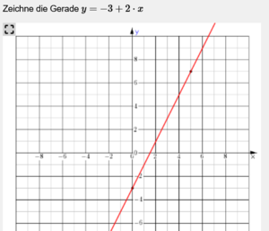 | Punktematrix &#91;&#91;0,-3&#93;,&#91;5,7&#93;&#93; oder Gleichung y=-3+2*x je nach Lösungsfeld                                     |
| input=hline        | Eingabe einer horizontalen Geraden                                                                                    | U(t):=Us*sin(2*%pi*f*t) U:-Us*1.2,Us*1.2,name=u(t) t:0s,3/f input=hline w50h                                                                                                                                                                            |  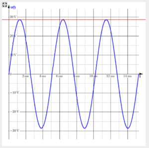 | Zahlenwert   28V                                                                                                                 |
| input=vline        | Eingabe einer vertikalen Geraden                                                                                      | U(t):=Us*sin(2*%pi*f*t) U:-Us*1.2,Us*1.2,name=u(t) t:0s,3/f input=vline w50h   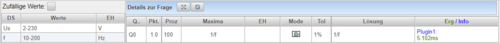                                                                                                                                                                         |  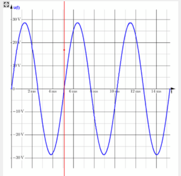 | Zahlenwert   5.1ms                                                                                                               |
| input=topoint(x,y) | Eingabe einer Linie von einem Startpunkt (x/y) zu einem einzugebenen Endpunkt                                         | y(x):=y x:0,6*T y:0,m*1.2 input=topoint(0,a-b) w50h  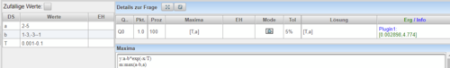                                                                                                                                                                                                      |  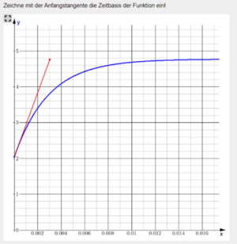 | Vektor   &#91;0.003,4.8&#93;                                                                                                     |
| input=toline(x,y)  | Eingabe einer Geraden durch einen Startpunkt (x/y) und einen einzugebenen Punkt                                       | input=toline(2,0)                                                                                                                                                                                                                                                                                                                                |  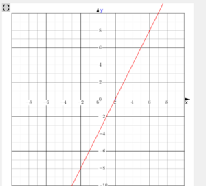 | Vektor   &#91;6,8&#93;                                                                                                           |
| input=toarrow(x,y) | Eingabe eines Vektorpfeiles von einem Startpunkt (x/y) zu einem einzugebenen Endpunkt                                 | input=toarrow(2,0)                                                                                                                                                                                                                                                                                                                               |  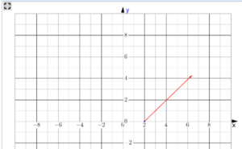 | Vektor   &#91;6.4,4.2&#93;                                                                                                       |
| input=lines        | Eingabe von mehreren Geraden für die Vermessung in Diagrammen.                                                        |                                                                                                                                                                                                                                                                                                                                                  |  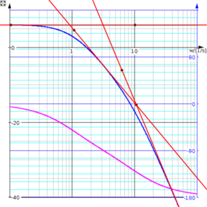 | Punktematrix                                                                                                                        |
| input=arrow        | Eingabe von mehreren Pfeilen.                                                                                         |                                                                                                                                                                                                                                                                                                                                                  |                                                                             | Punktematrix                                                                                                                        |
| input=polyline     | Eingabe von mehreren Punkten deren Reihenfolge stimmen muss. Es müssen immer alle Punkte stimmen!                     |                                                                                                                                                                                                                                                                                                                                                  |                                                                             | Punktematrix                                                                                                                        |
| input=polygon      | Eingabe von mehreren Punkten deren geschlossene Reihenfolge stimmen muss. Es müssen immer alle Punkte stimmen!                                            |  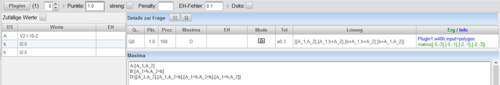                                                                                                                                                                                                                                                                      |  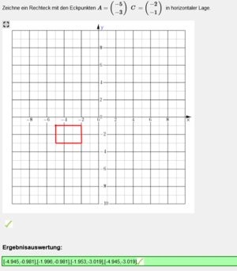 | Punktematrix   &#91;&#91;-5,-1&#93;,&#91;-2,-1&#93;,&#91;-2,-3&#93;,&#91;-5,-3&#93;&#93;                                         |
| input=function     | Eingabe einer Funktion y=f(x) mit streng monoton steigendem x                                                         |  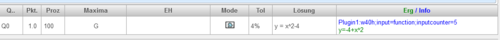                                                                                                                                                                                                                                                                      |  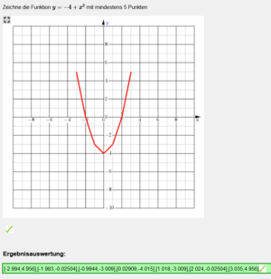 | Punktematrix   &#91;&#91;-3,5&#93;,&#91;-2,0&#93;,&#91;-1,-3&#93;,&#91;0,-4&#93;,&#91;1,-3&#93;,&#91;2,0&#93;,&#91;3,5&#93;&#93; |
| input=mc(...)      | Multiple Choice Eingabe auf Basis von Pixelkoordinaten                                                                | baseimage(0) input=mc(&#91;301.2,521.1&#93;,&#91;551.1,512&#93;,&#91;697,470&#93;,&#91;988.9,280.3&#93;,&#91;905,220.1&#93;,&#91;751.7,537.5&#93;,&#91;631.4,641.5&#93;,&#91;968.8,537.5&#93;,&#91;666,347.8&#93;,&#91;806.5,349.6&#93;,&#91;1008,406.2&#93;)   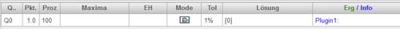 |  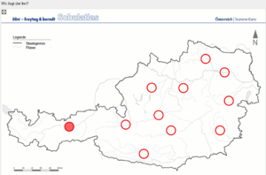 | Vektor aller angehakten Items   &#91;0&#93;                                                                                      |
| input=mcxy(...)    | Multiple Choice Eingabe auf Basis des x-y-Koordinatensystems                                                          | input=mcxy(TP,P1,P2,P3,P4,P5,P6) x:1.2*minx,1.2*maxx y:1.2*miny,1.2*maxy w50h   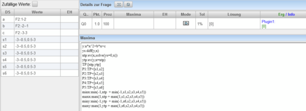                                                                                                                                                                           |  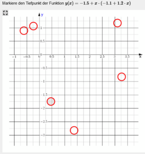 | Vektor aller angehakten Items   &#91;0&#93;                                                                                      |

###  siehe auch 
[Plot](../Plot/index.md) Plugin [allgemeine Parameter](../Plot/index.md#allgemeine-parameter-)

[Plot-Plugin graphische Multiple-Choice-Eingabe](/notimplemented/index.md)

