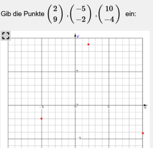

# Plugin Input Mode
Mit dem Parameter **input** kann die Art der interaktiven Eingabe beim [Plot](../Plot/index.md) Plugin durch den Schüler definiert werden.

| Parameter          | Beschreibung                                                                                                          | Beispieldefinition                                                                                                                                                                                                                                                                                                                                                                           | charakteristisches Bild                                                     | Lösung                                                                                                        |
|--------------------|-----------------------------------------------------------------------------------------------------------------------|----------------------------------------------------------------------------------------------------------------------------------------------------------------------------------------------------------------------------------------------------------------------------------------------------------------------------------------------------------------------------------------------|-----------------------------------------------------------------------------|---------------------------------------------------------------------------------------------------------------|
| input=off          | die interaktive Eingabe ist abgeschaltet, es funktioniert nur das Zoom                                                |                                                                                                                                                                                                                                                                                                                                                                                              |                                                                             |                                                                                                               |
| input=measure      | Messwerkzeug für die Vermessung in einem karthesischen Koordinatensystem                                              |                                                                                                                                                                                                                                                                                                                                                                                              |   | Punktematrix  [[-5.924,5.077]([-5.924,5.077),[5.107,-3.353](5.107,-3.353)]                                 |
| input=point        | Eingabe eines einzigen Punktes                                                                                        |                                                                                                                                                                                                                                                                                                                                                                                              |   | Vektor   [2,9](2,9)                                                                                        |
| input=points       | Eingabe von mehreren Punkten. Die Reihenfolge der Punkte ist dabei unwesentlich. Es müssen immer alle Punkte stimmen! |                                                                                                                                                                                                                                                                                                                                                                                              |   | Punktematrix [[2,9]([2,9),[-5,-2](-5,-2),[10,-4](10,-4)]                                                   |
| input=line         | Eingabe einer Geraden gegeben durch zwei Punkte.                                                                      |                                                                                                                                                                                                                                                                                                                                                                                              |   | Punktematrix [[0,-3]([0,-3),[5,7](5,7)] oder Gleichung y=-3+2*x je nach Lösungsfeld                           |
| input=hline        | Eingabe einer horizontalen Geraden                                                                                    | U(t):=Us*sin(2*%pi*f*t) U:-Us*1.2,Us*1.2,name=u(t) t:0s,3/f input=hline w50h                                                                                                                                                                                                                        |   | Zahlenwert   28V                                                                                           |
| input=vline        | Eingabe einer vertikalen Geraden                                                                                      | U(t):=Us*sin(2*%pi*f*t) U:-Us*1.2,Us*1.2,name=u(t) t:0s,3/f input=vline w50h                                                                                                                                                                                                                        |   | Zahlenwert   5.1ms                                                                                         |
| input=topoint(x,y) | Eingabe einer Linie von einem Startpunkt (x/y) zu einem einzugebenen Endpunkt                                         | y(x):=y x:0,6*T y:0,m*1.2 input=topoint(0,a-b) w50h                                                                                                                                                                                                                                                    |   | Vektor   [0.003,4.8](0.003,4.8)                                                                            |
| input=toline(x,y)  | Eingabe einer Geraden durch einen Startpunkt (x/y) und einen einzugebenen Punkt                                       | input=toline(2,0)                                                                                                                                                                                                                                                                                                                                                                            |   | Vektor   [6,8](6,8)                                                                                        |
| input=toarrow(x,y) | Eingabe eines Vektorpfeiles von einem Startpunkt (x/y) zu einem einzugebenen Endpunkt                                 | input=toarrow(2,0)                                                                                                                                                                                                                                                                                                                                                                           |   | Vektor   [6.4,4.2](6.4,4.2)                                                                                |
| input=lines        | Eingabe von mehreren Geraden für die Vermessung in Diagrammen.                                                        |                                                                                                                                                                                                                                                                                                                                                                                              |   | Punktematrix                                                                                                  |
| input=arrow        | Eingabe von mehreren Pfeilen.                                                                                         |                                                                                                                                                                                                                                                                                                                                                                                              |                                                                             | Punktematrix                                                                                                  |
| input=polyline     | Eingabe von mehreren Punkten deren Reihenfolge stimmen muss. Es müssen immer alle Punkte stimmen!                     |                                                                                                                                                                                                                                                                                                                                                                                              |                                                                             | Punktematrix                                                                                                  |
| input=polygon      | Eingabe von mehreren Punkten deren geschlossene Reihenfolge stimmen muss. Es müssen immer alle Punkte stimmen!                                            |                                                                                                                                                                                                                                                                                                                    |   | Punktematrix   [[-5,-1]([-5,-1),[-2,-1](-2,-1),[-2,-3](-2,-3),[-5,-3](-5,-3)]                              |
| input=function     | Eingabe einer Funktion y=f(x) mit streng monoton steigendem x                                                         |                                                                                                                                                                                                                                                                                                                    |   | Punktematrix   [[-3,5]([-3,5),[-2,0](-2,0),[-1,-3](-1,-3),[0,-4](0,-4),[1,-3](1,-3),[2,0](2,0),[3,5](3,5)] |
| input=mc(...)      | Multiple Choice Eingabe auf Basis von Pixelkoordinaten                                                                | baseimage(0) input=mc([301.2,521.1](301.2,521.1),[551.1,512](551.1,512),[697,470](697,470),[988.9,280.3](988.9,280.3),[905,220.1](905,220.1),[751.7,537.5](751.7,537.5),[631.4,641.5](631.4,641.5),[968.8,537.5](968.8,537.5),[666,347.8](666,347.8),[806.5,349.6](806.5,349.6),[1008,406.2](1008,406.2))    |   | Vektor aller angehakten Items   [0](0)                                                                     |
| input=mcxy(...)    | Multiple Choice Eingabe auf Basis des x-y-Koordinatensystems                                                          | input=mcxy(TP,P1,P2,P3,P4,P5,P6) x:1.2*minx,1.2*maxx y:1.2*miny,1.2*maxy w50h                                                                                                                                                                                                                          |   | Vektor aller angehakten Items   [0](0)                                                                     |

###  siehe auch 
[Plot](../Plot/index.md) Plugin [allgemeine Parameter](../Plot/index.md#allgemeine-parameter-)

[Plot-Plugin graphische Multiple-Choice-Eingabe](/notimplemented/index.md)

