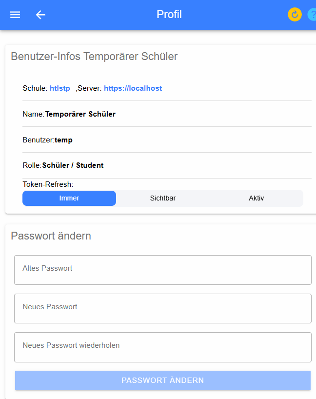
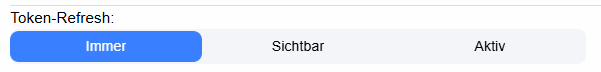
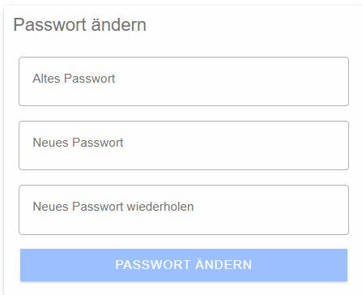

# Profil anzeigen
Mit dem Benutzerprofil können die wesentlichen Benutzer-Eigenschafter angesehen werden. 

## Änderbare Einstellungen

### Token-Refresh
Mit Token-Refresh können Sie steuern, wann und ob Sie aus der Anwendung abgemeldet werden. 
 
Folgende Einstellungen sind möglich:

* **Immer**: Token refresh erfolgt immer automatisch, Sie werden auch nach längerer Inaktivität nicht ausgeloggt. Bedingung dafür ist, dass der PC bzw. das mobiltelefon nicht ausgeschaltet wird.
* **Sichtbar**: Solange Sie auf der Seite der Anwendung bleiben und den Tab des Browsers nicht verlassen, bleiben Sie angemeldet.
* **Aktiv**: Sie müssen innerhalb der letzten 10 Minuten auf der Seite eine Aktivität gezeigt haben (Mausbewegung, Eingaben, ...), um angemeldet zu bleiben.

### Passwort ändern
Mit diesen drei Formularfeldern können Sie ihr eigenes Passwort ändern und neu definieren.
Dazu müssen Sie das alte Passwort sowie das neue Passwort und die Bestätigung dieses neuen Passwortes eintippen
und können das den Passwortwechsel anfordern.
