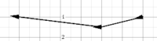
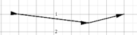

# Punktstyle
Der Punktstyle im [Plot](../Plot/index.md)-Plogin wird über den **pointstyle** Wert der als String definiert ist angegeben. 

Jeder Punkt eines Linienzuges wird über ein Zeichen des Definitionsstrings beschrieben, wobei diese Zeichen durch ein Minus getrennt werden. 

Links im Definitionsstring liegt immer der Startpunkt des Linienzuges und rechts der Endpunkt,  dazwischen liegen die Zwischenpunkte welche natürlich auch mehrfach vorkommen können.

##  Zeichen für die Definition des Punktestyles 

| Zeichen          | Beschreibung                                                                                                                                                                                                                                                                                                                         | Beispiel                                                                       | Graph                                                                                                                                                                                                                                        |
|------------------|--------------------------------------------------------------------------------------------------------------------------------------------------------------------------------------------------------------------------------------------------------------------------------------------------------------------------------------|--------------------------------------------------------------------------------|----------------------------------------------------------------------------------------------------------------------------------------------------------------------------------------------------------------------------------------------|
| - (Minus)        | Trennzeichen zwischen den Punktdefinitionen. Ohne Trennzeichen werden nur die Zwischenpunkte definiert. Mit nur einem Trennzeichen wird nur Anfangs und Endpunkt definiert. Bei mehr als einem Trennzeichen befindet sich links der Anfangs, rechts der Endpunkt und in der Mitte die Punkte welche wiederholt dazwischen vorkommen. | pointstyle="Q-o-x-R-&gt;"   pointstyle="O"   pointstyle="&lt;-&gt;"      |          |
| . (Punkt)        | kleiner gefüllter Punkt                                                                                                                                                                                                                                                                                                              | polyline([[-4,4]([-4,4),[4,3](4,3),[8,4](8,4)],pointstyle=".")                 |                                                                                                                                                                    |
| o                | Kreis                                                                                                                                                                                                                                                                                                                                | polyline([[-4,4]([-4,4),[4,3](4,3),[8,4](8,4)],pointstyle="o")                 |                                                                                                                                                                    |
| O                | gefüllter Kreis                                                                                                                                                                                                                                                                                                                      | polyline([[-4,4]([-4,4),[4,3](4,3),[8,4](8,4)],pointstyle="O")                 |                                                                                                                                                                    |
| x                | schräges Kreuz                                                                                                                                                                                                                                                                                                                       | polyline([[-4,4]([-4,4),[4,3](4,3),[8,4](8,4)],pointstyle="x")                 |                                                                                                                                                                    |
| +                | aufrechtes Kreuz                                                                                                                                                                                                                                                                                                                     | polyline([[-4,4]([-4,4),[4,3](4,3),[8,4](8,4)],pointstyle="+")                 |                                                                                                                                                                    |
| r                | Raute                                                                                                                                                                                                                                                                                                                                | polyline([[-4,4]([-4,4),[4,3](4,3),[8,4](8,4)],pointstyle="r")                 |                                                                                                                                                                    |
| R                | gefüllte Raute                                                                                                                                                                                                                                                                                                                       | polyline([[-4,4]([-4,4),[4,3](4,3),[8,4](8,4)],pointstyle="R")                 |                                                                                                                                                                    |
| q                | Quadrat                                                                                                                                                                                                                                                                                                                              | polyline([[-4,4]([-4,4),[4,3](4,3),[8,4](8,4)],pointstyle="q")                 |                                                                                                                                                                    |
| Q                | gefülltes Quadrat                                                                                                                                                                                                                                                                                                                    | polyline([[-4,4]([-4,4),[4,3](4,3),[8,4](8,4)],pointstyle="Q")                 |                                                                                                                                                                    |
| <pre>&lt;</pre>  | Pfeilspitze nach links zentriert zum Punkt                                                                                                                                                                                                                                                                                           | polyline([[-4,4]([-4,4),[4,3](4,3),[8,4](8,4)],pointstyle="&lt;-&lt;-&lt;")    |                                                                                                                                                                    |
| <pre>|&lt;</pre> | Pfeilspitze nach links mit Spitze zum Punkt                                                                                                                                                                                                                                                                                          | polyline([[-4,4]([-4,4),[4,3](4,3),[8,4](8,4)],pointstyle="|&lt;-|&lt;-|&lt;") |                                                                                                                                                                    |
| <pre>&lt;|</pre> | Pfeilspitze nach links mit Pfeilbasis am Punkt                                                                                                                                                                                                                                                                                       | polyline([[-4,4]([-4,4),[4,3](4,3),[8,4](8,4)],pointstyle="&lt;|-&lt;|-&lt;|") |                                                                                                                                                                    |
| <pre>&gt;</pre>  | Pfeilspitze nach rechts zentriert zum Punkt                                                                                                                                                                                                                                                                                          | polyline([[-4,4]([-4,4),[4,3](4,3),[8,4](8,4)],pointstyle="&gt;-&gt;-&gt;")    |                                                                                                                                                                    |
| <pre>|&gt;</pre> | Pfeilspitze nach rechts mit Spitze zum Punkt                                                                                                                                                                                                                                                                                         | polyline([[-4,4]([-4,4),[4,3](4,3),[8,4](8,4)],pointstyle="|&gt;-|&gt;-|&gt;") |                                                                                                                                                                    |
| <pre>&gt;|</pre> | Pfeilspitze nach rechts mit Pfeilbasis am Punkt                                                                                                                                                                                                                                                                                      | polyline([[-4,4]([-4,4),[4,3](4,3),[8,4](8,4)],pointstyle="&gt;|-&gt;|-&gt;|") |                                                                                                                                                                    |

##  Beispiele 

