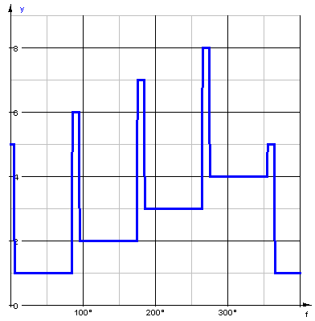

# Quadrant
Die Quadrant-Funktion liefert den Quadranten eines Winkels.

<pre>
quadrant(winkel,toleranz)
</pre>

An den Quadranten-Grenzen kann mittels einer Toleranz der Grenzbereich als Quadrant 5-8 definiert werden. 

Folgende Quadranten sind definiert: 

| Quadrant | Beschreibung     | Bereich   |
|----------|------------------|-----------|
| 1        | erster Quadrant  | 0°-90°    |
| 2        | zweiter Quadrant | 90°-180°  |
| 3        | dritter Quadrant | 180°-270° |
| 4        | vierter Quadrant | 270°-360° |
| 5        |                  | 0°        |
| 6        |                  | 90°       |
| 7        |                  | 180°      |
| 8        |                  | 270°      |

 

Bsp: y(f):=quadrant(f,5°)

 

Zurück zu [Berechnungen](../Berechnungen/index.md)

