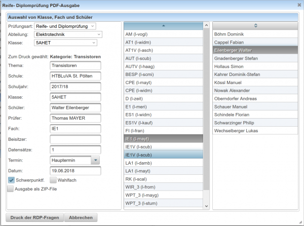
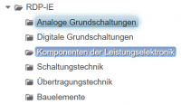
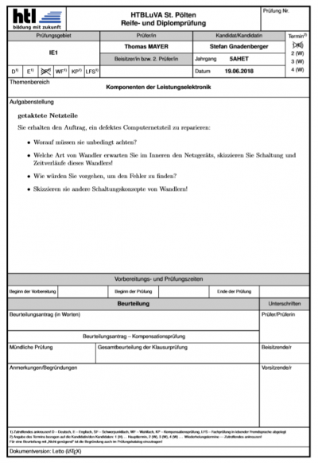

# Reife- und Diplomprüfungsfragen
Der Dialog zur Erstellung von **Reife- und Diplomprüfungsfragen** kann entweder aus dem [Kategorie-Baum](../Ordnerverwaltung/index.md) über das [Kontext-Menü](../Ordnerverwaltung/index.md#kontext-menü) aufgerufen werden oder für eine einzelne Frage aus der [Fragenliste](../Fragenliste/index.md) ebenfalls mit dem [Kontext-Menü#kontextmenü-zur-fragenliste-](../Fragenliste#kontextmenü-zur-fragenliste-/index.md#kontextmenü-zur-fragenliste-). 

## Ausgabe von Fragen für die mündliche Reife- und Diplomprüfung

 

Folgende Einstellungsmöglichkeiten sind verfügbar:

| Prüfungsart | Reife- und Diplomprüfung oder Abschlussprüfung |
|-------------|------------------------------------------------|
| Abteilung   | Auswahl von gewünschter Abteilung              |
| Klasse      | Auswahl von gewünschter Klasse                 |

Damit wird im rechten Bereich eine sortierbare Liste mit allen Einträgen der Lehrfächerverteilung für diese Klasse (Gegenstand + Lehrerkurzzeichen) angezeigt, sowie alle Schüler in einer weiteren sortierbaren Liste aufgelistet. Aus diesen beiden Listen kann Prüfer sowie Kandidat ausgewählt werden. Optional können alle Daten im linken Bereich, die dann für die Dokumneterzeugung verwendet werden, manuell eingegeben oder überschrieben werden.

### Weitere Einstellungsmöglichkeiten
* Schwerpunktfach oder Wahlfach
* Ausgabe alle erzeugten PDFs in ein ZIP-File: Diese Option ist dann hilfreich, wenn alle RDP-Fragen auf einmal erzeugt werden sollen.

Wenn für die Vorbereitung auf die Reifeprüfung alle Fragen gedruckt werden sollen, dann müssen in einer beliebigen [Kategorie](../Ordnerverwaltung/index.md) Unterordner mit dem Namen der Themengebiete der mündlichen RDP angelegt werden. In diese Ordner kommen dann die Fragen pro Themengebiet. Beim Download als ZIP-File befindet sich dann darin ein PDF-Dokument für jede Frage. Der Dateiname setzt sich aus Gegenstand, Themengebiet und Fragenname zusammen.
 

### Ausgabe
 

Kategorie:Dialoge

