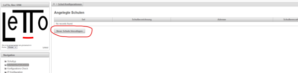
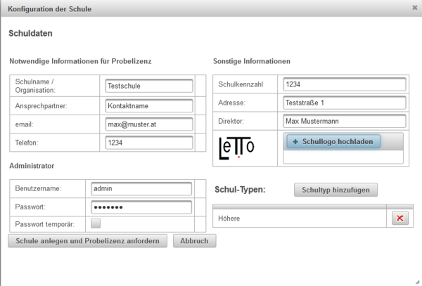
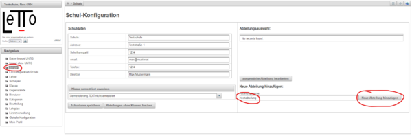

# Schul-Konfiguration
##  Schule anlegen 
* als globaler Administator eine Schule anlegen:             Durch "Schule anlegen und Probelizenz anfordern" wird die Schule erzeugt und vom Lizenzserver eine Demolizenz geladen.
* als Schuladministrator eine Abteilung anlegen:    

##  siehe auch 
* [Globaler Administrator](../GlobalerAdministrator/index.md)
* [Installation](../Installation/index.md)

