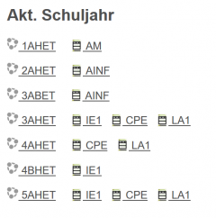
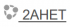
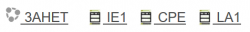
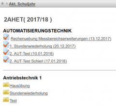

# Schuljahr
In dieser Ansicht werden alle Informationen zu einem Schuljahr bereitgestellt. Die Ansicht ist für Schüler und Lehrer unterschiedlich.

Hilfestellungen: [Einführung](../Einführung/index.md), [LeTTo-Hauptansicht](../LeTTo-Hauptansicht/index.md)

### Schuljahresübersicht für Lehrer

 

#### Links zu den einzelnen Klassenzimmern
: 

Auf der linken Seite sind Links zum jeweiligen [Klassenzimmer](../Klassenzimmer/index.md) angelegt. In dieser Ansicht können Tests im Schülermodus ausgeführt werden, Lehrer können unterschiedliche Aktivitäten in Ordnern sortieren, Tests probehalber ausprobieren, Testergebnisse eingesehen werden, ...

#### Links zu den Katalogen für alle unterrichteten Gegenstände
 

Rechts davon sind Links angeordnet, die zu den [Katalogen](../Katalog/index.md) der jeweiligen Gegenständen der links angeführten Klasse führen. Im System ist die Lehrfächerverteilung hinterlegt und jeder Lehrer sieht seine Gegenstände.

 
### Schuljahresübersicht für Schüler
Schüler sehen automatisch die Ansicht des [Klassenzimmers](../Klassenzimmer/index.md), in der alle Online-Tests, Ordnerer, Dokumente und Projekte - nach Gegenständen geordnet - angezeigt werden.

