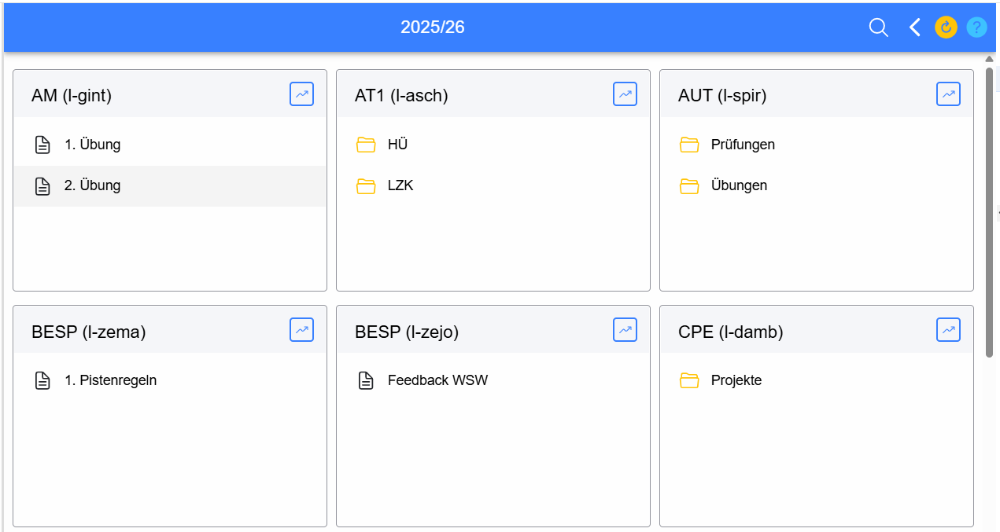
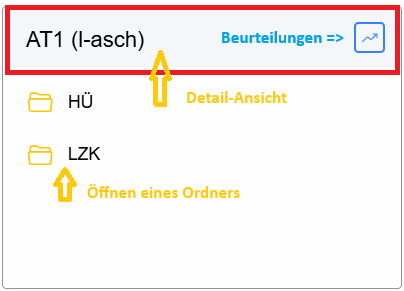
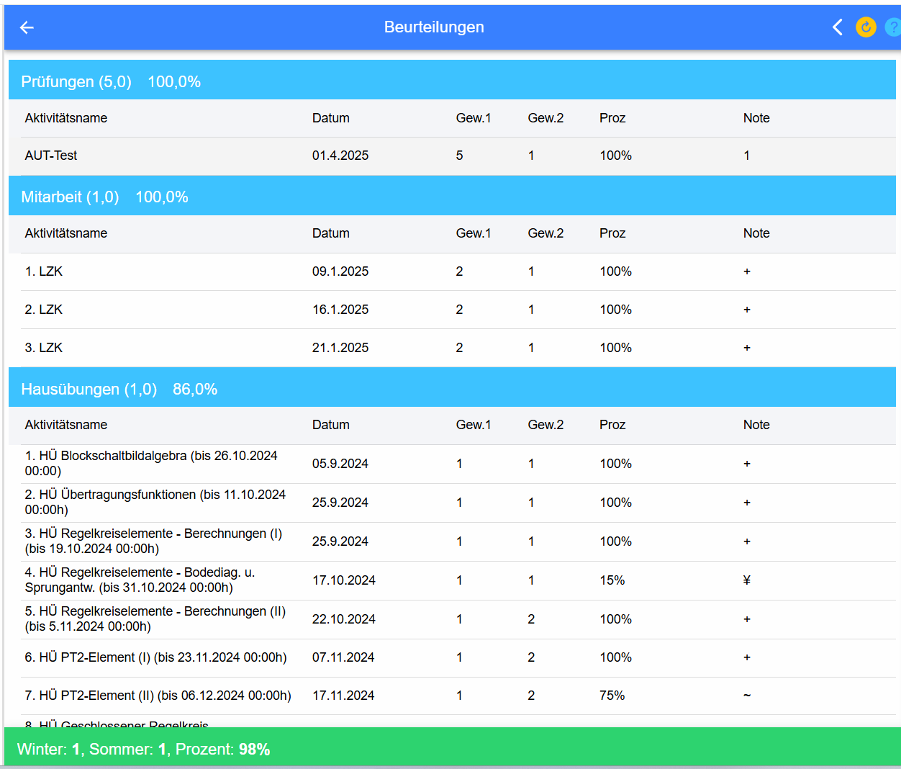
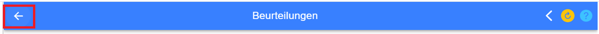

# Schuljahr / Gegenstand / Ordner

Diese Ansicht bietet eine Übersicht über alle für diese Klasse bereitgestellten Lernmaterialien (Aktivitäten), 
ähnlich einem Kurs in MOODLE.

Je nach Auswahl werden die Daten für ein Schuljahr, einen Gegenstand eines Lehrers oder der Inhalt eines Ordners angezeigt.
 

Diese Ansicht ist die Standard-Ansicht für Schüler. 
Aufruf dieser Seite über das [Menü](../MenueSchueler/index.md) auf der linken Seite.

Für jeden Gegenstand gint es einen eigenen Reiter:
 
Beim Klick auf die Detail-Ansicht bekommen nur mehr die Information und Aktivitäten für diesen Gegenstand eines bestimmten Lehrers.
Sollten mehrere Lehrer den gleichen Gegenstand unterrichten, dann ginb es pro Lehrer einen eigenen Eintrag.

### Beurteilungen / 1.Semester / 2. Semester
Über diese Links, die immer in der Zeile unterhalb der Gegenstandbezeichnung zu finden sind, kann man den [Katalog](../Katalog/index.md) des jeweiligen Gegenstandes öffnen.

Abhängig vom Lehrplan oder der Schulform (Jahrgangsweise / Semestrierung lt. Nost / ...) wird der Katalog für das ganze Schuljahr oder nur für ein Semester geführt.

Für Schüler sind die Beurteilungen des Lehrers dann sichtbar, wenn in der [Beurteilungskonfiguration](../Beurteilungskonfiguration/index.md) des Lehrers die Freigabe der Anzeige der Noten ausgewählt wurde.

Im Bereich des Headers eines Reiters finden sie rechts (blau markiert) einen Link zu den 
Beurteilungen für diesen Gegenstand. Beim Klick darauf öffnet sich folgender Dialog:  
  
mit einer Übersicht über alle in diesem Jahr erbrachten Leistungen. 

**Achtung** Die Prozentwerte geben keinen Aufschluss über die spätere Note. 
Diese Übersicht dient nur zur Übersicht über alle erbrachten Leistungen. 

**Wesentlich: Die Note gibt immer der Lehrer!** 
 
Zurück zur vorigen Seite kommen Sie immer über den markierten Pfeil in der Titelzeile!

### Aktivitäten
Alle Materialien, die dem Schüler bereitgestellt werden, sind unter dem Begriff Aktivitäten zusammengefasst. Dazu gehören:
* **Link**: Ein normaler Link im Internet
* Verzeichnis / **Ordner**: Ein Verzeichnis, das wieder mehrere andere Elemente/Aktivitäten enthalten kann
* **Aktivität**: Ein Online-Test, der mit dem Testmodul erstellt wurde und für jeden Schüler individuelle Aufgabenstellungen bereitstellt.
* **Projekt**: Ein Projekt, bei dem die Schüler Daten am Server abgeben können.
* **Dokumente**, die dem Schüler bereitgestellt werden.

