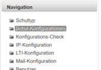

# Schultypen
##  Allgemeines 

###  Erstinstallation 
Bei der Erstinstallation kontrollieren Sie bitte, ob die Schultypen für ihre Schule eingetragen sind. Wenn Sie für ihre Schule einen Schultp brauchen, der nicht vorkonfiguriert ist, dann legen Sie diesen bitte mit dem Button **Neuer Schultyp** an.

Wenn alle notwendigen Schultypen in der Liste aufscheinen, dann setzen Sie bitte die Konfiguration mit [Schul-Konfiguration](../Schul-Konfiguration/index.md) (Listen-Eintrag auf der linken Seite) fort.
 

##  siehe auch 
* [Globaler Administrator](../GlobalerAdministrator/index.md)
* [Installation](../Installation/index.md)

