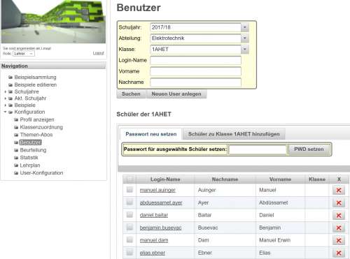
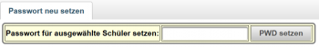
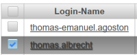

# Schülerpasswort zurücksetzen
 
Wählen Sie in der Navigation den Begriff **Konfiguration** und dort **Benutzer** aus.

In der rechts erscheinenden Suchmaske können Sie entweder die Klasse auswählen oder direkt nach Schülern über Login-Name, Vor- und Nachname suchen.

Sie erhalten nach der **Suche** eine ein Eingabefeld zur Passwortdefinition und eine Liste mit allen gefundenen Schülern

**ACHTUNG:** Um Passwörter zu setzen, müssen Sie in der Ergebnisliste die Schüler, bei denen das Passwort neu gesetzt werden soll, auswählen! Diese Auswahl erfolgt über die Checkboxen links neben dem Namen. Für die Auswahl von allen Schülern wählen Sie die Checkbox in der Überschrift der Tabelle neben dem Bezeichner _Login-Namen_.

[Administration](../Administration/index.md)

