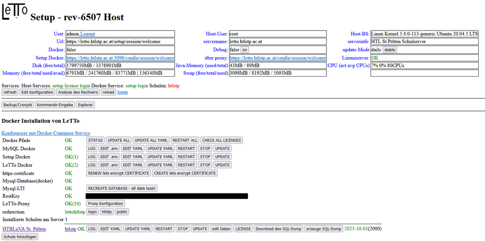
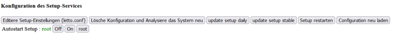

# Setup-Service
##  siehe auch 
* [Administration](../Administration/index.md)
* [Installation](../Installation/index.md)

= Setup Service = 
###  Verbindung mit dem Setup Service 
####  Direkt über Port 9096 
Direkt nach der Installation ist das Setup-Service nur über den Port 9096 mit https erreichbar. Es sollte deshalb in der Firewall dieser Port so konfiguriert werden, dass man von dem konfigurierenden Client-PC diesen Port erreichen kann. 
  https://letto.serverdns.at:9096/setup
####  Mit ssh-Tunnel an Port 9096 
Ist es nicht möglich oder gewünscht dass der Port 9096 an der Firewall freigegeben wird, der ssh-Port ist aber erreichbar, dann kann ein Tunnel vom Client auf den Setup-Port gesetzt werden.
* In Windows mit [putty.exe](https://www.putty.org/)
  putty ssh letto@letto.serverdns.at -pw dasSshPasswort -L 19096:127.0.0.1:9096 -C -N
* In Linux per ssh
  ssh letto@letto.serverdns.at -pw dasSshPasswort -L 19096:127.0.0.1:9096 -C -N
Damit ist dann das Setup-Service am Browser an der lokalen IP an Port 19906 erreichbar über:
  https://127.0.0.1:19096/setup
####  über den Reversproxy 
Das Setup-Service welches am Server außerhalb der Docker-Container auf Port 9096 läuft ist über den Reverse-Proxy "letto-proxy" erreichbar am Endpoint "setup" mit:
  https://letto.serverdns.at/setup
####  im Docker-Container über den Reversproxy 
Nach erfolgreicher Installation läuft immer auch eine Setup-Instanz in einem Docker-Container "letto-setup". Diese kann sicher natürlich nicht selbst starten,stoppen oder updaten. Weiters sind natürlich auch direkte Zugriffe auf das Host-Filesystem nicht möglich. Es wird jedoch benötigt damit der LeTTo-Server die Systemkonfiguration abfragen kann. Grundlegende Vorgänge können jedoch auch mit dieser Setup-Instanz vorgenommen werden. Sie ist erreichbar am Endpoint "config" mit:
  https://letto.serverdns.at/config

###  Web-Oberfläche des Setup-Service 

####  allgemeine Informationen 
* Im oberen Teil des Setup-Services stehen allgemeine Informationen zum System
####  wichtige Buttons 
* on/off bei Debug: Schaltet das Debugging für alle Services ein bzw. aus. Wird erst wirksam wenn das/die Services neu gestartet werden.
* daily/stable bei Update Mode: setzt den Update-Mode für alle Services auf Daily oder Stable. Nur wenn Debug deaktiviert ist, da sonst immer latest verwendet wird.
* refresh: Lädt die komplette Konfiguration des Systems neu und analysiert die Docker-Container. Das kann je nach System und Auslastung einige Sekunden dauern.
* Edit Konfiguration: Editiert die Konfigurationsdatei des Setup-Services für die Installation von LeTTo ohne Docker
* Anaylse des Rechner: Analysiert den Rechner nochmals und sucht nach einer lokalen Installation von LeTTo ohne Docker
* reload: Lädt die Dateilisten und Auslastungswerte neu, analysiert aber nicht das Dockersystem, ist deshalb wesentlich schneller als refresh
* Backup/Cronjob: Konfigurationsdialog für [Datenbank-Backups](../Datensicherung-Docker/index.md)
* Kommando-Eingabe: Dialog zum Ausführen von Systemkommandos auf der Shell des Host-Systems
* Explorer: Einfacher Explorer des Dateisystems mit der Möglichkeit von Datei-Up und Download.
####  Docker Pfade - Buttons 
* STATUS : Liefert den Status aller Docker-Container, Netwerke und Volumes
* UPDATE ALL: Führt ein Update aller Docker-Container auf die, in den yml-Dateien, eingestellte Revision durch und aktualisiert dann auch alle YAML-Dateien
* RESTART ALL: Führt einen Neustart aller Docker-Container durch
* CHECK LICENSES: Führt einen Lizenzcheck bei allen Schulen durch
####  MySQL,Setup,LeTTo Buttons 
* EDIT .env : Editiert die .env Datei. Sie enthalten die komplette Systemkonfiguration und liegen in den Verzeichnissen /opt/letto/docker/compose/mysql, /opt/letto/docker/compose/setup, /opt/letto/docker/compose/letto
* EDIT YAML : Editiert die docker-compose.yml Datei. Sie sollte nur in Ausnahmefällen verändert werden dient aber vor allem zur Installationsinformation.
* UPDATE YAML : Aktualisiert die docker-compose.yml auf die vorgeschlagene Version des Setup-Services. Nach einem Setup-Update kann es sinnvoll sein auch die YAML-Datei zu aktualisieren
* RESTART : Startet den Container neu
* STOP : stoppt den Container
* UPDATE : Führt ein Update des Containers durch und startet ihn bei einem erfolgten Update neu
####  https-certificate 
aktualisiert das lets encrypt Zertifikat oder erstellt ein komplett neues Zertifikat. Die Basisdaten dazu sind in der .env-Datei von letto in den Variablen SERVER_NAME und DOMAIN_ALTERNATIV
* siehe auch [Https-Zertifikat](../Https-Zertifikat/index.md)

####  redirection 
Hier wird eingestellt welche Seite geöffnet wird wenn die root-URL des Servers besucht wird.
####  Installierte Schulen 
* EDIT YAML : Editiert die docker-compose.yml Datei. Sie sollte nur in Ausnahmefällen verändert werden dient aber vor allem zur Installationsinformation.
* UPDATE YAML : Aktualisiert die docker-compose.yml auf die vorgeschlagene Version des Setup-Services. Nach einem Setup-Update kann es sinnvoll sein auch die YAML-Datei zu aktualisieren
* RESTART : Startet den Container neu
* STOP : stoppt den Container
* UPDATE : Führt ein Update des Containers durch und startet ihn bei einem erfolgten Update neu
* edit Daten: Editiert alle Einstellungen der Schule. Hier kann auch ein Datenbank-Dump über die bestehende Datenbank geschrieben werden und die Schule gelöscht werden.
* Download des SQL Dump: Lädt einen zuvor erstellten SQL-Dump der Schuldatenbank auf den Client-PC herunter
* erzeuge SQL-Dump: Erstellt einen SQL-Dump der Schuldatenbank im Verzeichnis /opt/letto/docker/storage/database-dump
####  Schule hinzufügen 
* neue Schule hinzufügen siehe [Setup - Schule hinzufügen](/notimplemented/index.md)

##  Update Setup-Service 

* Editiere Setup-Einstellungen(letto.conf): Wenn das Setup auch eine lokale Installation von Letto ohne Docker verwalten soll kann hier einiges konfiguriert werden (undokumentiert)
* Lösche Konfiguration und Analysiere das System neu: Löscht die Datei letto.conf und sucht nach einer lokalen Installation ohne Docker
* update setup daily: Führt ein Update des Setup-Services auf die aktuelle Daily-Version durch
* update setup stable: Führt ein Update des Setup-Services auf die aktuelle Stable-Version durch
* Setup restarten: Startet das Setup-Service neu
* Configuration neu laden (Lädt die Konfiguration einer lokalen Letto-Installation neu)

[Administration](../Administration/index.md)

