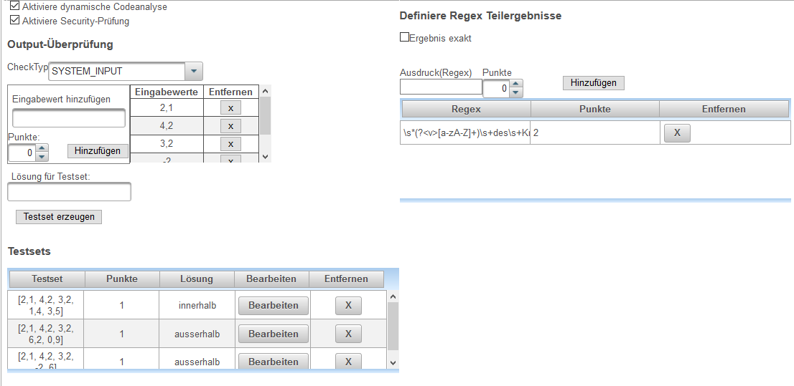
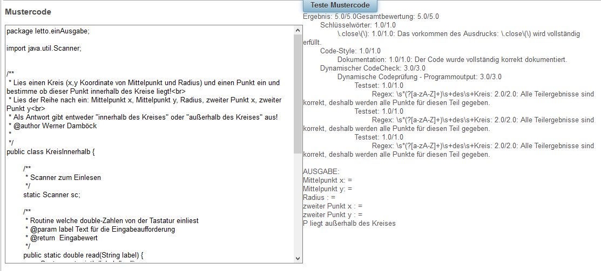

# SourceCode Konfiguration
= Allgemeines = 
Das [CodeCheck](../CodeCheck/index.md)-Plugin wird verwendet um Programme von Schülern in verschiedenen Programmiersprachen (aktuell nur Java) automatische korrigieren zu können.
 
 

Der Konfigurationsdialog besteht aus den Bereichen:
* statisch : Statische Codeprüfung für die das Programm nicht gestartet werden muss
* dynamische Ausgabe: Hierbei wird die Programmausgabe des Schülerprogrammes mit einem Beispielprogramm verglichen
* dynamische Methoden: Hierbei wird das Ergebnis von klar definierten Methoden zwischen Schüler und Mustercode verglichen
* Mustercode : Der Code welcher eine richtige Lösung für die dynamische Bewertung enthält

##  statisch
 
####  Grundkonfiguration 
* Auswahl der verwendeten Programmiersprache (aktuell ist nur Java realisiert)

####  Imports 
* imports überprüfen: Ist dies angehakt sind nur die in der Liste angegebenen imports zulässig. Sind andere imports im Schülercode vorhanden, so wird die dynamische Codeprüfung verweigert, und der Schüler erhält dafür auch keine Punkte.
* Import hinzufügen: hier kann ein Import definiert werden, der zur Liste hinzugefügt werden kann
* Liste der Imports: Hier werden alle erlaubten imports eingetragen. Die Einträge können nur gelöscht und hinzugefügt, nicht geändert werden.

####  Schlüsselwörter 
Hier können über einen Java-Regular-Expression Ausdrücke definiert werden, die im Schülercode vorkommen sollen oder nicht vorkommen dürfen. 

Ein Eintrag in der Liste wird zuerst definiert, und dann mit "Hinzufügen" zur Liste hinzugefügt. Beim Hinzufügen wird der Regexp auch auf Gültigkeit geprüft, und nur dann hinzugefügt wenn er korrekt angegeben wurde.

* Ausdruck : Regulärer Ausdruck nach dem gesucht wird
* Art: Gibt an ob der Ausdruck vorkommen muss(relevant) oder nicht vorkommen darf(verboten)
* Von: Definiert, ab welcher Anzahl von Vorkommen des Ausdrucks Punkte vergeben/abgezogen werden.
* Bis: Definiert, bis zu welcher Anzahl von Vorkommen des Ausdrucks Punkte vergeben/abgezogen werden. Liegt die Anzahl zwischen Von und Bis werden immer alle Punkte erreicht. Soll die Anzahl nach oben offen sein, muss Bis=0 definiert werden.
* Punkte: Die Punkte, welche für die Erfüllung des Ausdrucks vergeben werden. Wenn "verboten" als Art gewählt wird, dann werden die Punkte dann gegeben, wenn die Anzahl des Vorkommens des Ausdrucks außerhalb von Von-Bis liegt. Bei relevant genau dann, wenn sie innerhalb liegt.
* Abzug: Punkte die abgezogen werden bei jeglicher Nichterfüllung der Definition. ZB. "verboten" ist als Art gewählt, Von=1, Bis=0, und die Anzahl des Vorkommens des Audrucks im Code = 2, dann werden Punkte nicht vergeben und Abzug wird zusätzlich abgezogen. Bei "relevant" wird Abzug genau dann abgezogen wenn die Anzahl des Vorkommens des Ausdrucks außerhalb des definierten Bereiches liegt, zB. Von=1, Bis=2, Anzahl des Vorkommens des Ausdrucks im Code = 0. Hier werden keine Punkte vergeben und der Abzug abgezogen.
* Teilpunkte: Gibt an ob Teilpunkte gegeben werden sollen wenn "relevant" als Art gewählt wird. ZB. Von=3, Bis=5, Punkte=9, Anzahl des Vorkommens des Ausdrucks im Code = 2, dann werden (Punkte/Von)*Vorkommen Punkte vergeben, also (9/3)*2=6. Liegt die Anzahl des Vorkommens des Ausdrucks über- oder ist gleich dem Von-Wert, werden alle Punkte gegeben. Wenn Teilpunkte=true, dann werden, falls die Anzahl des Vorkommens des Ausdrucks im Code&gt;Bis ist trotzdem alle Punkte gegeben, jedoch wird der Abzug dann abgezogen. Wenn Teilpunkte=false, dann werden die Punkte in so einem Fall nicht gegeben.
####  Style-Check 
Hier kann eine Prüfung des Code-Aufbaues definiert werden.
* Abzug bei Syntaxfehler: Wenn true, dann werden im Falle eines Syntaxfehlers im Programm alle Punkte des Style-Checks abgezogen. Wenn false, dann wird der Style-Check nicht gewertet.
* Dokumentation: Testet die Dokumentation mit gültiger Java-Doc. Es wird überprüft, ob eine nicht-leere Dokumentation vorhanden ist und ob alle Parameter und Return-Values entsprechend Dokumentiert wurden.
  * Punkte: Diese Punkte können erreicht werden.
  * Teilpunkte: So viele Teilpunkte werden vergeben. ZB. ist Punkte=5, Teilpunkte=5 und Anz. der Fehler=2, werden Punkte-(Punkte/Teilpunkte)*Fehler=3 Punkte vergeben.
  * max-Fehler: Wenn Die Anzahl der Fehler über diesem Wert liegt, werden die in Abzug definierten Punkte abgezogen.
  * Abzug: So viele Punkte können abgezogen werden.
  * Main-Methode prüfen: Wenn true, wird die Dokumentation der Main Methode geprüft und in die Bewertung miteinbezogen.
* Name-Conventions: Hier wird geprüft, ob die Java-Naming-Conventions korrekt eingehalten werden.
  * Punkte: Diese Punkte können erreicht werden.
  * Teilpunkte: So viele Teilpunkte werden vergeben. ZB. ist Punkte=5, Teilpunkte=5 und Anz. der Fehler=2, werden Punkte-(Punkte/Teilpunkte)*Fehler=3 Punkte vergeben.
  * max-Fehler: Wenn Die Anzahl der Fehler über diesem Wert liegt, werden die in Abzug definierten Punkte abgezogen.
  * Abzug: So viele Punkte können abgezogen werden.
  * Methodennamen: Wenn true, werden Methodennamen geprüft. Prüfung mit: "^[a-z_](a-z_)&#92;w*$"
  * Klassennamen: Wenn true, werden Klassennamen geprüft. Prüfung mit: "^[A-Z_](A-Z_)&#92;w*$"
  * lokaleVariablen: Wenn true, werden alle lokalen Variablen geprüft. Prüfung mit: "^[a-z_](a-z_)&#92;w*$"
  * Instanzvariablen: Wenn true, werden Instanzvariablen geprüft. Prüfung mit: "^[a-z_](a-z_)&#92;w*$"
  * Konstanten: Wenn true, werden Konstanten geprüft. "^[A-Z_](A-Z_)*$"
  * Packagename: Wenn true, werden packagenamen geprüft. Prüfung mit: "^[a-z_](a-z_)&#92;w*$" (mit Punkt getrennt)

##  dynamische Ausgabe 
 
Bei der dynamischen Codeanalyse wird das Programm des Schülers kompiliert und ausgeführt und die **Ausgabe des Programmes am Standard-Output** mit der Ausgabe des Musterprogrammes verglichen.

Bei der Security-Prüfung wird der Java-Security-Manager aktiviert, um zu verhindern, dass der Schüler gefährlichen Code am Server ausführt. Dieser Punkt sollte im Normalfall immer eingeschaltet sein. Liefert die Security-Prüfung einen Fehler, so wird der Code des Schülers nicht ausgeführt und er bekommt auf die dynamische Codeanalyse keine Punkte.

Die Prüfung des 

####  Output-Überprüfung 
Hier wird die Art der Überprüfung eingestellt und die Werte für die Testsets definiert.

* **CheckTyp** : 
  * System Input :       Hier werden Testsets definiert, welche dann über den Standard-Input in das Schülerprogramm eingegeben werden.
  * Programmargumente :  Hier werden Testsets definiert, welche dann als Kommandozeilenparameter an das Schülerprogramm übergeben werden.
  * Interne Variable :   Es werden keine Testsets definiert, das Programm wird ohne Eingabe oder Kommandozeilenparameter ausgeführt. Das Beispiel muss daher über die Datensätze des Beispiels parametriert werden.
==== Testset definieren ====   
Hier kann ein Testset definiert werden.
 
* Eingabewert hinzufügen: hier wird ein Eingabwert als String definiert welcher mit Hinzufügen dem Testset hinzugefügt werden kann.
* Punkte : Die Punkte welche für das neue Testset gegeben werden.
* Eingabewerte und Entfernen: Hier stehen alle Werte welche als Eingabwerte für das aktuelle Testset definiert sind. Mit Entfernen kann ein Wert aus der Liste entfernt werden. Die Reihenfolge der Werte ist für die Eingabereihenfolge beim Programmtest maßgebend.
* Lösung für Testset: Die richtige Lösung welche bei dem aktuellen Testset vom Mustprogramm berechnet werden sollte (Dient nur zum Kontrollieren des Musterprogrammes). Hier ist aktuelle pro Testset nur ein Ergebnis möglich. Bleibt das Lösungsfeld leer, so wird das Ergebnis des Mustercodes nicht geprüft, der Lehrer muss daher anderweitig dafür garantieren, dass sein Mustercode korrekt ist. Für die **Prüfung der Schülerlösung** hat das **Lösungsfeld keine Relevanz**!
* Testset erzeugen: Mit diesem Button wird das oben definierte Testset der Liste der Testsets hinzugefügt. Die erfolgt nur dann, wenn mehr als Null Punkte vergeben werden.

####  Testsets 
 
In dieser Liste stehen alle Testsets welche für das Beispiel definiert sind. Beim Prüfen des Programmes wird das Programm mit allen Testsets durchlaufen und die jeweiligen Punkte vergeben.
* Testset   : List aller Eingabwerte durch Strichpunkt getrennt
* Punkte    : Punkte welche für dieses Testset vergeben werden
* Lösung    : richtige Lösung für die Prüfung des Musterprogrammes (Für die Schülerlösung nicht relevant und leer wenn das Musterprogramm nicht geprüft werden soll)
* Bearbeiten: bringt die Werte des Testsets in den oberen Teil des Dialogs zum Testset definieren. Soll ein Testset verändert werden, so muss man es bearbeiten, löschen und neu hinzufügen.
* Entfernen : Hier kann ein Testset aus der Liste entfernt werden. 

####  Definiere Regex Teilergebnisse 
* Ergebnis exakt: Ist die angehakt, so wird die komplette Ausgabe des Mustercodes mit der kompletten Ausgabe des Schülercodes verglichen. Dies muss bis auf das letzte Zeichen exakt sein. Ist hier nichts angehakt, so erfolgt die Prüfung über die unterhalb angegebenen regulären Ausdrücke.
* Ausdruck(Regex): Definition eines neuen regulären Ausdrucks, der der Prüfliste hinzugefügt werden kann.
* Punkte: Punkte, die für die Ergebnis des angegebenen regulären Ausdrucks vergeben werden.
* Hinzufügen: Fügt den Ausdruck mit den angegebenen Punkten der Prüfliste hinzu.
#####  Liste der Teilergebnisse 
 
Das Ergebnis des Mustercodes und des Schülercodes wird nach den angegebenen regulären Ausdrücken durchsucht. Hierbei wird für jeden angegebenen Regex die komplette Porgrammausgabe nach **allen Treffern** des regulären Ausdrucks durchsucht. Das Schülerprogramm und der Mustercode müssen exakt die gleiche **Anzahl** von Treffern und die gleichen **Werte** der Treffer haben um die Punkte zu erhalten. Handelt es sich bei einem Treffer um eine Gleitkommazahl, so wird die Prüfung mit der, bei dem Beispiel angegebenen, Toleranz geprüft.

* Regex: Der reguäre Ausdruck mit dem gesucht wird. Ist eine benannte Gruppe vorhanden (zB.:_(?&lt;a&gt;...)_ ), so wird nur der Inhalt der Gruppe verglichen, ansonsten wird der komplette Treffer verglichen.
* Punkte: Punkte welche für den richtigen Vergleich des Ergebnisses vergeben werden.
* Entfernen: Hier kann ein Regex aus der Liste entfernt werden

##  dynamische Methoden 
 

Hier können Methoden definiert werden, welche der Schüler programmieren muss. Diese Methoden werden dann mit den angegebenen Testsets geprüft und dabei das Ergebnis der Schülerabgabe mit dem Ergebnis des Mustercodes verglichen.

Alle definierten Methoden befinden sich in der Liste **Check-Methoden** und werden schrittweise über die Punkte Methoden-Überprüfung, Methoden-Parameter,Testwerte und Testsets definiert. 

#####  Definition einer Methode 
Die Definition einer Methode erfolgt nach folgender Vorgehensweise:
1. Methodenname, Punkte und ggf. void bei prozeduralen Methoden definieren
2. Methodenparameter festlegen
3. Testsets definieren durch hinzufügen von Testwerten zu den Testsets
4. Methode Erzeugen

#####  Bearbeiten einer bestehenden Methode 
1. In _Check-Methoden_ auf bearbeiten
2. Methoden-Name, Methoden-Parameter oder Testsets verändern
3. Methode mit _Erzeuge Methode_ aktualisieren

####  Konfigurationsdialog 
#####  Methoden-Überprüfung 
Hier wird Name und Art der Methode festgelegt. Der Ergebnistyp wird über den Mustercode definiert.
* Name: Name der Methode
* Punkt: Punkte welche für diese Methode insgesamt vergeben werden 
* void : muss bei Methoden ohne Ergebnis gesetzt werden
#####  Methoden-Parameter festlegen 
Hier werden die Datentypen und Anzahl der Parameter festgelegt.
#####  Testwerte 
Hier werden die Testwerte für die Testsets definiert. Die Anzahl der Testwerte muss immer gleich wie die Anzahl der Methodenparameter sein!
#####  Testsets 
Liste der Testsets, welche für die Methode definiert wurden 
#####  Erzeuge Methode 
Mit diesem Button wird eine Methode in die Liste der Check Methoden eingetragen. Ist der gleiche Name schon vorhanden, so wird der Eintrag aktualisiert.
#####  Check-Methoden 
List der Methoden, welche für die Prüfung definiert sind.

##  Mustercode 
 

Im linken Fensterteil wird der Mustercode eingegeben, welcher als richtige Lösung für die Ergebniskontrolle der Schülerlösung verwendet wird.

Mit **Teste Mustercode** kann der Mustercode geprüft werden, ob das Ergebnis korrekt ist, und es überhaupt möglich ist alle Punkte zu erreichen.

#####  Datensätze 
Wie auch in der Beispielangabe können im Mustercode Datensätze in **geschwungenen Klammern** angegeben werden (zB: {x} ). 
Diese Datensätze werden dann vor dem Durchlaufen des Mustercodes durch die Datensätze des Schülers ersetzt.

