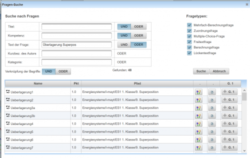

# Suche von Fragen in der Fragensammlung
Mit diesem Dialog können in der [Fragensammlung](../Beispielsammlung/index.md) bereits bestehende Fragen gesucht, bearbeitet und in Tests eingebunden werden.
Der Dialog zur Suche von Fragen kann in der [Beispielsammlung](../Beispielsammlung/index.md) über den [Toolbar](../Toolbar/index.md) mit dem Button  geöffnet werden.
 

### Definition der Suche
Mit den Suchfeldern Titel und Text können Wörter im Namen der Frage und im Fragetext gesucht werden.
Mit Kompetenz kann die Suche auf den Fragen zugeordnete [Kompetenzbereiche](../Kompetenzen/index.md) eingeschränkt werden.

Mit den Buttons UND/ODER neben jedem Suchbegriff wird festgelgt, ob **alle** Suchbegriffe oder **mindestens ein** Suchbegriff in Titel, Kompetenz oder dem Fragetext vorkommen müssen/können.

Die Suche kann noch zusätzlich auf einen Benutzer oder einen Kategorienamen eingeschränkt werden.

Die Verknüfung der einzelnen Suchoptionen kann ebenfalls auf UND/ODER festgelegt werden.
Weiters ist eine Auswahl von bestimmten :Kategorie:Fragetypen|Fragetypen für die Suche möglich.

In obigem Beispiel wird in der [Fragensammlung](../Beispielsammlung/index.md) nach den Begriffen Überlagerung oder Superpos gesucht, wobei einer der beiden Begriffe sowohl im Titel als auch im Fragetext vorkommen müssen. Alle Fragetypen werden in die Suche mit einbezogen.

### Ergebnisse der Suche
Die Anzahl an gefundenen Fragen wird unterhalb des Abbruch-Buttons angezeigt. Die Liste der gefundenen Fragen wird in Tabellenform mit folgenden Spalten dargestellt:
* [Name der Frage](/notimplemented/index.md)
* [Pfad](../Ordnerverwaltung/index.md) (gesamter Pfad, wo die Frage im Kategorie-Baum zu finden ist)
*  im [EditModus](../BeispielsammlungEditieren/index.md) wird ein Button zur Vorschau der Frage dargestellt
*  Button zum Öffnen der Frage in der Fragensammlung
* Ist ein Test zur Bearbeitung geöffnet, dann werden für jede Testgruppe Buttons angezeigt, mit denen eine gefunden Frage zu einer Testgruppe hinzugefügt werden kann.

Kategorie:Dialoge

