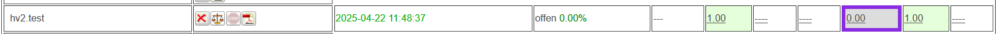

# Test-Ergebnisse / Aktivität-Ergebnisse
Ist ein Test aktiv, dann wird im [Navigationsbereich](../LeTTo-Hauptansicht/index.md#navigation) der Baum mit **Test-Einstellungen** angezeigt.
 

Der Menüpunkt **Ergebnisse** führt zur Übersicht über alle Ergebnisse eines Online-Tests bzw. Online-Aktivität.

Dabei bedeutet:
* violett umrahmt: Das letzte selektierte Bsp. innerhalb der Aktivität bzw. zur Aktivitätslaufzeit, dass gerade aktive Bsp.
* grün: Bsp. ist als korrekt gelöst evaluiert worden
* dunkel grün: Bsp. ist vom Lehrer manuel als korrekt evaluiert worden
* rot: Bsp. ist als inkorrekt (nicht korrekt) evaluiert worden
* gelb: Bsp. ist als teilweise korrekt evaluiert worden

## Ergebnisse einer Befragung
siehe [Anonyme Befragung](../AnonymeBefragung/index.md)
## Ergebnis-Übersicht für einen Test

Folgende Spalten werden in der Ergebnisübersicht angezeigt:
* Name des Schülers
* Versuch: Zeitpunkt, wann der Testversuch gestartet wurde.
* : Diesen Schüler neu beurteilen:
* : Diesen Testversuch neu beurteilen, alle Beispiele ausser vom Lehrer beurteilte werden neu durchgerechnet und mit den Schülereingaben verglichen, die Note wird neu berechnet.
* Punkte: : Angabe von Soll- und Ist-Punktezahl, Prozentwert für dieses Beispiel
* Note: Note für diesen Test
* Für jede Frage eines Online-Tests wird eine eigene Spalte angezeigt: Hier werden die erreichten Punkte für diese Frage dargestellt. Farbliche Hinterlegung für falsch (rot), grün(richtig) und teilweise richtig (gelb). Wird diese Beurteilung vom Lehrer festgelegt, dann erscheint diese in grellerer Farbhinterlegung.

Alle diese Ergebnisse sind als Links ausgeführt. Beim Klick darauf öffnet sich ein Dialog mit den konkreten Schülerergebnissen.

##  Beispielansicht 

 
Links oben sind Name und Fragenummern zu sehen. Die Beispielangabe (Bp. ...) bezieht sich auf die Beispielnummer des Schülers bei der Testabwicklung. (Die Beispiele eines Tests werden bei der Testausführung zufällig angeordnet!)

Für jede Teilfrage sind die erreichten Punkte angeführt. Diese können vom Lehrer überschrieben werden. 
 
Wenn man mit der Maus über die Fragebezeichnung einer Teilfrage fährt, dann wird ein Tooltip mit dem zur Teilfrage gehörenden Fragetext angezeigt.

Nach jeder Änderung wird automatisch die Summe mitberechnet. 

Der Link **Frage bearbeiten** dient dazu, dass bei ev. fehlerhaften Fragen diese direkt aus dieser Ansicht heraus bearbeitet und geändert werden können. Beim Klicken auf diesen Link wird die [Beispielsammlung](../BeispielsammlungEditieren/index.md) geöffnet und das Beispiel kann geändert werden.

Zu jedem Ergebnis kann der Lehrer ein **individuelles Feedback** geben und mit der Notenänderung speichern.

###  Weiterschalten / Abschliessen der Eingaben  
Folgende Buttons stehen zur Verfügung:
* Neu beurteilen: Die korrigierten Beurteilugen werden übernommen und der Dialog geschlossen
* Pfeile nach oben und nach unten: Nächster / voriger Schüler: Beurteilungen übernehmen und zum nächsten oder vorigen Schüler bei gleichem Beispiel wechseln.
* Pfeile nach rechts und links: Nächste / vorige Frage: Beurteilungen übernehmen und zur nächsten Frage bei gleichem Schüler gehen
  

###  Frage - Ergebnisse 
Anzeige des aktuellen Beispiels mit den Schülereingaben.

###  Anzeige des Testprotokolls
Klicken Sie auf das, durch den blauen Pfeil markierte Symbol - siehe folgende Abbildung.
 

Das Testprotokol (Protokol der Online-Aktivität) wird angezeigt - siehe Abbildung darunter.
* blauer Bereich: Allgemeine Daten der Online-Aktivität werden aufgelistet.
* oranger Bereich: Schülerspezifische Informationen werden aufgelistet. Diese sind: Name, Note, Prozentwert, Start, Stop, Event-Loging
  * Name
  * Beurteilung/Note
  * Prozentwert
  * Startdatum
  * Stopdatum
  * Event-Loging
    * F: Zeitstempel bei der Fortsetzung des Schülers nach Wiederöffnung des Lehrers nach Fokusverlust des Schülers
    * E: Zeitstempel bei Ergebnisabruf vom Schüler
    * O: Zeitstempel des abermaligen Öffnens der Aktivität durch Lehrer nach einem Focus-Verlust
    * X: Zeitstempel bei Auftritt eines Focus-Verlusts
    

[//]: # (    * NoCon: Systembedingter Fokusverlust - Bsp. Internetverbindung nicht vorhanden)

