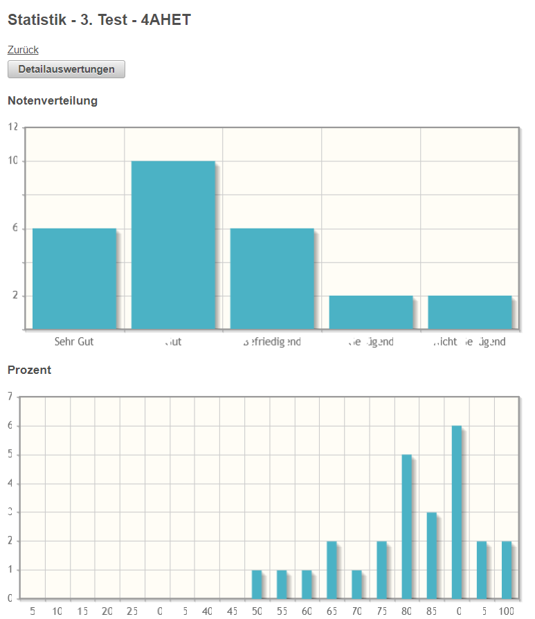
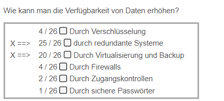
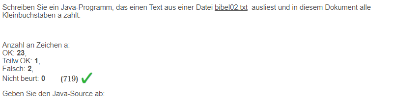

# Aktivitäts-Statistiken
[Zur Ergebnis-Übersicht der Aktivität](../Test-Ergebnisse/index.md)

## Leistungsverteilung ##
Übersicht über die Leistungsverteilung bei einer Aktivität: 
Das erste Diagramm gibt eine Notenübersicht wieder,
während das zweite Diagramm eine Aufschlüsselung nach Prozentwerten anzeigt.

Über den Button [Detailauswertungen](#detailsauswertungen) werden die einzelnen Testfragen nach falschen und korrekten
Ergebnissen aufgeschlüsselt

 

## Detailauswertungen ##
#### Multiple-Choice-Fragen
Bei Multiple-Choice-Fragen erhalten Sie eine Übersicht,
welche Antworten wie oft von den Schülern ausgewählt wurden

Beispiel dafür: 
 

#### Berechnungsfragen, Plugins ####
Bei Berechnungsfragen erhalten Sie Infos darüber, wieviele Schüler pro Teilfrage korrekt,
teilweise richtig oder falsch geantwortet haben.

Beispiel dafür:

