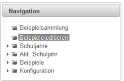
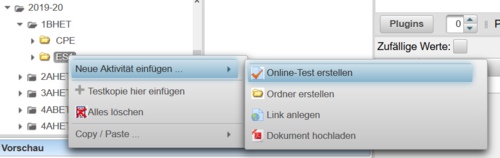
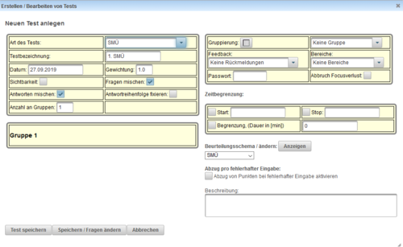
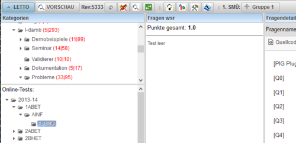

# Test anlegen
* Wechseln sie in den Modus "Beispiele Editieren" oder "Beispielsammlung"
 
* Wählen sie im Bereich "Online-Tests:" in dem gewünschten Gegenstand in der gewünschten Klasse mit der rechten Maustaste "Neue Aktivität einfügen" und danach "Online-Test erstellen"
 
* Konfigurieren sie den Test wie gewünscht (siehe [Online-Tests testeinstellungen](../Online-Tests/index.md#testeinstellungen)). 
  * der Test ist für den Schüler nicht sichbar solange das Häkchen bei "Sichtbarkeit" nicht gesetzt ist!
 
* Mit "Test speichern" wird der Test fertig angelegt
* Der Test befindet sich nun im Zustand "Bearbeitung aktiviert", dies ist durch deb Button "Gruppe 1" in der Symbolleiste erkennbar.
 
Weiter mit:
* [Beispiele zu Test hinzufügen](../BeispielezuTesthinzufügen/index.md)
* [Testbearbeitung fortsetzen](../Testbearbeitungfortsetzen/index.md) wenn ein schon vorhandener Test geändert werden soll
* [IP-Einschränkung](../IP-Einschränkung/index.md)

