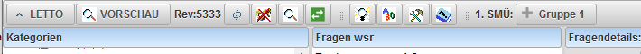
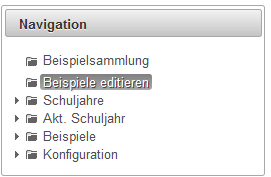
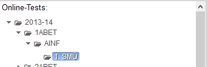
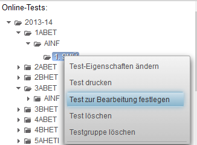

# Testbearbeitung fortsetzen
* Um zu einem Test weitere Beispiele hinzufügen zu können muss sich der Test im Zustand "Testbearbeitung" befinden. Dies erkennt man an dem Button "Gruppe 1" in der Symbolleiste im Modus "Beispiele Editieren" oder "Beispielsammlung":
 
* In den Modus "Testbearbeitung" gelangt man durch [Test anlegen](../Testanlegen/index.md) oder wie hier beschrieben
###  Testbearbeitung forstsetzen 
* Wechseln sie in den Modus "Beispiele Editieren" oder "Beispielsammlung"
 
* Wählen sie im Bereich "Online-Tests:" in dem gewünschten Gegenstand in der gewünschten Klasse den gewünschten Test aus
 
* Wählen sie mit der rechten Maustaste "Test zur Bearbeitung festlegen"
 

