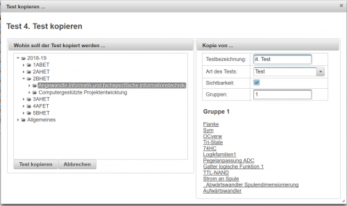
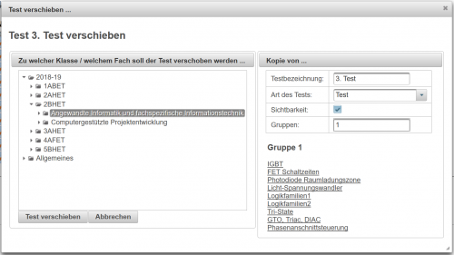

# Test kopieren
Zurück zum [Klassenzimmer](../Klassenzimmer/index.md)

Mit diesem Dialog können Sie eigene Tests oder auch Tests von Kollegen (siehe [Fremde Daten](../Klassenzimmer/index.md#eigene--fremde-daten)) in einen anderen Gegenstand/Ordner kopieren und dort unter neuem Namen anlegen.
 

Im Bereich **Wohin soll der Test kopiert werden...** wählen Sie bitte das Ziel aus, wo der Test kopiert und neu angelegt werden soll.

Im Bereich **Kopie von** können Sie den Namen und die Eigenschaften des Tests festlegen.

Wenn Sie ein neues Fach gewählt haben, dann wird der Button **Test kopieren** sichtbar und Sie können die Kopie fertigstellen.

## Test verschieben
Achtung: Sie können NUR EIGENE Tests verschieben!
 
Ähnlich aufgebaut wie der oben beschreibene Dialog ist der **Dialog zum Verschieben eines Tests**. Sollte ein Test zB. im falschen Gegenstand angelegt worden sein, dann können Sie diesen Test hiermit zu einem anderen Gegenstand verschieben.

 

