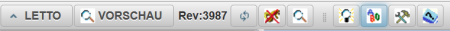
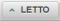
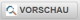
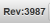
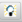
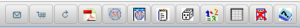

# Toolbar
## Symbolleiste zur Steuerung der Fragensammlung

Mit den Toolsbars im oberen Bereich der [Beispielsammlung](../Beispielsammlung/index.md) bzw. des Modus [Beispielsammlung Editieren](../BeispielsammlungEditieren/index.md) kann die Beispielerstellung gesteuert und unterschiedliche Dialoge zur Bearbeitung angezeigt werden.
Dieser Toolbar ist in zwei Bereiche unterteilt: Links kann das Verhalten der Kategorien gesteuert werden, rechts sind die entsprechenden Buttons für die Bearbeitung einer ausgewählten Frage angeordnet.

### Toolbar für Kategorien

|  | Zurückwechseln zur [LeTTo-Hauptansicht](../LeTTo-Hauptansicht/index.md)                                                        |
|-----------------------------------------------------------------------|--------------------------------------------------------------------------------------------------------------------------------|
|  | Umschalten zwischen der [Vorschau](../Beispielsammlung/index.md) und dem [Editiermodus](../BeispielsammlungEditieren/index.md) |
|  | Anzeige der aktuellen Versionsnummer                                                                                           |
|  | Neuladen aller [Kategorien](../Ordnerverwaltung/index.md)                                                                      |
|  | Ausloggen vom System                                                                                                           |
|  | [Suche von Fragen in der Fragensammlung](../SuchevonFrageninderFragensammlung/index.md)                                        |
|  | Kompetenzen zu Fragen hinzufügen                                                                                               |
|  | [Umschalten zwischen Eingabe- und Ergebnisansicht](../UmschaltenzwischenEingabe-undErgebnisansicht/index.md)                   |
|  | [Festlegung von angezeigten Themen und Benutzern](../Abos/index.md)                                                            |
|  | Einstellungen konfigurieren                                                                                                    |
|  | Hilfe öffnen                                                                                                                   |

###  Toolbar für Fragen im Edit-Modus
