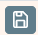

# Toolbar
## Symbolleiste zur Steuerung der Fragensammlung

Mit den Toolsbars im oberen Bereich der [Beispielsammlung](../Beispielsammlung/index.md) bzw. des Modus [Beispielsammlung Editieren](../BeispielsammlungEditieren/index.md) kann die Beispielerstellung gesteuert und unterschiedliche Dialoge zur Bearbeitung angezeigt werden.
Dieser Toolbar ist in zwei Bereiche unterteilt: Links kann das Verhalten der Kategorien gesteuert werden, rechts sind die entsprechenden Buttons für die Bearbeitung einer ausgewählten Frage angeordnet.

### Toolbar für Kategorien

| Button                    | Beschreibung                                                                                                                               |
|---------------------------|--------------------------------------------------------------------------------------------------------------------------------------------|
|    | Zurückwechseln zur [LeTTo-Hauptansicht](../LeTTo-Hauptansicht/index.md)                                                                    |
|    | Umschalten zwischen der [Bibliotheks Vorschau](../Beispielsammlung/index.md) und dem [Editiermodus](../BeispielsammlungEditieren/index.md) |
|    | Kontextmenü  für den aktuellen Bereich anzeigen                                                                                            |
|    | Neuladen aller [Kategorien](../Ordnerverwaltung/index.md) des Ordnerbaumes                                                                 |
|    | Ausloggen vom System                                                                                                                       |
|    | [Suche von Fragen in der Fragensammlung](../SuchevonFrageninderFragensammlung/index.md)                                                    |
|    | zuletzt bearbeitete Frage anzeigen                                                                                                         |
|    | Einstellungen - Abos, Sprache, Design                                                                                                      |
|    | Ansicht der Frage-Vorschau im Bibliotheksmodus umschalten - Vorschau, Debug, App                                                           |
|  | Hilfe öffnen                                                                                                                               |

###  Toolbar für Fragen im Edit-Modus

| Button | Beschreibung                                          |
|--------|-------------------------------------------------------|
|  | Speichern der Frage                                   |
|  | Zusatzinformationen zur Frage anzeigen                |
|  | Frage zurücksetzen - wird neu aus der Datenbank geladen |
|  | Historie der Fragetexte anzeigen                      |
|  | Frage drucken                                         |
|   | Dialog für angehängte Dateien und Bilder              |
|  | Durchrechnen der Frage                                |
|  | Durchrechnen der Frage und Anzeige aller Berechnungen |
|  | Alle Teilergebnisse der Berechnung anzeigen           |
|  | Zahlenwerte der Datensätze neu Würfeln - Vorsicht: ist nicht rückgängig machbar |
|  | [Vorschaudialog](../Fragen-Vorschau/index.md) öffnen |
|  | Tabelle aller Datensätze und Ergebnisse anzeigen |
|  | Überflüssige Datensätze löschen |
|  | Hilfe zum aktuellen Fragetyp öffnen |

