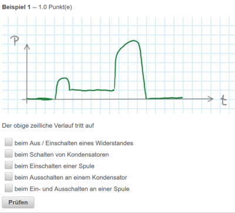

# Umschalten zwischen Eingabe- und Ergebnisansicht
Mit dem Button  aus dem [Toolbar](../Toolbar/index.md) in der [Beispielsammlung](../Beispielsammlung/index.md) kann die Ansicht zwischen der Eingabeansicht und der Ergebnisansicht umgeschaltet werden.

## Eingabeansicht
Die Fragen werden so angezeigt, wie die Fragen während der Testausführung für den Schüler erscheinen. Mit dem **Prüfen-Button** kann die Eingabe auf Richtigkeit kontrolliert werden (ähnlich wie bei einem Online-Test im Modus einer Hausübung).
 

## Ergebnisansicht
In der Ergebnisansicht sehen Sie, wie die obige Multiple-Choice-Frage nach dem Beenden eines Tests mit korrigierten Ergebnis aussieht.
 
Hinweis: Bei Multiple-Choice-Fragen werden die Antworten, wo ein Häckchen gesetzt werden sollte, mit einem -Symbol gekennzeichnet. Alle Antworten mit grüner Farbe haben eine Übereinstimmung zwischen Soll- und Ist-Lösung, die roten Farbbereiche zeigen eine falsche Lösung an. (Häckchen wurde gesetzt, wo es falsch war, oder bei fehlendem Häckchen bei richtigen Antworten)

