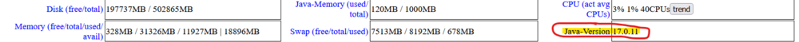
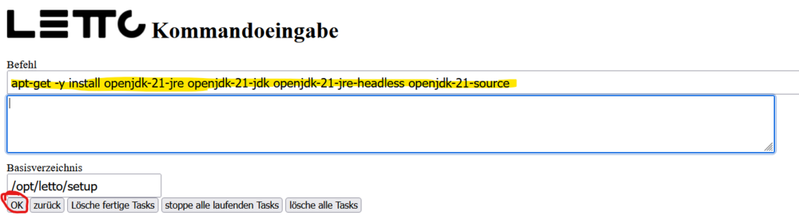
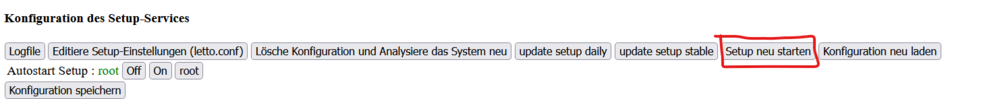
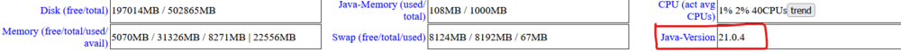
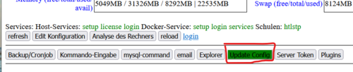
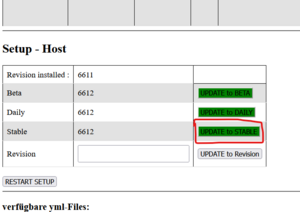
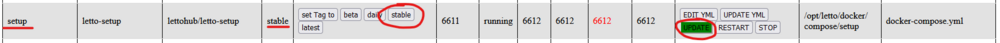
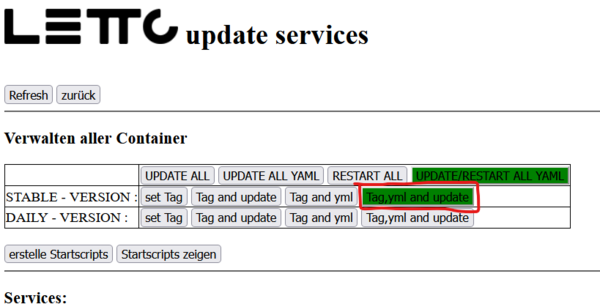

# Update rev66xx
Datum 4.9.2024

zurück zu [Administration](../Administration/index.md)

##  Update einer Version 65xx auf die Stable-Version 66xx vom September 2024 

Das Update besteht aus 3 Phasen.
* 1. Update des hostbasierten Setup-Services (https://servername/setup) - ist nur notwendig wenn es auch verwendet wird und läuft
* 2. Update des dockerbasierten Setup-Services (https://servername/config) 
* 3. Update aller anderen Services **nachdem** das Setup-Service aktualisiert wurde!!

###  Update des hostbasierten Setup-Services 
* vor einem Java-Update sollten alle anstehenden Betriebsystem-Aktualisierungen durchgeführt werden.  
<pre>    apt-get update -y
    apt-get upgrade -y
    apt-get dist-upgrade -y
    apt-get autoremove -y
    reboot</pre>
* Falls am System noch Java 17 oder älter läuft muss zuerst das [JDK-21](../InstallJDK-21/index.md) installiert werden. (siehe auch [Install JDK-21](../InstallJDK-21/index.md))   
  * in Ubuntu 22.04 oder 24.04
*** entweder in der shell: <pre>apt-get -y install openjdk-21-jre openjdk-21-jdk openjdk-21-jre-headless openjdk-21-source</pre>
*** oder über das Setup-Service (https://servername/setup) über den Button Kommandoeingabe:    
  * in Debian siehe [Install JDK-21](../InstallJDK-21/index.md)
  * danach muss das Setup-Service neu gestartet werden   
  * Nach dem Neustart des Setup-Services sollte die Java Version 21 eingetragen sein    
* Update des hostbasierten Setup-Services
  * Entweder über die Kommandozeile <pre>bash /opt/letto/setup/updatelettosetup.sh</pre>
  * oder über Update-Config   
*** über den Button Update-to-Stable bei Host   

###  Update des dockerbasierten Setup-Services 
Das Update kann entweder webbasiert oder in der Ubuntu-bash erfolgen.
* webbasiertes Update:   Das Update kann entweder über das dockerbasierte https://servername/config oder über das hostbasierte https://servername/setup Setup-Service erfolgen. Hierzu bitte über Update-Config zuerst den Update-Plan auf "stable" setzen und danach das Update starten. 
* in der Ubuntu-bash:
  * ins Verzeichnis /opt/letto/docker/compose/setup wechseln<pre>cd /opt/letto/docker/compose/setup</pre>
  * in der Datei docker-compose.yml den tag beim image auf stable setzen<pre>image: lettohub/letto-setup:stable</pre>
  * container pullen und neu starten 
<pre>     docker compose down
     docker compose pull
     docker compose up -d</pre>

###  Update aller anderen Services 
Auch das Update aller anderen Services kann entweder webbasiert(empfohlen) oder in der Ubuntu-bash erfolgen.
* webbasiertes Update im Setup-Service über Update-Config und dann   
* in der Ubuntu-bash müssten relativ viele Operationen durchgeführt werden um das Update komplett zu erledigen weshalb ich mal diese Art hier nicht näher beschreibe sondern nur die Schritte angebe
  * Aktualisierung aller .yml Dateien in /opt/letto/docker/compose und den Unterverzeichnissen (dabei den Tag aller LeTTo-Container auf stable setzen)
  * alle container mit docker compose stoppen, pullen und neu starten
  * Installation der neuen Services edit,main,question,plugins,pluginsourcecode falls sie noch nicht installiert sind über die .yml,.conf Dateien und Start der Services

