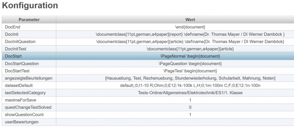
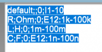

# User-Konfiguration
 
In dieser Tabelle können Sie die Paramter für Letto an ihre eigenen Bedürfnisse anpassen.

Wesentliche Parameter:
* **DocInit**, **DocInitQuestion**: Hier können Sie ihren Namen festlegen, der beim Ausdruck auf den Dokumenten erscheinen soll.
* **datasetDefault**: Hiermit legen Sie fest, welche Einheiten und Zahlenbereiche für Formelzeichen verwendet werden sollen.

* **showQuestionCount**: Wenn dieser Parameter auf 1 gesetzt wird, dann werden in der [Baumstruktur der Fragensammlung](../Ordnerverwaltung/index.md) die [Anzahl an Fragen pro Ordner anzeige-der-fragenanzahl](../Ordnerverwaltung/index.md#anzeige-der-fragenanzahl) dargestellt.

**datasetDefault**:
 
Jede Zeile legt die Definition für ein Formelzeichen fest und besteht aus Parametern, die durch Beistrich getrennt sind:
* Formelzeichen
* zugeordnete Einheit
* Automatische Ergänzung, = bedeutet deaktiviert
* Wertebereich, der für Datensätze, die mit diesem Formelzeichen beginnen, verwendet wird.

