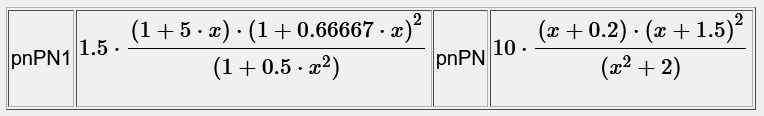
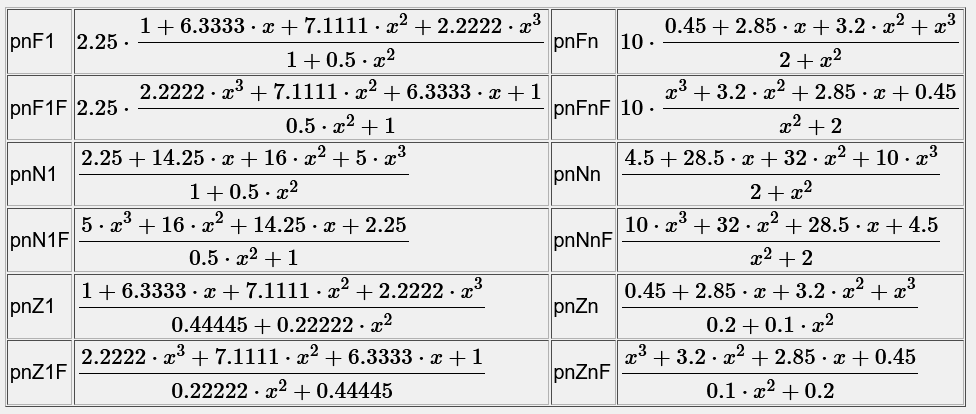
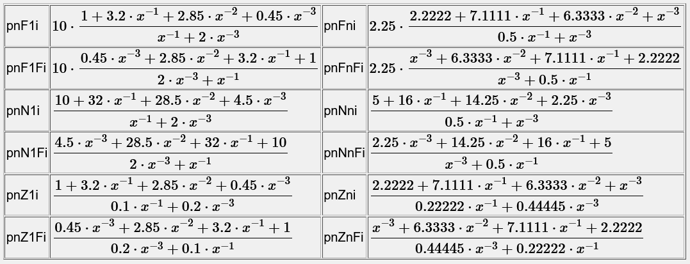

# Zahlendarstellung
Im Angabetext und bei der [ZielEinheit](../ZielEinheit/index.md) einer Lösung kann die Zahlendarstellung durch ein Zahlenformat durch ein **Strichpunkt**(;) oder einen 
Beistrich(,) getrennt angegeben werden. Bei einer berechnenden Anzeige {= } sollte man nur den **Strichpunkt**(;) verwenden!

z.B:
<pre>{x;a2}
{y,4}
{=153;F3}   

Bei konstanten Werten oder berechneten Werten kann der Beistrich als Listentrenner interpretiert werden. Es wird empfohlen den Strichpunkt zu verwenden.
</pre>

###  Ergebniseingabe bei Antwortfeldern 
Für die Schülereingabe kann die Eingabe durch ein Gleichheitszeichen vor dem Zahlenformat in der [ZielEinheit](../ZielEinheit/index.md) der Teilantwort einer Frage erzwungen werden!

###  Zahlenformate 
Für die Zahlendarstellung sind folgende Zahlenformate definiert:

| Format      | Bedeutung                                                                                                                     | Beispiel           | Wert                           | Ausgabe                     |
|-------------|-------------------------------------------------------------------------------------------------------------------------------|--------------------|--------------------------------|-----------------------------|
|             | ohne Angabe wird die Zahl ab 10^5 bzw. 10^-5 als Gleitkommazahl mit 14 gültigen Ziffern dargestellt                           | {x}                | 12345.34 123456.43          | 12345.34   1.2345643e5   |
| ;{ziffern}  | maximale Anzahl gültiger Ziffern auch hier wird ab 10^5 bzw. 10^-5 auf Gleitkommadarstellung umgestellt                    | {x;3}              | 1451.34   1234567.23        | 1450   1.23e6            |
| ;d{ziffern} | Kommazahl mit einer maximalen Anzahl gültiger Ziffern                                                                         | {x;d3} {x;d8}   | 203.2                          | 203 203.2                |
| ;D{ziffern} | Kommazahl mit einer fixen Anzahl gültiger Ziffern                                                                             | {x;D3} {x;D8}   | 203.2                          | 203 203.20000            |
| ;r{ziffern} | Kommazahl in normaler oder Gleitkommadarstellung mit einer maximalen Anzahl gültiger Ziffern                                  | {x;r3} {x;r8}   | 203.2                          | 203 203.2                |
| ;R{ziffern} | Kommazahl in normaler oder Gleitkommadarstellungmit einer fixen Anzahl gültiger Ziffern                                       | {x;R3} {x;R8}   | 203.2                          | 203 203.20000            |
| ;a{ziffern} | Kommazahl mit einer maximalen Anzahl von Nachkommastellen                                                                     | {x;a1}   {x;a3} | 1451.34                        | 1451.3  1451.34          |
| ;A{ziffern} | Kommazahl mit einer fixen Anzahl von Nachkommastellen                                                                         | {x;A1}   {x;A3} | 1451.34                        | 1451.3  1451.340         |
| ;A0         | Ganzzahl ohne Gleitkommadarstellung                                                                                           | {x;A0}             | 1451.34   123456789012.2345 | 1451  123456789012       |
| ;e{ziffern} | Exponentialschreibweise Gleitkommazahl mit einer maximalen Anzahl gültiger Ziffern                                            | {x;e3} {x;e8}   | 1451.34                        | 1.45e3 1.45134e3         |
| ;E{ziffern} | Exponentialschreibweise Gleitkommazahl mit einer fixen Anzahl Ziffern                                                         | {x;E3} {x;E8}   | 1451.34                        | 1.45e3 1.4513400e3       |
| ;t{ziffern} | technische Exponentialschreibweise (Potenzen sind Vielfache von 3) Gleitkommazahl mit einer maximalen Anzahl gültiger Ziffern | {x;t3} {x;t8}   | 14513.4                        | 14.5E3 14.5134E3         |
| ;T{ziffern} | technische Exponentialschreibweise (Potenzen sind Vielfache von 3) Gleitkommazahl mit einer fixen Anzahl Ziffern              | {x;T3} {x;T8}   | 14513.4                        | 14.5E3 14.513400E3       |
| ;f{ziffern} | Gleitkommazahl mit einer maximalen Anzahl gültiger Ziffern                                                                    | {x;f3} {x;f8}   | 1451.34                        | 1.45*10^3 1.45134*10^3   |
| ;F{ziffern} | Gleitkommazahl mit einer fixen Anzahl Ziffern                                                                                 | {x;F3} {x;F8}   | 1451.34                        | 1.45*10^3 1.4513400*10^3 |
| ;Z{ziffern} | gekürzter Bruch aus einer Dezimalzahl mit einer definierten Anzahl von gültigen Ziffern                                       | {x;Z4}             | 203.2                          | 1016/5                      |
| ;einheit    | es wird nur die Einheit **ohne Zahlenwert** dargestellt                                                                       | {=x;einheit}       | 32V/m                          | V/m                         |
| ;unit       | es wird nur die Einheit **ohne Zahlenwert** dargestellt                                                                       | {=x;unit}          | 32V/m                          | V/m                         |

#### für Vektoren, Matrizen und Mengen können weiters folgende Parameter angegeben werden

| Format | Bedeutung                                                                    | Beispiel  | Wert           | Ausgabe               |
|--------|------------------------------------------------------------------------------|-----------|----------------|-----------------------|
| ;line  | gibt den Vektorn in einer Zeile an                                           | {x;line}  | [2,3,4](2,3,4) | (2&#x007C;3&#x007C;4) |
| ;input | gibt den Vektorn so an, wie er auch eingegeben werden kann                   | {x;input} | [2,3,4](2,3,4) | [2,3,4](2,3,4)        |
| ;set   | gibt eine Menge mit Mengenklammern an                                        | {x;set}   | [2,3,4](2,3,4) | {2,3,4}               |
| ;list  | gibt eine Menge ohne Klammern an                                             | {x;list}  | [2,3,4](2,3,4) | 2,3,4                 |
| ;frac  | stellt eine Menge mit 2 oder 3 Elementen als Bruch oder gemischten Bruch dar | {x;frac}  | [2,3,4](2,3,4) | 2 3/4                 |

#### für allgemeine Funtionen können folgende Parameter angegeben werden

| Format | Bedeutung                                                      | Beispiel                | Wert | Ausgabe   |
|--------|----------------------------------------------------------------|-------------------------|------|-----------|
| ;term  | lässt alle Malzeichen zwischen Variablen und Zahlenwerten weg. | {=x^2*y+2*x^2*y^3;term} |      | x²y+2x²y³ |

####  für Polynome und gebrochen rationale Funktionen mit numerischen Koeffizienten in einer Variablen können folgende Parameter angegeben werden
siehe auch [Berechnungen polynome](../Berechnungen/index.md#polynome)

| Format  | Bedeutung                                                                                                                                  |
|---------|--------------------------------------------------------------------------------------------------------------------------------------------|
| ;pnPN   | Pole und Nullstellen mit 1 bei der kleinsten Potenz der Polynomvariablen.                                                                  |
| ;pnPN1  | Pole und Nullstellen mit 1 bei der höchsten Potenz der Polynomvariablen.                                                                   |
| ;pnF1   | Faktordarstellung mit 1 bei der niedrigsten Potenz der Polynomvariable in Zähler und Nenner und steigenden Potenzen                        |
| ;pnF1F  | Faktordarstellung mit 1 bei der niedrigsten Potenz der Polynomvariable in Zähler und Nenner und fallende Potenzen                          |
| ;pnFn   | Faktordarstellung mit 1 bei der höchsten Potenz der Polynomvariable in Zähler und Nenner und steigenden Potenzen                           |
| ;pnFnF  | Faktordarstellung mit 1 bei der höchsten Potenz der Polynomvariable in Zähler und Nenner und fallende Potenzen                             |
| ;pnF1i  | Faktordarstellung mit negativen Potenzen mit 1 bei der niedrigsten Potenz der Polynomvariable in Zähler und Nenner und steigenden Potenzen |
| ;pnF1Fi | Faktordarstellung mit negativen Potenzen mit 1 bei der niedrigsten Potenz der Polynomvariable in Zähler und Nenner und fallende Potenzen   |
| ;pnFni  | Faktordarstellung mit negativen Potenzen mit 1 bei der höchsten Potenz der Polynomvariable in Zähler und Nenner und steigenden Potenzen    |
| ;pnFnFi | Faktordarstellung mit negativen Potenzen mit 1 bei der höchsten Potenz der Polynomvariable in Zähler und Nenner und fallende Potenzen      |
| ;pnN1   | Faktordarstellung mit 1 bei der niedrigsten Potenz der Polynomvariable im Nenner und steigenden Potenzen                                   |
| ;pnN1F  | Faktordarstellung mit 1 bei der niedrigsten Potenz der Polynomvariable im Nenner und fallende Potenzen                                     |
| ;pnZ1   | Faktordarstellung mit 1 bei der niedrigsten Potenz der Polynomvariable im Zähler und steigenden Potenzen                                   |
| ;pnZ1F  | Faktordarstellung mit 1 bei der niedrigsten Potenz der Polynomvariable im Zähler und fallende Potenzen                                     |
| ;pnNn   | Faktordarstellung mit 1 bei der höchsten Potenz der Polynomvariable im Nenner und steigenden Potenzen                                      |
| ;pnNnF  | Faktordarstellung mit 1 bei der höchsten Potenz der Polynomvariable im Nenner und fallende Potenzen                                        |
| ;pnZn   | Faktordarstellung mit 1 bei der höchsten Potenz der Polynomvariable im Zähler und steigenden Potenzen                                      |
| ;pnZnF  | Faktordarstellung mit 1 bei der höchsten Potenz der Polynomvariable im Zähler und fallende Potenzen                                        |
| ;pnN1i  | Faktordarstellung mit negativen Potenzen mit 1 bei der niedrigsten Potenz der Polynomvariable im Nenner und steigenden Potenzen            |
| ;pnN1Fi | Faktordarstellung mit negativen Potenzen mit 1 bei der niedrigsten Potenz der Polynomvariable im Nenner und fallende Potenzen              |
| ;pnZ1i  | Faktordarstellung mit negativen Potenzen mit 1 bei der niedrigsten Potenz der Polynomvariable im Zähler und steigenden Potenzen            |
| ;pnZ1Fi | Faktordarstellung mit negativen Potenzen mit 1 bei der niedrigsten Potenz der Polynomvariable im Zähler und fallende Potenzen              |
| ;pnNni  | Faktordarstellung mit negativen Potenzen mit 1 bei der höchsten Potenz der Polynomvariable im Nenner und steigenden Potenzen               |
| ;pnNnFi | Faktordarstellung mit negativen Potenzen mit 1 bei der höchsten Potenz der Polynomvariable im Nenner und fallende Potenzen                 |
| ;pnZni  | Faktordarstellung mit negativen Potenzen mit 1 bei der höchsten Potenz der Polynomvariable im Zähler und steigenden Potenzen               |
| ;pnZnFi | Faktordarstellung mit negativen Potenzen mit 1 bei der höchsten Potenz der Polynomvariable im Zähler und fallende Potenzen                 |

* Mit Nullstellen und Polen: 
 

* Mit positiven Potenzen:
 

* Mit negativen Potenzen:
 

### Datums- und Zeitformate
* Ein Datum oder eine Uhrzeit wird in LeTTo grundsätzlich als Anzahl der Sekunden seit dem 1.1.0000 um 00:00 Uhr gespeichert.
* Erzeugt wird ein Datum mittels der Funktion date(jahr,monat,tag,stunde,minute,sekunde), date(jahr,monat,tag,stunde,minute,sekunde)
* Eine Uhrzeit wird mittels der Funktion time(stunde,minute,sekunde) erzeugt - sie enthält nur die Zeitangabe ohne Datum in Sekunden seit Mitternacht.

| Format            | Bedeutung                             | Beispiel                                 | Ausgabe             |
|-------------------|---------------------------------------|------------------------------------------|---------------------|
| ;date             | Datum                                 | {=date(2020,3,12);date}                  | 2020-03-12          |
| ;date:de-AT       | Datum im deutschen Format             | {=date(2020,3,12);date:de-AT}            | 12.03.2020          |
| ;date:d.MMMM yyyy | Datum im deutschen Langformat         | {=date(2020,3,12);date:d.MMMM yyyy}      | 12.März 2020        |
| ;time             | Uhrzeit                               | {=time(7,3,15);time}                     | 07:03:15            |
| ;time:H:mm        | Uhrzeit                               | {=time(7,3,15);time:H:mm}                | 7:03                |
| ;datetime         | Datum und Uhrzeit                     | {=date(2020,3,12,7,3,15);datetime}       | 2020-03-12 07:03:15 |
| ;datetime:de-AT   | Datum und Uhrzeit im deutschen Format | {=date(2020,3,12,7,3,15);datetime:de-AT} | 12.03.2020 07:03:15 |

### Widerstandsfarbcode
* Es können 3-8 Ringe dargestellt werden.
* Die Farbcodes sind in Deutsch und Englisch mit 2- oder 3-Buchstaben Abkürzungen möglich.
* Als Trennzeichen zwischen den Farbcodes können Leerzeichen, Beistrich(,), Doppelpunkt(:), Schrägstrich(/) oder Bindestrich(-) und deren Kombinationen verwendet werden.
* Für die Darstellung von Widerstandswerten nach dem Widerstandsfarbcode können folgende Formate verwendet werden:

| Format           | Bedeutung                                                                      | Beispiel                  | Ausgabe                 |
|------------------|--------------------------------------------------------------------------------|---------------------------|-------------------------|
| ;color           | Widerstandswert mit Farbcodes mit 3 Ringen                                     | {=27kOhm;color}           | rot,violett,orange      |
| ;color:de-4      | Code mit 4 Ringen, Minus als Trennzeichen und deutsche 2-Zeichen Bezeichnungen | {=27kOhm;color:de-4}      | rt-vt-sw-rt             |
| ;color:deu/3     | Code mit 3 Ringen, / als Trennzeichen und deutsche 3-Zeichen Bezeichnungen     | {=27kOhm;color:deu/3}     | rot-vlt-ora             |
| ;color:deutsch 4 | Code mit 4 Ringen, Leerzeichen als Trennzeichen und deutsche Bezeichnungen     | {=27kOhm;color:deutsch 4} | rot violett schwarz rot |
| ;color:en:4      | Code mit 4 Ringen, : als Trennzeichen und englische 2-Zeichen Bezeichnungen    | {=27kOhm;color:en:4}      | rd:vt:bk:rd             |
| ;color:eng-3     | Code mit 3 Ringen, - als Trennzeichen und englische 3-Zeichen Bezeichnungen    | {=27kOhm;color:eng-3}     | red-vio-org             |
| ;color:english,3 | Code mit 4 Ringen, Beistrich als Trennzeichen und englische Bezeichnungen      | {=27kOhm;color:english,4} | red,violet,black,red    |
