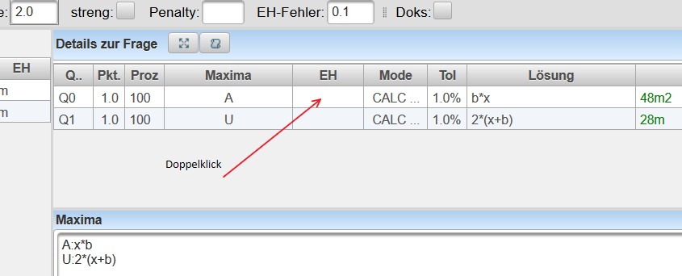
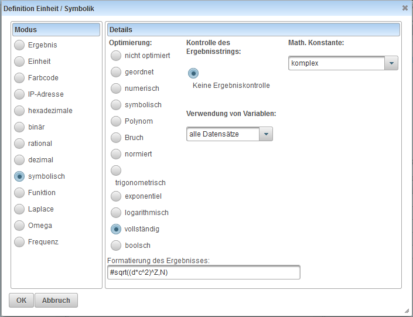

# ZielEinheit

Die Zieleinheit von Berechnungsfragen und Mehrfachberechnungsfragen definiert die [Einheit](../Einheit/index.md) und die Art der Verarbeitung des
Ergebnisses, welches der Schüler eingeben soll. Siehe auch [Korrektur](../Korrektur/index.md)

Neben der Einheit die der Schüler eingeben soll/muss kann auch die Art der symbolischen Verarbeitung und ein Muster wie die Lösung aussehen soll definiert werden.

Die Zieleinheit ist eine Zeichenkette mit einem definierten Syntax, da das Eingabefeld der Zieleinheit für komplexere Angaben zu klein ist und der Syntax nicht immer bekannt ist kann die Zieleinheit auch über einen Dialog eingegeben werden, welcher über Doppelklick auf die Zieleinheit erreicht wird.

Sehr ähnlich zur Zieleinheit ist auch die Einheitenangabe für Datensätze und Variable im Angabetext
( [Editor für den Angabetext](../EditorfürdenAngabetext/index.md#datensätze-und-variable) ).
Einige Definitionen der Zieleinheit können auch hier verwendet werden.

###  Dialog zur Definition der Zieleinheit

Durch einen Doppelklick auf die Zieleinheit erhält man den Dialog zur Definition der Zieleinheit.
 
Es öffnet sich der folgende Diaglog:

 

In diesem Dialog wird die Zieleinheit konfiguriert und es wird eine zugehörige Zeichenkette für die Zieleinheit erzeugt.

Im linken Teil des Dialogs wird die Art der Zieleinheit eingstellt (Für genauere Erklärung siehe unten bei Syntax der Zieleinheit-Zeichenkette).

Bei **Formatierung der Zeichenkette** kann ein Muster definiert werden, welches der Ausdruck des Schülers erfüllen muss. Mehrere Muster, welche durch Raute getrennt werden, können angegeben werden. Der Schülerausdruck muss mindestens einem Muster entsprechen.

###  Syntax der Zieleinheit-Zeichenkette
Die Zieleinheit beginnt mit einem optinalen Gleichheitszeichen gefolgt von Einheit, Funktion oder symbolischer Berechnungsart. Danach werden alle gültigen Suchmuster durch Raute getrennt angehängt
####  keine Zieleinheit
Ist keine Zieleinheit angegeben, so muss der Schüler als Ergebnis ein Ergebnis angeben, welches die gleiche Dimension und den gleichen Datentyp wie das Ergebnis der Berechnung hat.

Der Schüler kann hierbei auch IP-Adressen(getrennt durch Punkte), Hexadezimalzahlen(beginnen mit 0x) oder Binärzahlen(beginnen mit 0b eingeben, welche für den Ergebnisvergleich in eine Ganzzahl umgewandelt werden.

####  Einheiten des SI-Systems

* Beginnt die Zieleinheit mit einem **Gleichheitszeichen**, so muss der Schüler die Einheit, welche rechts neben dem Gleichheitszeichen steht genauso eingeben wie angegeben.
<pre>=VA
</pre>
* Beginnt die Einheit mit einem **Fragezeichen**, so muss der Schüler die angegebene Einheit verwenden, darf jedoch einen gültigen Einheitenvielfachen-Vorsatz vor dieser Einheit verwenden. (zB.: statt m/s darf der Schüler auch km/s oder m/ms verwenden, er darf jedoch nicht m/h verwenden da die Stunde kein Einheitenvorsatz für die Sekunde ist).
<pre>?km/h
</pre>
* Beginnt die Zieleinheit mit einer gültigen '''[Einheit](../Einheit/index.md)''' ohne Gleichheitszeichen oder Fragezeichen, so muss der Schüler eine Einheit der gleichen Dimension verwenden. Diese Angabe dient einerseits zur Kontrolle ob die Lösung des Lehrers auch die selbe Dimension hat, andererseits wird dem Schüler nach der Abgabe die richtige Lösung der Berechnung in dieser Einheit angezeigt.
<pre>m/s
</pre>
* an die Einheit kann noch ein '''[Zahlenformat](../Zahlendarstellung/index.md)** durch **Beistrich** getrennt angehängt werden. Diese Ziffernanzahl wird für die Anzeige der richtigen Lösung verwendet hat jedoch keinen Einfluss auf die Bewertung! Setzt man jedoch vor die Definition ein **Gleichheitszeichen**, dann **muss''' der Schüler das Ergebnis in dieser Form eingegeben (zB: =f2)!!
(zB: A,2 bedeutet Einheit Ampere mit 2 gültigen Ziffern in der Ergebnis-Anzeige)
* Für _komplexe Zahlen_ kann an die Einheit noch die Art der Darstellung der komplexen Zahl durch einen **Beistrich** getrennt eingestellt werden. Setzt man vor die Definition ein **Gleichheitszeichen**, dann **muss** der Schüler das Ergebnis in dieser Form eingeben (zB: =karti)!!

| Art    | Darstellung                        | Eingabe                                                                                                                                                                           |
|--------|------------------------------------|-----------------------------------------------------------------------------------------------------------------------------------------------------------------------------------|
| pol    | Polarform                          | 1arg0.15 1arg22° 1arg(22°) 1arg(0.15) 1*e^0.15i 1*e^i0.15 1*e^(0.15i) 1*e^(i0.15) 1*e^(0.15*i) 1*e^(i*0.15) 1*e^0.15j 1*e^j0.15 1*e^(0.15j) 1*e^(j0.15) 1*e^(0.15*j) 1*e^(j*0.15) |
| poli   | Polarform in i                     | 1*e^0.15i 1*e^i0.15 1*e^(0.15i) 1*e^(i0.15) 1*e^(0.15*i) 1*e^(i*0.15)                                                                                                             |
| polj   | Polarform in j                     | 1*e^0.15j 1*e^j0.15 1*e^(0.15j) 1*e^(j0.15) 1*e^(0.15*j) 1*e^(j*0.15)                                                                                                             |
| polrad | Polarform Radiant                  | 1arg(0.15) 1*e^0.15i 1*e^i0.15 1*e^(0.15i) 1*e^(i0.15) 1*e^(0.15*i) 1*e^(i*0.15) 1*e^0.15j 1*e^j0.15 1*e^(0.15j) 1*e^(j0.15) 1*e^(0.15*j) 1*e^(j*0.15)                            |
| poldeg | Polarform Grad | 1arg22° 1arg(22°) |                                                                                                                                                                                   |
| kart   | karthesische Koordinaten           | 2+3i 2+3*i 2+i*3 2+i3 i3+2 i*3+2 3i+2 3*i+2 2+3j 2+3*j 2+j*3 2+j3 j3+2 j*3+2 3j+2 3*j+2                                                                                           |
| karti  | karthesische Koordinaten 2+2i      | 2+3i 2+3*i 2+i*3 2+i3 i3+2 i*3+2 3i+2 3*i+2                                                                                                                                       |
| kartj  | karthesische Koordinaten 2+2j      | 2+3j 2+3*j 2+j*3 2+j3 j3+2 j*3+2 3j+2 3*j+2                                                                                                                                       |

* Beispiele:

| Zieleinheit | berechnetes Ergebnis | korrektes Ergebnis               | Ergebnis mit Einheitenfehler | Falsches Ergebnis                     |
|-------------|----------------------|----------------------------------|------------------------------|---------------------------------------|
|             | 2m/s                 | 2m/s oder 0.002km/s oder 7.2km/h | 2m                           | 2km oder 7.2km                        |
| m/s         | 2m/s                 | 2m/s oder 0.002km/s              | 2m oder 7.2km/h              | 2km oder 7.2km                        |
| =m/s        | 2m/s                 | 2m/s                             |                              | 2km oder 7.2km oder 7.2km/h 0.002km/s |
| =kart       | 3+6*%i               | 3+6i   3+6*j                  |                              | 6.7082arg63.435°                      |

####  einheitenlose Zahlen

Einheitenlose Zahlen können und dürfen mit den einheitenlosen Hilfseinheiten dB,Prozent,° angegeben werden. 
Ist dies nicht erwünscht, kann mit =float auch die einheitenlose Eingabe erzwungen werden.

| Sondereinheit | Bedeutung          | Zieleinheit | korrekte Antwort | falsche Antwort |
|---------------|--------------------|-------------|------------------|-----------------|
| float         | einheitenlose Zahl | =float      | 0.25             | 25%             |

#### Winkel

Winkel werden intern immer im Bogenmaß als dimensionslose Größe behandelt. Verwendet man in der Zieleinheit
jedoch Grad, so wird der Winkel in der Eingabe des Schülers in Grad erwartet. Wobei der Winkel über den
Einheitskreis definiert wird und der Schüler daher auch negative Winkel und vielfache am Einheitskreis
eingeben kann.

####  Sondereinheiten für ganze Zahlen

Sondereinheiten für ganze Zahlen verhalten sich immer wie mit vorangestelltem Gleichheitszeichen, weshalb das vorangestellt Gleichheitszeichen auch weggelassen werden kann.
Das bedeutet der Schüler muss das Ergebnis immer in der Form eingeben wie es die Zieleinheit verlangt!

| Sondereinheit | Bedeutung                                                                                                                                                                               | Zieleinheit       | korrekte Antwort               | falsche Antwort             |
|---------------|-----------------------------------------------------------------------------------------------------------------------------------------------------------------------------------------|-------------------|--------------------------------|-----------------------------|
| color         | Widerstandsfarbcode ohne Toleranz mit 3 Ringen. Hierbei wird nur der Zahlenwert des Ergebnisses verglichen, der Schüler braucht/darf keine SI-Einheit zusätzlich angeben. Als Farbcode  | color oder =color | rot-rot-orange                 | rot-blau-orange oder 22kOhm |
| ip            | IP-Adresse IPv4 in der auch binäre und hexadezimale Zahlen erlaubt sind                                                                                                                 | ip oder =ip       | 10.32.1.7 oder 10.0x20,1,0b111 | 169869575                   |
| hex           | Hexadezimalzahl                                                                                                                                                                         | hex oder =hex     | 0x20 oder 20                   | 32                          |
| bin           | Binärzahl                                                                                                                                                                               | bin oder =bin     | 0b101 oder 101                 | 5                           |
| long          | Dezimale Ganzzahl                                                                                                                                                                       | long oder =long   | 32                             | 30 oder 0x20 oder 0b100000  |
| deg           | Eingabe im Gradmaß mit Grad Minuten und Sekunden(auch mit Komma)                                                                                                                        | deg               | °2&#39;22&#15;&#39;            | 2.42°                       |
| date          | Eingabe eines Datums                                                                                                                                                                    | date              | 2.4.1970                       | 2342                        |
| time          | Eingabe einer Uhrzeit                                                                                                                                                                   | time              | 10:30:21                       | 3242                        |
| datetime      | Eingabe eines Datums mit Uhrzeit                                                                                                                                                        | datetime          | 2.4.1970 10:30:21              | 235234                      |

####  rational (Brüche)

Bei der Zieleinheit **rational** muss der Schüler einen Bruch aus Ganzzahlen eingeben.

rational unterstützt keine Einheiten!

Bei **=rational** muss der Schüler exakt den gleichen Bruch wie gefordert eingeben, ohne Gleichheitszeichen darf der Schüler jeden Bruch eingeben der den gleichen Wert wie gefordert darstellt (auch ungekürzt).

####  symbolische Berechnungen

Syntax: Optimierungsgrad;Konstantenverarbeitung;Datensatzverarbeitung#Muster1#Muster2

Soll der Schüler ein symbolisches Ergebnis eingeben, so muss die symbolische Berechnung gewählt werden. Je nach Optimierungsgrad gibt es verschiedenen symbolische Berechnungsmodie, welche im Dialog nach der Auswahl der symbolischen Berechnung in der zweiten Spalte des Dialogs ausgewählt werden können.

#####  Optimierungsgrad

Der **Optimierungsgrad** gibt an, wie das Schülerergebnis und die Lösung des Beispiels umgeformt werden dürfen um dann den gleichen Ausdruck zu liefern.

Folgende smbolischen Modi sind definiert:

| Zieleinheit     | Optimierungsgrad                           | Beschreibung                                                                                                                |
|-----------------|--------------------------------------------|-----------------------------------------------------------------------------------------------------------------------------|
| symbolnone      | Nicht optimiert                            | Der Schüler muss den Ausdruck exakt gleich wie im Ergebnis eingeben                                                         |
| symbolorder     | Reihenfolge optimiert                      | Der Schüler darf bei den Grundrechnungsarten die Reihenfolge der Operanden vertauschen                                      |
| symbolnumeric   | numerische Berechnungen werden ausgewertet | Der Schüler darf statt 2 auch 1+1 oder 4/2 etc. schreiben,  da alle numerischen Berechnungen ausgewertet werden             |
| symbolic        | symbolische Auswertung                     | symbolische Berechnungen der Grundrechnungsarten werden ausgewertet, Brüche werden gekürzt                                  |
| symbolpolynom   | Polynome ausmultiplizieren                 | Produkte von Summen werden ausmultipliziert wenn sie als Term in einer weitere Summen vorkommen                             |
| symbolbruch     | gemeinsame Nenner bilden                   | gemeinsamer Nenner von Brüchen wird bestimmt und ausmultipliziert                                                           |
| symbolnormbruch | Polynombrüche Normieren                    | Polynombruchfunktionen werden auf 1 für den Zahlenwert der Summenelemente normiert (noch nicht realisiert)                  |
| symboltrig      | trigonometrische Optimierung               | Trigonometrische Funktionen werden vereinfacht (noch nicht realisiert)                                                      |
| symbolexp       | Optimierung von Exponentialfunktionen      | Exponentialfunktions-Terme werden vereinfacht (noch nicht realisiert)                                                       |
| symbollog       | Optimierung von logarithmischen Funktionen | Logarithmus-Therme werden vereinfacht (noch nicht realisiert)                                                               |
| symbolfull      | vollständige Optimierung                   | Alle Optimierungstufen werden ausgeführt bzw. wenn das nicht hilft wird das Ergebnis durch Testvektoren numerische geprüft. |
| symbolboolsch   | Optimierung von booleschen(boolschen) Funktionen       | boolesche(boolsche) Funktionen werden vereinfacht (noch nicht realisiert)                                                              |

Nach dem Optimierungsmode folgt durch **Strichpunkt** getrennt die Verarbeitungsart von Konstanten und durch einen weiteren Strichpunkt getrennt die Verarbeitungsart von Datensätzen.

#####  Konstantenverarbeitung

Hier wird definiert welche Konstanten bei der Berechnung der Lösung als Zahlenwert eingesetzt werden.

Die Konstantenverarbeitung bezieht sich hierbei nur auf Konstante welche nicht mit einem Prozent beginnen! Alle Konstanten welche mit einem Prozent beginnen bleiben solange erhalten, bis sie numerisch ausgewertet werden, dann werden sie immer sofort eingesetzt!

Folgende Möglichkeiten gibt es für die Konstantenverarbeitung:

| String für die Konstantenverarbeitung | Beschreibung |                                                                            |
|------------------------------------------------------|----------------------------------------------------------------------------|
|                                                      | Ist kein String angegeben, so wird wie constscomplex verarbeitet           |
| constsmath                                           | Es werden die mathematische Konstanten i,j,e und pi im Ergebnis eingesetzt |
| constscomplex                                        | Es wird nur der komplexe Parameter i,j im Ergebnis eingesetzt (Standard)   |
| constsnone                                           | Es werden keine Konstanten im Ergebnis eingesetzt                          |
| consts(e)                                            | Es wird nur die Konstante e im Ergebnis eingesetzt                         |
| constsall                                            | Es werden alle definierten Konstaten im Ergebnis eingesetzt                |

#####  Datensatzverarbeitung

Hier wird definiert welche Datensätze bei der Berechnung der Lösung als Zahlenwert eingesetzt werden. Wird ein Datensatz nicht eingesetzt, so wird er in einem symbolischen Ergebnis wie eine Variable behandelt.

Folgende Möglichkeiten gibt es für die Konstantenverarbeitung:

| String für die Datensatzverarbeitung | Beschreibung |                                                                    |
|-----------------------------------------------------|--------------------------------------------------------------------|
|                                                     | Ist kein String angegeben, so wird wie constvarsall verarbeitet    |
| constvars(u,i)                                      | Es werden nur die Datensätze von u und i als Zahlenwert eingesetzt |
| constvarsnone                                       | Es wird kein einziger Datensatz in das Ergebnis eingesetzt         |
| constvarsall                                        | Es werden alle Datensätze in das Ergebnis eingesetzt (Standard)    |

####  Funktionen

Funktionen sind spezielle symbolische Ausdrücke, bei denen nur definiert Funktionsparameter als Variable vorkommen dürfen. Da diese Variablen durch Name und Einheit vorgegeben sind, ist auch eine Einheitenprüfung von Funktionen mögliche, was bei symbolischen Ausdrücken im Allgemeinen nicht möglich ist.

### Parameter für den Ergebnisvergleich von Vektoren und Mengen bei der Schülereingabe

* Sind durch **Strichpunkt** von der Einheit getrennt

| parameter | Funktion                                                                                                     |
|-----------|--------------------------------------------------------------------------------------------------------------|
| set       | Vektoren werden ohne Berücksichtigung von doppelten Einträgen in beliebiger Reihenfolge als Menge verglichen |
| multiset  | Vektoren werden ohne Berücksichtigung der Reihenfolge der Eintrag als Menge verglichen                       |

### Parameter für die vereinfachte Eingabe von symbolischen Ausdrücken

* Um die Eingabe von symbolischen Ausdrücken für den Schüler zu vereinfachen, kann die Eingabe in einer vereinfachten Form erfolgen.
* Bei der vereinfachten Termeingabe werden nur Variablen aus einem Buchstaben verwendet.
* Variablen mit mehr als einem Buchstaben werden als Multiplikation der Buchstaben interpretiert (zB. abc entspricht a*b*c)
* Einheiten können in dieser Eingabeform nur mit Hochkomma (') angegeben werden (zB.: 3'cm2')
* Vergisst man die Hochkomma bei einer Einheit wird diese als Variable interpretiert (zB.: 3cm2 entspricht 2*c*m*2)
* Da Einheiten nur mit Hochkomma erlaubt sind wird empfohlen die vereinfachte Termeingabe nur für Terme zu verwenden, bei denen keine Einheiten vorkommen.
* Variablen welche mehr als einen Buchstaben haben dürfen in der Lehrer-Lösung nicht vorkommen, da diese dann vom Schüler nicht eingegeben werden können.

| parameter | Funktion                 |
|-----------|--------------------------|
| term      | vereinfachte Termeingabe |

### Parameter für die Größe bzw. Breite und Art des Eingabefeldes bei berechneten Teilfragen einer Mehrfachberechnungsfrage

* Sind durch **Strichpunkt** von der Einheit getrennt

| parameter  | Funktion                                                                                      |
|------------|-----------------------------------------------------------------------------------------------|
| w30        | Definiert ein Eingabefeld welches in etwa 30 Zeichen anzeigen kann                            |
| w30m       | Definiert ein mathematisches Eingabefeld welches in etwa 30 Zeichen anzeigen kann             |
| w30t       | Definiert ein Text-Eingabefeld welches in etwa 30 Zeichen anzeigen kann                       |
| w20c       | Definiert ein Eingabefeld mit Taschenrechnerfunktion welches in etwa 20 Zeichen anzeigen kann |
| w30p       | Definiert ein Eingabefeld mit Vorschaufunktion welches in etwa 30 Zeichen anzeigen kann       |

##  Muster

Das Muster dient vor allem bei symbolischen Auswertungen dazu, um zu definieren, wie die Lösung aussehen kann. Ist ein Muster definiert, so wird automatische mit Symbolfull ausgewertet. Hierbei wird zuerste überprüft, ob die Schülereingabe dem Suchmuster entspricht, und danach noch geprüft ob der Ausdruck des Schülers die gleiche Funktion ergibt wie der Ausdruck im Ergebnis.

Mehrere Muster welche durch Raute getrennt werden können angegeben werden, wobei der Schülerausdruck mindestens einem Muster entsprechen muss.

Im wesentlichen gibt es zwei Arten wie das Suchmuster definiert sein kann:
* Als Mengendefinition wenn das Suchmuster mit einer eckigen Klammer beginnt
* ansonsten als regulärer Ausdruck, der vom Syntax her an die regulären Ausdrücke von Java angelehnt ist sich jedoch bei der Klammerung und den Platzhaltern von den Java-RegExp unterscheidet.

####  Zeichen für die Definition

Folgende Zeichen sind definiert:

| Zeichen | Bedeutung                                                                                    |
|---------|----------------------------------------------------------------------------------------------|
| N       | Natürliche Zahl                                                                              |
| Z       | ganze Zahl                                                                                   |
| R       | reelle Zahl                                                                                  |
| C       | komplexe Zahl                                                                                |
| G       | reelle Zahl in Exponentialschreibweise zB:1.0e24                                             |
| V       | beliebige Variable welche mit einem Buchstaben beginnt und aus Buchstaben und Zahlen besteht |
| K       | Konstante                                                                                    |
| E       | Einheit                                                                                      |

Alle anderen Zeichen haben keine spezielle Funktion.

####  Mengendefinition

Bei der Mengendefinition werden zu Beginn in eckigen Klammern alle Elemente definiert welche im Ergebnis vorkommen dürfen gefolgt von allen Funktionen durch Beistrich getrennt.

Beispiele:

| Muster           | trifft bei                                                     | trifft nicht bei                       |
|------------------|----------------------------------------------------------------|----------------------------------------|
| `[NK*(],sin,cos` | `4` `pi` `2*pi` `sin(2*pi)` `sin(4)` `5*sin(4)` | `tan(pi)` `sin(pi/2)` `5+sin(4)` |
| `[N*]`           | `3*4` `3`                                                   | `3+4` `1.2*3`                       |

####  Definition als regulärer Ausdruck

Ein Regulärer Ausdruck besteht aus den definierten Mengen, fixen Zeichen und Gruppierungen mit Verknüpfungen.

Die Mengen NZRCGVKE sind wie schon zuvor definiert.

Für Gruppierung und Verknüpfung stehen folgende Zeichen zur Verfügung:

| Zeichen   | Bedeutung                                                                                     |
|-----------|-----------------------------------------------------------------------------------------------|
| { }       | Gruppierungsklammer                                                                           |
| \\&#124; | der senkrechte Strich wenn er in einem symbolischen Ausdruch vorkommen darf                   |
| &#124;    | logische Oder-Verknüpfung des linken und rechten Ausdrucks                                    |
| ?         | optionales Vorkommen eines Zeichens (Das Zeichen links von ? kann Vorkommen, oder auch nicht) |
| { }?      | optionales Vorkommen einer Gruppe                                                             |
| { }+?     | Gruppe kann einmal oder mehrmals vorkommen                                                    |
| { }*?     | Gruppe kann nicht, einmal oder mehrmals vorkommen                                             |

Beispiele:
