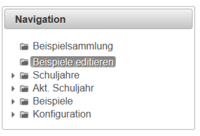
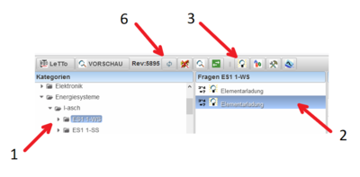
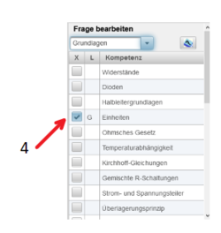
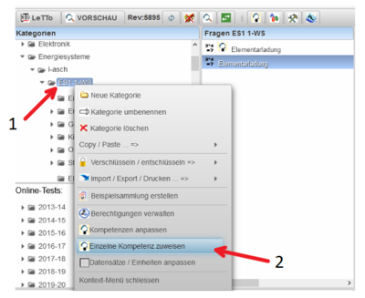
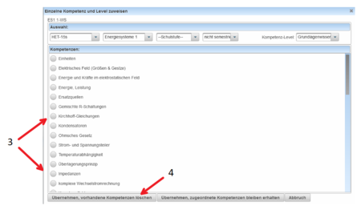

# Zuordnung v. Beispielen

###  Einem einzigen Beispiel eine Komptenz oder mehrere Kompetenzen zuordnen 

Um ein einzelnes Beispiel eine oder mehrere Kompetenzen zu zuordnen, gehen Sie wie folgt vor. Wechseln Sie nach erfolgreicher Anmeldung am Server in den Editiermodus von LeTTo - mit Klick auf **Beispiele editieren** im Bereich Navigation - siehe Graphik.
 

Nachstehende Tabelle dient als Anleitung - Kochrezept - zum Zuordnen von Kompetenzen zu einem Beispiel.

| Graphikverweis | Anmerkung                                                                                                                        |
|----------------|----------------------------------------------------------------------------------------------------------------------------------|
| 1              | Wählen Sie den Ordner mit dem betreffenden Beispiel, welchen Sie Kompetenzen zuordnen wollen.                                    |
| 2              | Wählen Sie das betreffende Beispiel aus                                                                                          |
| 3              | Klicken Sie auf das Komptenzsymbol - es wird die Parameterliste aus- und die Kompetenztabelle eingeblendet.                      |
| 4              | Wählen Sie eine oder mehrere Kompetenzen aus                                                                                     |
| 5              | Mit abermaligen Klick auf das Kompetenzsymbol (3) wird das Kompetenzfenster ausgeblendet und die Paramterliste wieder sichtbar.  |
| 6              | Klick auf das Symbol Baumneuaubauen refresht die Baumstruktur und die zugewiesen Kompetenz wird angezeigt. Tipp:Tooltip auf Bsp. |

 

 

###  Beispielpool eine Kompetenz oder mehrere Kompetenzen zuordnen 
LeTTo unterstützt die Zuordnung von einer oder mehreren Kompetenzen auch über die Ordnerstrktur. Dabei können allen Beispielen die in dem betreffenden ordner liegen auf einmal und somit zeiteffektiver Kompetenzen zugeordnet werden. Wechseln Sie nach erfolgreicher Anmeldung am Server in den Editiermodus von LeTTo - mit Klick auf **Beispiele editieren** im Bereich Navigation - siehe Graphik.
 
Nachstehende Tabelle dient als Anleitung - Kochrezept - zum Zuordnen von Kompetenzen zu einem Beispielpool. Dabei werden allen Beispielen in diesem Ordner die ausgewählten Kompetenzen zugeordnet.
 

| Graphikverweis | Anmerkung                                                                                                                                                             |
|----------------|-----------------------------------------------------------------------------------------------------------------------------------------------------------------------|
| 1              | Wählen Sie den Ordner mit dem betreffenden Beispielen, welchen Sie Kompetenzen zuordnen wollen. Mit Klick der rechten Maustaste auf diesen Ordner öffnen Sie ein Menü |
| 2              | Wählen Sie die Option **Einzelne Kompetenz zuweisen** - es öffnet sich ein Dialog - siehe Abb. darunter.                                                              |
| 3              | Definieren Sie jene Kompetenzen welche allen Beispiel in diesem Ordner zugewiesen werden sollen                                                                       |
| 4              | Schließen Sie die Zuweisung ab                                                                                                                                        |

 

