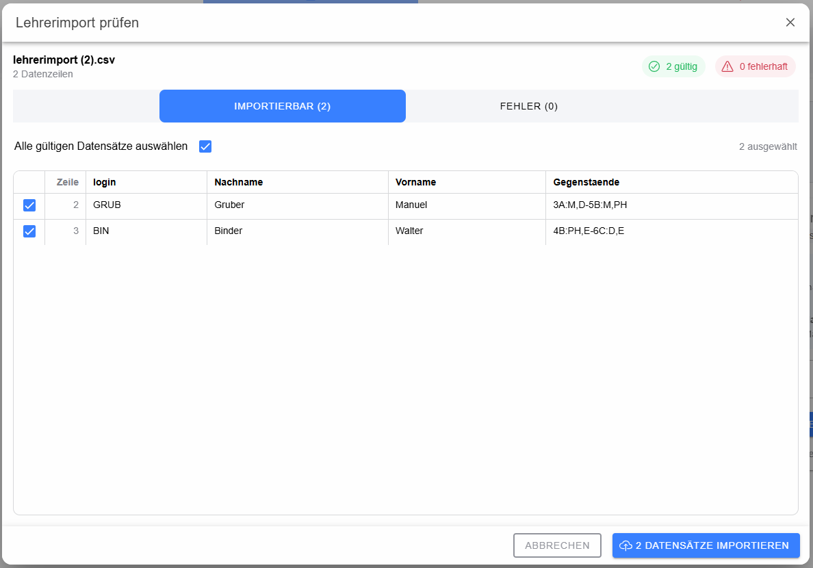

# Dialog: Lehrerimport prüfen

Nach Auswahl einer Lehrerdatei wird deren Inhalt zunächst lokal geprüft und in einem Kontrolldialog angezeigt.

Der Dialog zeigt Dateiname und Anzahl der Datenzeilen sowie getrennte Bereiche für **gültige** und **fehlerhafte** Datensätze. Gültige Datensätze können einzeln oder gesammelt an- und abgewählt werden.

Erst mit **Ausgewählte importieren** werden die markierten gültigen Zeilen zusammen mit Schuljahr, Abteilung und der Option zur Login-Ergänzung an das Backend gesendet. **Abbrechen** beendet die Prüfung ohne Import.
