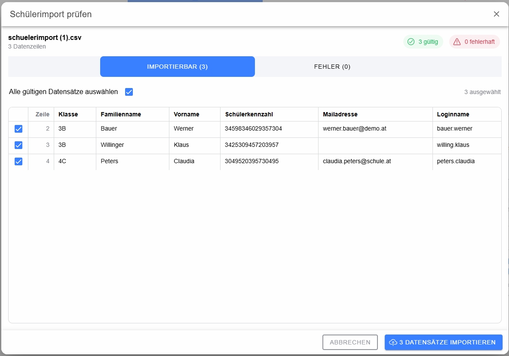

# Dialog: Schülerimport prüfen

Der Schüler-Prüfdialog kontrolliert die eingelesene Schülerdatei, bevor Daten verändert werden.

Gültige und fehlerhafte Zeilen werden getrennt dargestellt. Bei gültigen Zeilen kann festgelegt werden, welche Datensätze tatsächlich importiert werden sollen. Fehlerhafte Zeilen enthalten eine Meldung zur Ursache und können nicht für den Import ausgewählt werden.

Mit **Ausgewählte importieren** werden ausschließlich die markierten gültigen Datensätze importiert. **Abbrechen** schließt den Dialog ohne Änderung der Datenbank.
