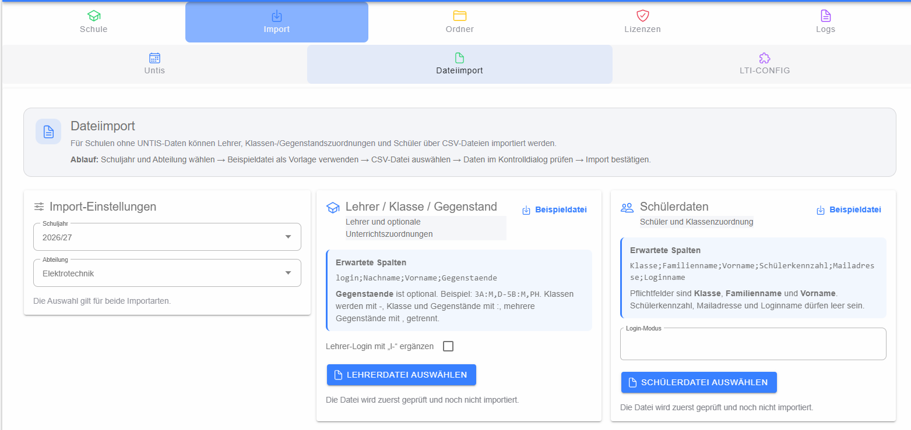

# Dateiimport ohne Untis

Der Dateiimport ist für Schulen gedacht, die Lehrer-, Klassen-/Gegenstandszuordnungen und Schülerdaten über CSV- bzw. Textdateien übernehmen. Vor dem Import werden **Schuljahr** und **Abteilung** gewählt; diese Auswahl gilt für beide Importarten.



## Lehrer, Klassen und Gegenstände

Die Lehrerdatei erwartet mindestens die Spalten

```text
login;Nachname;Vorname
```

Optional kann die Spalte **Gegenstaende** angegeben werden, um Unterrichtszuordnungen mitzuliefern. Über die Option **Lehrer-Login mit L ergänzen** kann die Loginbildung angepasst werden. Eine Beispiel-Datei kann direkt aus der Oberfläche heruntergeladen werden.

Nach der Dateiauswahl erfolgt noch kein Import. Zuerst wird der [Prüfdialog für Lehrer](dialog-lehrer-pruefen/index.md) geöffnet.

## Schülerdaten

Für Schüler sind **Klasse**, **Familienname** und **Vorname** Pflichtfelder. Weitere Informationen wie Schülerkennzahl, E-Mail-Adresse und Loginname können je nach Datei zusätzlich geliefert werden. Der **Login-Modus** steuert die Verarbeitung der Loginangabe.

Auch die Schülerdatei wird vor dem eigentlichen Import kontrolliert. Dazu dient der [Prüfdialog für Schüler](dialog-schueler-pruefen/index.md).

## Grundprinzip

Nur Datensätze, die die Vorprüfung bestehen und im Prüfdialog ausdrücklich ausgewählt sind, werden an das Backend übertragen. Fehlerhafte Zeilen werden getrennt angezeigt und nicht importiert.
