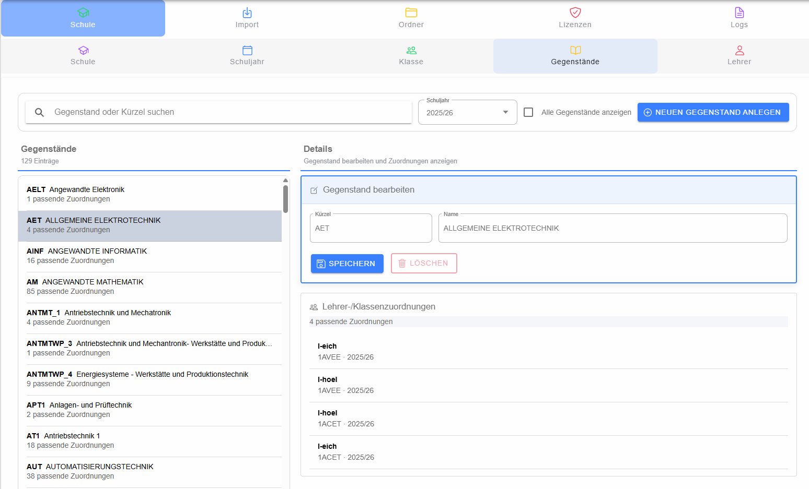

# Gegenstände

Die Gegenstandsverwaltung zeigt die vorhandenen Gegenstände und ihre Unterrichtszuordnungen. Die Oberfläche ist in Filter, Gegenstandsliste und Detailbereich gegliedert.

## Suchen und filtern

Die Liste kann nach Gegenstandsname oder Kürzel durchsucht werden. Zusätzlich kann auf ein Schuljahr eingeschränkt werden. Über die vorhandene Option können je nach aktuellem Datenbestand weitere Einträge ein- bzw. ausgeblendet werden.

## Gegenstand bearbeiten

Ein Klick auf einen Gegenstand öffnet dessen Details. Bearbeitet werden insbesondere **Kürzel** und **Name**. Mit **Neu** wird ein neuer Gegenstand angelegt. Änderungen werden erst mit **Speichern** übernommen.

Ein vorhandener Gegenstand kann über **Löschen** entfernt werden. Vorher wird eine Bestätigung verlangt.

## Unterrichtszuordnungen

Bei gespeicherten Gegenständen zeigt der untere Detailbereich die zugehörigen Lehrer-/Klassen-Zuordnungen. Dadurch lässt sich vor Änderungen oder einem Löschvorgang nachvollziehen, wo der Gegenstand bereits verwendet wird.
