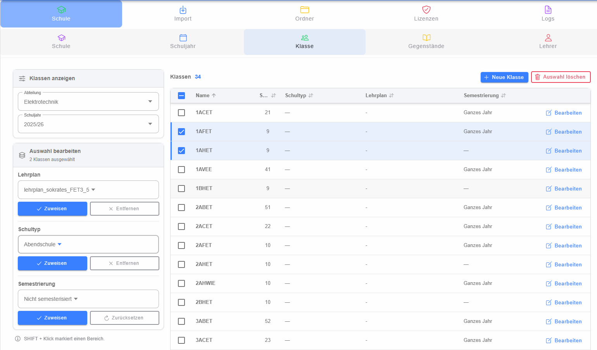

# Klassenverwaltung

Die Klassenverwaltung dient zum Anzeigen, Anlegen, Bearbeiten und gebündelten Ändern von Klassen. Zuerst werden **Abteilung** und **Schuljahr** gewählt. Die darunterliegende Tabelle enthält die Klassen des gewählten Bereichs.

## Klassen auswählen

Klassen können über die Checkboxen oder durch Klick auf eine Tabellenzeile ausgewählt werden. Die Checkbox im Tabellenkopf markiert alle sichtbaren Klassen. Mehrfachauswahl ermöglicht Sammeländerungen.

Die Tabelle kann nach mehreren Spalten sortiert werden, unter anderem nach Name, Stufe, Schultyp, Lehrplan und Semestrierung.

## Sammeländerungen

Für die ausgewählten Klassen können gemeinsam gesetzt oder entfernt werden:

- **Lehrplan**
- **Schultyp**
- **Semestrierung**

Die Änderungen werden über die jeweilige Aktion direkt für die markierten Klassen ausgeführt.

## Klasse anlegen und bearbeiten

Mit **Neue Klasse** wird der [Dialog zum Bearbeiten einer Klasse](dialog-klasse/index.md) geöffnet. Der Bearbeiten-Button einer Tabellenzeile öffnet denselben Dialog für die vorhandene Klasse.

Über den Dialog können außerdem die aktuellen Zuordnungen der Klasse eingesehen werden: unterrichtende Lehrer, zugewiesene Schüler und Gegenstände. Diese Informationen werden in einem separaten [Zuordnungsdialog](dialog-zuordnungen/index.md) angezeigt.

## Klassen löschen

Ausgewählte Klassen können über **Löschen** entfernt werden. Da dabei abhängige Daten betroffen sein können, ist vor dem endgültigen Löschen die angezeigte Bestätigung zu beachten.
