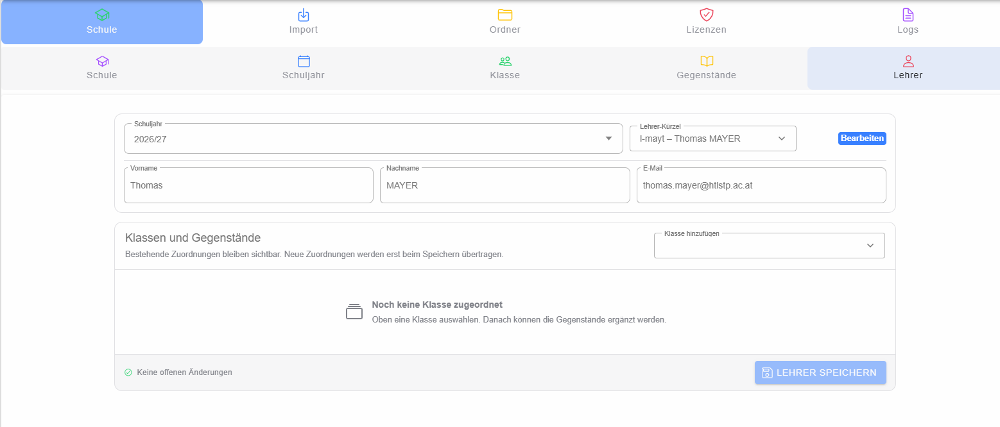
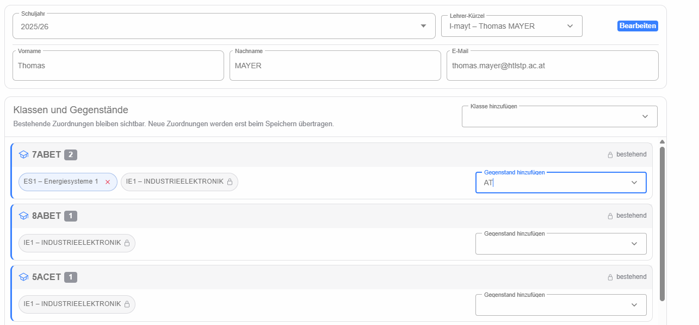

# Lehrer

Die Lehrerverwaltung arbeitet lehrerbezogen: Zuerst wird ein Schuljahr gewählt und anschließend ein Lehrer über sein **Lehrerkürzel** gesucht oder neu angelegt. Danach werden die persönlichen Daten sowie die Klassen- und Gegenstandszuordnungen bearbeitet.

## Lehrer auswählen oder neu anlegen

Das Lehrerkürzel kann über die Suche ausgewählt oder frei eingegeben werden. Existiert das Kürzel bereits, werden die Lehrerdaten für das gewählte Schuljahr geladen. Wird kein bestehender Lehrer gefunden, beginnt die Oberfläche mit einem neuen Lehrer unter diesem Kürzel. Die Anzeige macht sichtbar, ob ein bestehender Lehrer bearbeitet oder ein neuer Lehrer angelegt wird.

Beim Wechsel des Schuljahres werden die Zuordnungen passend zum neuen Schuljahr neu geladen.

## Klassen und Gegenstände zuordnen

Klassen werden aus den im gewählten Schuljahr verfügbaren Klassen hinzugefügt. Innerhalb jeder Klasse können anschließend mehrere Gegenstände zugeordnet werden.

Bereits vom Backend geladene Zuordnungen gelten als bestehend und können in dieser Bearbeitung nicht einfach lokal entfernt werden. Neu hinzugefügte Klassen oder Gegenstände können dagegen vor dem Speichern wieder entfernt werden. Dadurch werden bestehende, bereits verwendete Lehrer-Klasse-Zuordnungen vor unbeabsichtigtem Löschen geschützt.

## Speichern

Alle Änderungen bleiben zunächst lokal in der Oberfläche. Erst **Speichern** überträgt Lehrer und Zuordnungen an das Backend. Enthalten zu ändernde Zuordnungen bereits Daten, kann eine zusätzliche Sicherheitsabfrage erscheinen, bevor ein erzwungenes Speichern möglich ist.
