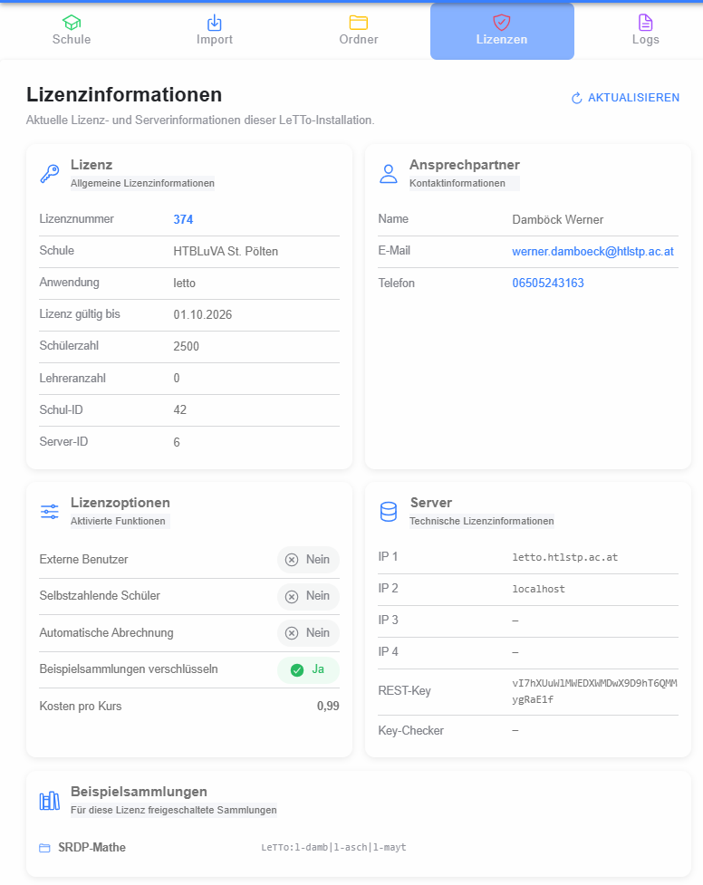

# Lizenzinformationen

Die Lizenzseite zeigt die für die aktuelle Installation hinterlegten Lizenzinformationen in einer reinen Informationsansicht.

Je nach Lizenz werden unter anderem folgende Bereiche angezeigt:

- Schule/Organisation und Lizenzlaufzeit
- Server- und Anwendungsinformationen
- Kontaktinformationen
- Anzahl bzw. Grenzen für Schüler und Lehrer
- aktivierte Lizenzmerkmale, beispielsweise externe Benutzer, zahlende Schüler, automatische Verrechnung oder Encoding-Funktionen
- technische Lizenz- und Schlüsselangaben
- Hash-/Sammlungsinformationen, sofern vorhanden

Die Daten werden nicht auf dieser Seite editiert. **Neu laden** liest den aktuellen Lizenzstand erneut vom Backend.
