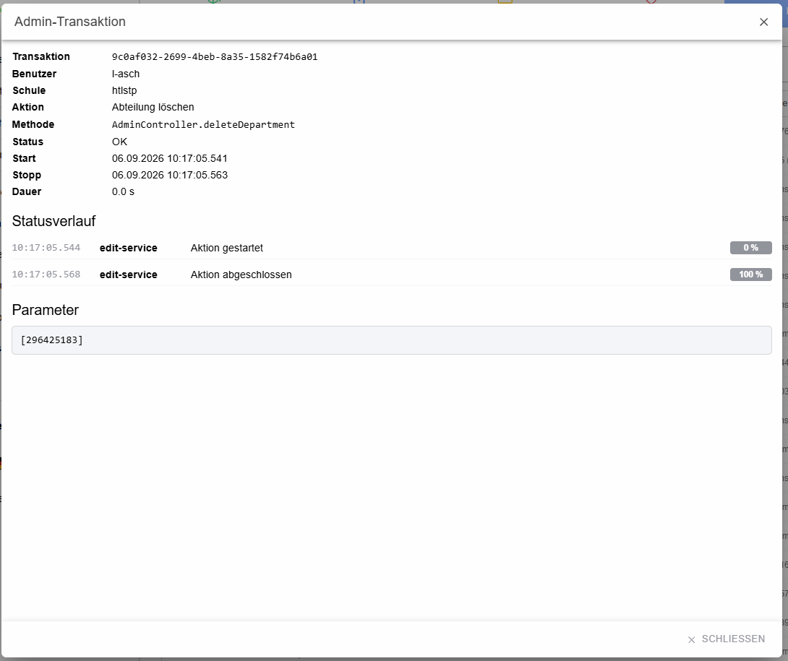

# Dialog: Admin-Transaktion

Der Detaildialog zeigt sämtliche verfügbaren Informationen zu einer administrativen Transaktion.

## Transaktionsdaten

Angezeigt werden Transaktions-ID, Benutzer, Schule, Aktion, technische Methode, Status, Start, Stopp und Dauer.

Bei einer noch laufenden Transaktion erscheint zusätzlich der aktuelle Fortschritt. Der Dialog aktualisiert laufende Transaktionen automatisch; ein separater Neu-laden-Button ist währenddessen nicht erforderlich.

## Statusverlauf

Alle gemeldeten Statusereignisse werden mit Zeitstempel, Service, Meldung und gegebenenfalls Fortschrittswert dargestellt.

## Parameter und Fehler

Wenn die Transaktion Parameter enthält, werden diese in einem separat scrollbar gehaltenen Bereich angezeigt. Bei Fehlern erscheinen Fehlerklasse, Fehlermeldung und Stacktrace in einem eigenen Fehlerblock.
