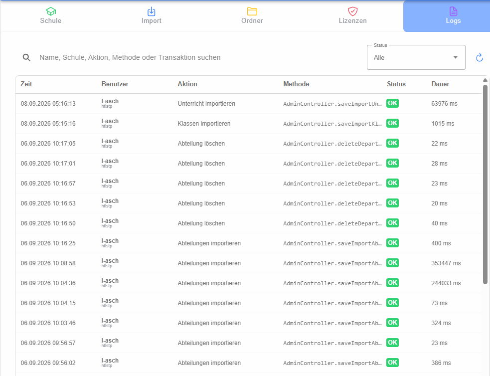

# Admin-Logs und Transaktionen

Die Seite **Logs** zeigt administrative Aktionen und länger laufende Hintergrundtransaktionen der aktuellen Schule. Dadurch können Importe, Bereinigungen und andere Admin-Vorgänge nachverfolgt werden.

## Filtern

Die Suche berücksichtigt unter anderem Benutzer, Schule, Aktion, Methode und Transaktionskennung. Zusätzlich kann nach Status gefiltert werden:

- **Läuft** (`RUNNING`)
- **OK**
- **Fehler** (`ERROR`)

Die Liste zeigt Startzeit, Benutzer, Aktion, technische Methode, Status und Dauer. Ein Klick auf eine Zeile öffnet den [Detaildialog](dialog-details/index.md).

## Aktualisierung

Die Liste kann manuell neu geladen werden. Im Detaildialog einer noch laufenden Transaktion erfolgt die Aktualisierung automatisch.
